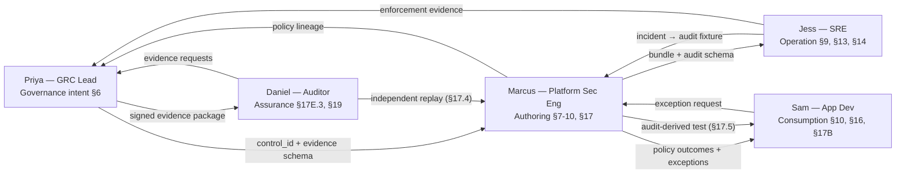

# Persona-to-Spec Mapping Summary

This document maps the five personas (from `policy engine personas.md`) to the
sections of the platform specification (`openssf_opa_unified_governance_platform_spec v1.md`)
where each persona spends their working time, the pain points the spec resolves,
and the cross-persona collaboration boundaries.

It is the foundation for the testable "after" scenarios in `analysis/scenarios/`.

---

## 1. The five personas at a glance

| # | Persona | Role focus | Lifecycle "moment" | Primary Spec Roles (§17A.2) |
|---|---------|------------|--------------------|------------------------------|
| 1 | **Priya** — Compliance & GRC Lead | Translates frameworks (SOC 2, ISO 27001, HIPAA) into internal controls; runs evidence cycles | **Intent** | Compliance Analyst; consumer of Auditor outputs |
| 2 | **Marcus** — Platform Security Engineer | Owns admission, CI gates, Keycloak realms; writes Rego/Kyverno; ships policy changes | **Authoring** | Platform Governance Admin; Policy Library Maintainer; Workflow Integrator |
| 3 | **Jess** — SRE / Cluster Operator | Runs the fleet; triages denied admissions; owns cluster health | **Operation** | Security Reviewer; cluster-scoped reader |
| 4 | **Sam** — Application Developer | Ships features; consumes policy outcomes; owns service end-to-end | **Consumption** | Developer; Namespace Policy Author (for own NS) |
| 5 | **Daniel** — Internal / External Auditor | Audits operating effectiveness; population-level testing; pattern-matches across clients | **Assurance** | Auditor (read-only) |

---

## 2. Persona → Spec section heatmap

Legend: ● primary surface (daily/weekly use), ◐ secondary (occasional use or read-only), · indirect (relies on but doesn't touch).

| Spec section | Topic | Priya | Marcus | Jess | Sam | Daniel |
|---|---|:---:|:---:|:---:|:---:|:---:|
| §3 Product Goals (G1) | Governance-to-enforcement traceability | ● | ● | ◐ | · | ● |
| §3 G2 | Unified policy lifecycle | ◐ | ● | ◐ | ◐ | · |
| §3 G3 | Runtime + retrospective compliance | ● | ◐ | ● | · | ● |
| §3 G4 | Identity-aware enforcement | ◐ | ● | ◐ | · | ◐ |
| §3 G5 | Lightweight ops / Headlamp | · | ● | ● | · | · |
| §5.2 Architecture | Top-level component graph | ◐ | ● | ◐ | · | ◐ |
| §5.3 Policy lifecycle | Author → simulate → promote | ◐ | ● | ◐ | ◐ | ◐ |
| §6 Governance hierarchy | Objectives, Controls, Enforcement/Evaluation/Evidence/Exception requirements | ● | ◐ | · | · | ● |
| §7 Policy lifecycle | Authoring metadata, enforcement classes | ◐ | ● | ◐ | ◐ | · |
| §8 OPA / Rego | Bundles, OCI artifacts, metadata extensions | · | ● | ◐ | · | · |
| §9 Gatekeeper | Constraints, deny/warn/dry-run/audit, required audit fields | · | ● | ● | ◐ | ◐ |
| §10 Conftest | Local + CI validation, normalized evidence | · | ● | · | ● | ◐ |
| §11 Privateer | Gemara-native evaluations and evidence | ● | ◐ | · | · | ● |
| §12–13 Audit schema | Sources, standardized replay-capable fields | ● | ● | ● | · | ● |
| §14 Compliance Analytics | Bypass / drift / coverage detection | ● | ◐ | ● | · | ● |
| §15 Keycloak/JWT | Required claims, mapping layer | ◐ | ● | ◐ | · | ◐ |
| §16 Governance Console | Graph / Rego Explorer / Runtime / Audit Correlation / Namespace Authoring | ● | ● | ● | ● | ● |
| §17 Simulation | Manifest, replay, shadow, snapshot, differential, namespace, false-pos/neg, audit-driven tests | ◐ | ● | ◐ | ● | ● |
| §17A Roles & storage scope | Scoped permissions, storage-layer enforcement | ● | ● | ◐ | ● | ● |
| §17B Approval-gated | suspend_pending_approval, webhooks, K8s patterns | ● | ● | ◐ | ● | ◐ |
| §17C Engine matrix & CRDs | Kyverno vs OPA, PolicyApprovalRequest, PolicyException, etc. | · | ● | ◐ | ◐ | · |
| §17D Product libraries | Kubernetes / Keycloak / Jenkins / GitLab / Trivy / OWASP / SonarQube / Grafana / Elasticsearch | ◐ | ● | ◐ | ◐ | ◐ |
| §17E Reporting | Real-time, audit-derived, simulation, coverage-gap | ● | ◐ | ◐ | · | ● |
| §18 Real-time enforcement | Kubernetes admission example flow | · | ● | ● | ◐ | ◐ |
| §19 Retrospective detection | Bypass discovery from audit | ● | ◐ | ● | · | ● |
| §20 Use cases | Supply chain / multi-tenant / AI governance | ● | ● | ◐ | · | ◐ |
| §21 APIs | Governance API surface | ◐ | ● | ◐ | ◐ | ◐ |
| §22 POC scale | Sizing targets | · | ◐ | ● | · | · |
| §23 Security | Policy/evidence integrity, OIDC, server-side authz | ◐ | ● | ◐ | · | ● |
| §24 Deployment | K8s-native deploy | · | ● | ● | · | · |
| §25 Extensibility | Plugin system | · | ● | · | · | · |
| §27 MVP | Recommended initial scope | ● | ● | ◐ | · | ◐ |

---

## 3. Per-persona detailed mapping (where each spends most of their time)

### 3.1 Priya — Compliance & GRC Lead

**Primary surfaces.**
- §6 Governance Hierarchy — authors objectives, controls, evidence requirements, exception requirements.
- §11 Privateer — consumer of evaluation evidence.
- §14 Compliance Analytics Engine — main analytical lens; bypass and drift detections.
- §16.3 Audit Correlation View — quarterly evidence pulls.
- §17E Reporting — real-time, audit-derived, simulation, coverage-gap reports.
- §17A.2 Compliance Analyst role — her team's everyday access.
- §19 Retrospective Audit Detection — formerly impossible "did it ever get bypassed" questions.
- §23 Security — evidence tamper-evidence properties (her audit committee question).

**Pain points the spec resolves.**
- Continuous (not point-in-time) evidence.
- Population-level (not sampled) testing.
- Intent-to-runtime traceability per decision (G1).
- Bypass detection over the entire audit period.
- Auditor-ready signed export packages.

**Pre/post state.** Quarterly SOC 2 evidence cycle goes from 3-week ticket-driven scramble to a one-click filtered export from the Governance Console.

---

### 3.2 Marcus — Platform Security Engineer

**Primary surfaces.**
- §7 Policy Lifecycle — entire authoring → testing → promotion path.
- §8 OPA bundle packaging, signing, Rego metadata extensions.
- §9 Gatekeeper constraint authoring, audit field requirements.
- §10 Conftest CI integration.
- §13 Standardized Audit Event Schema — to make replay possible for what he authors.
- §15.4 JWT-to-Policy Mapping Layer — eliminates per-policy Keycloak realm tickets.
- §16.3 Rego Explorer and Runtime Enforcement View.
- §17 Simulation Framework — especially §17.4 Differential Simulation and §17.5 audit-derived test cases.
- §17A.2 Platform Governance Admin and Policy Library Maintainer roles.
- §17C Engine selection matrix (OPA vs Kyverno) and custom CRDs.
- §17D Product libraries — picks the right hook per product.

**Pain points the spec resolves.**
- Same intent implemented twice (CI Conftest vs admission Gatekeeper) drifting silently.
- Pre-promotion "deploy to dev and hope" replaced by differential simulation against real audit history.
- Per-policy Keycloak claim tickets replaced by normalization layer.
- Multi-cluster "where is what enforced" answered without a kubectl loop.
- Regression test suite built from past incidents.

**Pre/post state.** Tightening image-signing policy goes from a 48-hour staged rollout (sometimes ending in a 2 a.m. rollback) to a 30-minute differential simulation + tagged exception + warn → enforce promotion.

---

### 3.3 Jess — SRE / Cluster Operator

**Primary surfaces.**
- §9 Gatekeeper enforcement modes and audit field richness.
- §13 Audit event schema — fields she needs at 2 a.m. (cluster, namespace, JWT subject, policy version, correlation ID).
- §14 Compliance Analytics Engine — bypass and drift signals.
- §16.2 Headlamp plugin model — stays in her existing cluster tool.
- §16.3 Audit Correlation View — incident triage.
- §17.2 Cluster Snapshot Simulation — upgrade readiness.
- §19 Retrospective Audit Detection — bypass detection she never had time to build.
- §22 POC scale — sizing across the fleet.

**Pain points the spec resolves.**
- Gatekeeper deny messages without policy version, JWT, external-data context.
- Context-switching to a "policy console" during incidents.
- Cross-cluster drift detection.
- Trust-based bypass tolerance ("just for ten minutes") replaced by detection.

**Pre/post state.** A 2 a.m. "deploys failing in prod-east" page goes from a 90-minute log-archaeology call to a 12-minute click-through with rollback PR.

---

### 3.4 Sam — Application Developer

**Primary surfaces.**
- §10 Conftest local execution — pre-commit hooks identical to CI and admission.
- §16.3 Namespace Authoring View — authors NS-scoped policies for his service.
- §17.5 Test cases from audit logs — gets a reproducible fixture when blocked, not just a string.
- §17A.2 Developer + Namespace Policy Author roles, with §17A.5 storage-layer scope.
- §17B Approval-Gated Decisions — structured self-service exception flow.
- §17D Kubernetes/Jenkins/GitLab libraries — reusable decision points his team adapts.

**Pain points the spec resolves.**
- Pass CI, fail admission ("seam drift").
- One-line opaque deny messages.
- Multi-day exception requests.
- Inability to author NS-scoped rate-limit or pod-security policies for his own service.

**Pre/post state.** A privileged-container deploy that previously cost two lost days becomes a 20-minute pre-commit catch + structured exception request + temporary warn-mode.

---

### 3.5 Daniel — Internal / External Auditor

**Primary surfaces.**
- §3 G1 Traceability — the property he tests against.
- §11 Privateer evidence logs.
- §13 Audit event schema — the auditable foundation.
- §14.2 Bypass / drift detections — population-level evidence.
- §16.3 Audit Correlation View — read-only filtered slice.
- §17.4 Differential Simulation — independent replay of historical events against deployed policy version.
- §17A.2 Auditor role (read-only scoped) with §17A.5 storage-side scope enforcement.
- §17E.3 Audit-Derived Violation Report.
- §19 Retrospective Audit Detection — proves absence of bypass.
- §23 Evidence integrity / tamper-evidence.

**Pain points the spec resolves.**
- Population completeness verification (currently he sees what he's given).
- Sampling-based testing replaced by population-level testing.
- "Control existed" vs "control was enforced without bypass" finally distinguishable.
- Independent re-execution against historical inputs — genuinely novel evidence.

**Pre/post state.** Testing control SC-IMG-001 goes from a 1-week PDF/CSV exchange yielding sampled-only opinion to a 1-hour population query yielding stronger conclusions including bypass-absence.

---

## 4. Cross-persona handoff map

The platform's value compounds where personas hand off work. The most material handoffs:

**Key handoff insights.**
- **Priya ↔ Marcus** — the Gemara control ID is the shared anchor: Priya's policy text and Marcus's Rego reference the same ID.
- **Marcus ↔ Jess** — audit field richness (§13) is the contract; Jess relies on the policy_version, correlation_id, and JWT context that Marcus must emit.
- **Marcus ↔ Sam** — the unified lifecycle (§7) eliminates the seam between Conftest (Sam's CI) and Gatekeeper (Marcus's admission).
- **Sam ↔ Marcus (exception flow)** — §17B turns Slack-thread approvals into structured PolicyApprovalRequest CRDs.
- **Jess ↔ Marcus (incident loop)** — §17.5 turns the incident-derived audit event into a reusable regression test fixture.
- **Priya ↔ Daniel** — the signed evidence export replaces the screenshot bundle.
- **Daniel → Marcus (independent replay)** — §17.4 gives Daniel evidence he previously could not generate at all.

---

## 5. Scenario design implications

These persona-section mappings drive three classes of "after" scenarios:

1. **End-to-end / multi-persona (high-level).** Cross-section flows that show how the platform changes a whole business cycle — e.g. quarterly SOC 2 evidence, image-signing rollout, 2 a.m. admission incident with regression-fixture follow-up.
2. **Single-section deep (mid-level).** One spec section in detail — e.g. JWT mapping layer fixing a specific Keycloak claim drift; storage-layer scope test against a Namespace Policy Author.
3. **Single-feature micro (low-level).** One feature, one persona, one screen — e.g. exporting an audit-derived violation report for a single control; tagging a differential simulation result as "intended relaxation."

The scenario files in `analysis/scenarios/` populate all three classes with concrete steps, success criteria, and per-scenario flowcharts.
