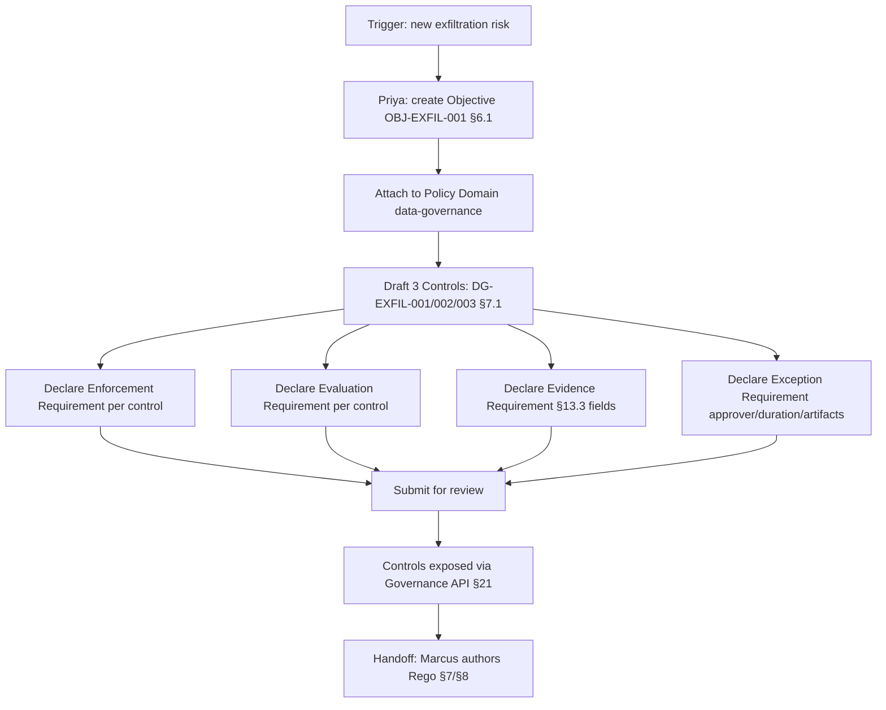

# DT-01 — Author a new Gemara objective and decompose into controls

**Personas:** Priya (Compliance Analyst / GRC Lead)
**Spec sections:** §6.1 Governance Hierarchy (Objectives → Domains → Controls → Enforcement / Evaluation / Evidence / Exception Requirements), §7.1 Policy Authoring
**Type:** Mid-level
**Pre-condition:** Priya holds the Compliance Analyst role (§17A.2) with write access to the governance domain `data-governance`. The Governance Console (§16) is installed and Privateer (§11) is wired to receive new control definitions.
**Trigger:** A new internal risk decision: prevent unauthorized data exfiltration from production services. Priya must translate it into platform-native governance artifacts.

## Steps
1. Priya opens the Governance Graph View (§16.3) and creates a new **Governance Objective**: `OBJ-EXFIL-001 — Prevent unauthorized data exfiltration`. She fills required §6.1 fields: title, rationale, owning domain, source framework references (left empty for now; populated by DT-02).
2. She attaches the objective to the existing **Policy Domain** `data-governance` (§6.1 layer 2). The Graph View renders the objective as a node under that domain.
3. Priya drafts three **Controls** (§6.1 layer 3, §7.1 fields):
   - `DG-EXFIL-001` — Egress traffic from production namespaces must be restricted to an allowlist (severity: high; enforcement class: Runtime).
   - `DG-EXFIL-002` — Object-store bucket reads above a per-subject threshold must require approval (severity: high; enforcement class: Approval / Detective).
   - `DG-EXFIL-003` — Service accounts in production must not hold long-lived cloud credentials (severity: critical; enforcement class: Runtime + Detective).
4. For each control, Priya declares the **Enforcement Requirement**: e.g. `DG-EXFIL-001` → Kubernetes admission deny on Pod/NetworkPolicy violating egress allowlist; `DG-EXFIL-002` → `suspend_pending_approval` (§17B) at the data-API PDP; `DG-EXFIL-003` → admission deny on ServiceAccount referencing static cloud-credential Secret.
5. She declares the **Evaluation Requirement** per control — the detective signal: `DG-EXFIL-001` evaluated via OPA replay of network-policy audit logs; `DG-EXFIL-002` evaluated via §14 Compliance Analytics detection over object-store access logs; `DG-EXFIL-003` evaluated via periodic Gatekeeper audit mode (§9.2).
6. She declares the **Evidence Requirement** per control, referencing the §13.3 required core fields (timestamp, cluster, namespace, JWT subject, JWT groups, control_id, decision outcome, policy_version, correlation_id) plus control-specific fields (e.g. destination CIDR for DG-EXFIL-001).
7. She declares the **Exception Requirement** per control: approval role, max duration, required linked artifacts. For `DG-EXFIL-001`, exceptions require Security Reviewer approval, ≤30 days, with a linked risk-acceptance ticket. (Detailed mechanics handled in DT-03.)
8. Priya saves and submits the objective for governance review. The platform stores the artifacts in the governance store and exposes the new control IDs via the Governance API (§21) so Marcus can begin Rego authoring (handoff to §7 / DT-05).

## Success criteria (testable)
- `OBJ-EXFIL-001` and its three child controls are retrievable via the Governance API with all §6.1 layers populated (objective, domain, controls, enforcement requirement, evaluation requirement, evidence requirement, exception requirement).
- The Governance Graph View renders the objective → domain → control hierarchy with no orphan nodes.
- Each control has a unique `control_id`, severity, applicability, and enforcement class (§7.1).
- Each evidence requirement enumerates §13.3 core fields plus control-specific fields.
- Each exception requirement records approver role, max duration, and required linked-artifact types.
- A subsequent search by domain `data-governance` returns all three controls.

## Flowchart

## Notes
DT-02 maps SOC 2 CC6.1 into this hierarchy; DT-03 specifies the exception mechanics for DG-EXFIL-001; DT-04 covers eventual deprecation.
