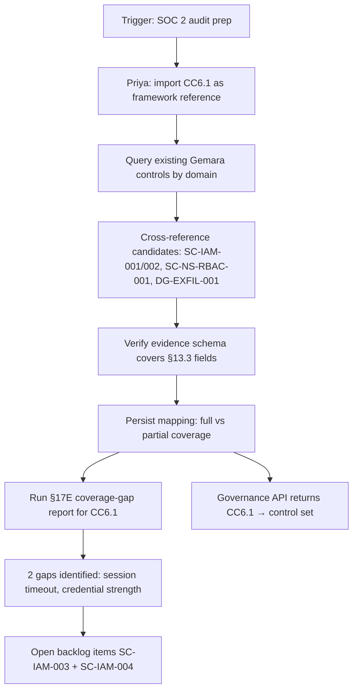

# DT-02 — Map an external framework requirement (SOC 2 CC6.1) to a Gemara control

**Personas:** Priya (Compliance Analyst / GRC Lead)
**Spec sections:** §6.1 Governance Hierarchy, §7.1 Policy Authoring (related Rego package, evidence schema), §17E.1 coverage-gap reporting
**Type:** Low-level
**Pre-condition:** The governance store already contains Gemara controls in the `identity` and `data-governance` domains (e.g. `SC-IAM-001` JWT-claim issuance, `SC-IAM-002` MFA-for-admin, `DG-EXFIL-001` egress allowlist from DT-01). Priya holds Compliance Analyst write access and uses the Governance Graph View (§16.3).
**Trigger:** Priya is preparing the SOC 2 control mapping table for the upcoming audit and must record how SOC 2 CC6.1 (logical access controls — restrict logical access to information assets) is satisfied by existing Gemara controls.

## Steps
1. Priya opens the Governance Console framework mapping panel and selects **SOC 2 → CC6.1**. She pastes the requirement text and saves it as an external **framework reference** node attached to the `identity` and `data-governance` domains (§6.1).
2. She queries existing Gemara controls by domain and reviews candidates whose enforcement and evaluation requirements (§6.1) plausibly satisfy CC6.1: `SC-IAM-001` (identity-aware JWT claims), `SC-IAM-002` (MFA-for-admin), `DG-EXFIL-001` (egress allowlist), `SC-NS-RBAC-001` (namespace RBAC restriction).
3. For each candidate, Priya inspects its **Evidence Requirement** in the Graph View to confirm the audit fields (§13.3) actually demonstrate "logical access restriction" — she verifies JWT subject, JWT groups, decision outcome, and policy_version are emitted on every decision.
4. Priya records cross-references: `CC6.1 ← satisfied_by ← {SC-IAM-001, SC-IAM-002, SC-NS-RBAC-001}`. `DG-EXFIL-001` she records as `partial` (egress restriction is access-adjacent, not directly logical access). Each cross-reference includes coverage rationale text.
5. She runs the §17E coverage-gap report filtered to `framework=SOC 2, requirement=CC6.1`. The report flags two gaps: (a) no Gemara control enforces session timeout / re-authentication; (b) no Gemara control covers password / credential complexity at the IdP.
6. Priya creates two control-work items in the governance backlog: `SC-IAM-003 — Session timeout enforcement` and `SC-IAM-004 — Credential strength policy at Keycloak`, each tagged `framework=SOC2:CC6.1` and assigned to her queue for authoring (per DT-01 pattern).
7. She saves the mapping. The Governance API (§21) now returns the CC6.1 → control set when queried, and the framework view displays a coverage badge (`covered: 3, partial: 1, gaps: 2`).

## Success criteria (testable)
- A SOC 2 CC6.1 framework-reference node exists and is linked to ≥1 Policy Domain.
- Cross-references between CC6.1 and `{SC-IAM-001, SC-IAM-002, SC-NS-RBAC-001}` are persisted with a `coverage` field (`full` or `partial`) and rationale text.
- The §17E coverage-gap report for `framework=SOC2:CC6.1` lists exactly the gaps identified during the session.
- Two new control-work items appear in the governance backlog tagged with `SOC2:CC6.1`.
- Querying the Governance API by `framework=SOC2, requirement=CC6.1` returns the linked controls and the gap list.
- The framework view shows a coverage badge with non-zero `covered` and `gaps` counts.

## Flowchart

## Notes
The cross-reference is bidirectional in the governance store: querying either CC6.1 or a Gemara control surfaces the link. Coverage badges drive the Group P reports (DT-77, DT-80).
