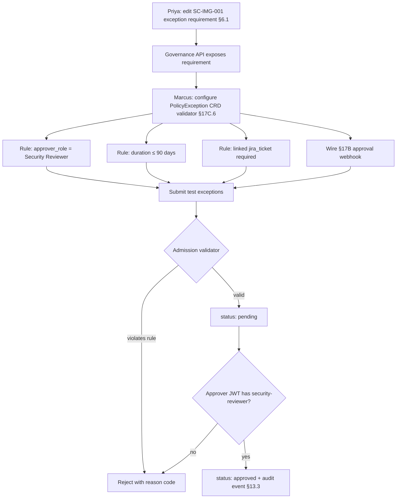

# DT-03 — Define an exception requirement on a Gemara control

**Personas:** Priya (Compliance Analyst), Marcus (Platform Governance Admin)
**Spec sections:** §6.1 Exception Requirements, §17B Approval-Gated Decisions, §17C.6 `PolicyException` CRD
**Type:** Mid-level
**Pre-condition:** Control `SC-IMG-001` (image signing required) exists in the governance store with an enforcement requirement of Kubernetes admission deny. The platform already runs Gatekeeper with the corresponding constraint, and the Keycloak realm issues `groups`, `tenant`, `environment` claims (§15). The Security Reviewer role (§17A.2) is defined.
**Trigger:** Priya's risk committee has decided that exceptions to image-signing must be tightly governed: only the Security Reviewer role may approve, exceptions must expire in ≤90 days, and each request must link to a Jira ticket for traceability.

## Steps
1. Priya opens `SC-IMG-001` in the Governance Graph View (§16.3) and edits its **Exception Requirement** (§6.1 layer 7). She sets: `approver_role: Security Reviewer`, `max_duration_days: 90`, `required_linked_artifacts: [jira_ticket]`, `scope: namespace`.
2. She saves the exception requirement. The Governance API (§21) exposes it on the control object so authoring tools and the CRD admission controller can read it.
3. Marcus opens the `PolicyException` CRD admission webhook configuration (§17C.6). He configures the validator to read the exception requirement from the Governance API at `spec.controlId` resolution time and to reject submissions that do not satisfy it.
4. Marcus encodes three enforced constraints on every `PolicyException` submission for `controlId: SC-IMG-001`:
   - `spec.approver.role` must equal `Security Reviewer` (rejected otherwise).
   - `spec.expiresAt - metadata.creationTimestamp` must be ≤ 90 days (rejected otherwise).
   - `spec.linkedArtifacts` must contain an entry with `type: jira_ticket` and a non-empty `url` matching the corporate Jira URL pattern.
5. Marcus also wires the §17B webhook: on `PolicyException` create, an `approval.requested` event (§17B.3 schema) is emitted to the corporate workflow system; on workflow callback, the controller transitions `status` from `pending` to `approved` only when the approver subject's JWT carries `groups: [security-reviewer]`.
6. Marcus and Priya validate end-to-end with three test submissions:
   - (a) `expiresAt = +120 days`, jira link, security-reviewer approver → **rejected at admission** with reason `duration_exceeds_max`.
   - (b) `expiresAt = +60 days`, no jira link → **rejected at admission** with reason `missing_linked_artifact: jira_ticket`.
   - (c) `expiresAt = +60 days`, jira link, security-reviewer approver → **admitted, pending**; after webhook approval the status becomes `approved` and is referenced by the next admission decision on the affected namespace.
7. Priya reviews the audit trail: every accepted, rejected, and approved exception emits an event carrying `control_id`, `policy_version`, exception_id, JWT subject of requester and approver, and correlation_id (§13.3).

## Success criteria (testable)
- `SC-IMG-001` exposes an `exception_requirement` object with `approver_role=Security Reviewer`, `max_duration_days=90`, `required_linked_artifacts=[jira_ticket]`.
- A `PolicyException` referencing `SC-IMG-001` with `expiresAt > 90 days` is rejected at admission with a machine-readable reason code.
- A `PolicyException` lacking a `jira_ticket` linked artifact is rejected at admission.
- An exception approval transition succeeds only when the approving subject's JWT carries the `security-reviewer` group (verified via JWT claim, not GUI role).
- An `approval.requested` webhook payload conforming to §17B.3 is emitted on create and a corresponding `approval.granted` event on approval, both carrying `correlation_id`.
- Every exception lifecycle event is replay-capable: it carries the §13.3 core fields.

## Flowchart

## Notes
The exception requirement is authored once by Priya and mechanically enforced by Marcus's validator — no per-request human review of the constraints themselves. Pairs with DT-67 (`PolicyException` lifecycle) and HL-19 (re-authorization on expiry).
