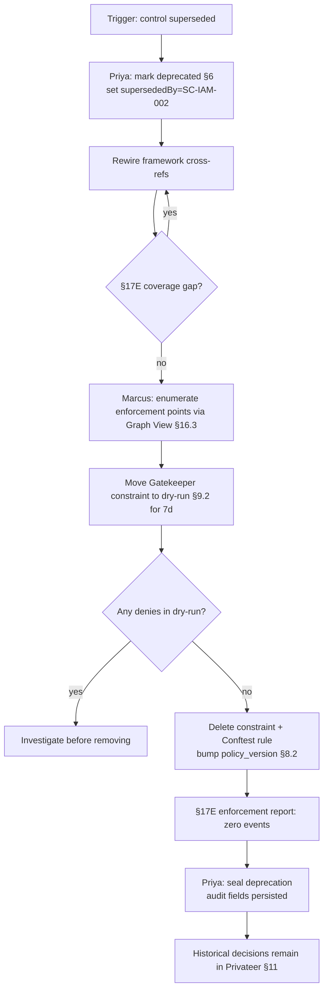

# DT-04 — Deprecate a Gemara control and remove its enforcement

**Personas:** Priya (Compliance Analyst), Marcus (Platform Governance Admin)
**Spec sections:** §6 Governance Model, §7 Policy Lifecycle, §17E Reporting (coverage-gap, real-time enforcement)
**Type:** Mid-level
**Pre-condition:** Control `SC-IAM-LEGACY-PWROT-001` (force password rotation every 60 days) was authored years ago and superseded by `SC-IAM-002` (MFA-for-admin). A Gatekeeper constraint and a Conftest rule both reference its Rego package `governance.identity.passwordrotation`. The Privateer evidence pipeline has been collecting decisions for 30+ days.
**Trigger:** Priya, after framework review (NIST and SOC 2 guidance no longer require periodic rotation when MFA is in force), decides to deprecate the legacy control and remove its constraints.

## Steps
1. Priya opens `SC-IAM-LEGACY-PWROT-001` in the Governance Graph View (§16.3) and changes its **lifecycle status** to `deprecated`. She records `supersededBy: SC-IAM-002`, deprecation rationale, and an `effective_deprecation_at` timestamp 14 days out (grace window). The Graph View visually flags the node as deprecated.
2. Priya checks framework cross-references (per DT-02). If any external requirement (e.g. an internal policy framework) still maps to this control, she rewires the mapping to `SC-IAM-002` and confirms via the §17E coverage-gap report that no framework requirement loses coverage.
3. Marcus is notified via the governance-change feed. He opens the Governance Graph View, follows the control → Rego → enforcement-points edges (§16.3) and enumerates the affected artifacts: the Gatekeeper constraint `pwrot-required`, the Conftest rule in the shared bundle, and the Privateer evaluation entry.
4. Marcus moves the Gatekeeper constraint to `dry-run` mode (§9.2) for 7 days as a safety period. He inspects Runtime Enforcement View (§16.3) to confirm there are zero remaining real denies attributable to the constraint during that window.
5. At the end of the grace window Marcus deletes the Gatekeeper constraint, removes the Conftest rule from the shared OCI bundle, signs and re-publishes the bundle with an incremented `policy_version` (§8.2), and removes the Privateer evaluation entry.
6. Marcus runs the §17E real-time enforcement report filtered by `control_id=SC-IAM-LEGACY-PWROT-001` over the last 24 hours. The report returns **zero affected enforcement points** (no decisions emitted).
7. Marcus also runs a §17E coverage-gap report. The deprecated control no longer appears in active coverage tables; `SC-IAM-002` remains the active mapping target.
8. Priya reviews and seals the deprecation: the control object's audit log retains `deprecated_at`, deprecating user (JWT subject), supersededBy reference, and a hash of the final pre-deprecation policy bundle version. Historical decisions remain queryable via Privateer (§11) for audit traceability (§3 G1).

## Success criteria (testable)
- The control's lifecycle status is `deprecated` with persisted `deprecated_at` timestamp, `supersededBy: SC-IAM-002`, and deprecating subject identity.
- No active Gatekeeper constraint, Conftest rule, or Privateer evaluation references the deprecated control's Rego package after the grace window.
- The §17E real-time enforcement report filtered by the deprecated `control_id` returns zero events for the 24 hours following removal.
- The §17E coverage-gap report shows no new uncovered framework requirements as a result of the deprecation.
- Historical decisions emitted before deprecation remain retrievable from the Privateer evidence store with their original `policy_version`.
- The policy bundle published after removal has an incremented `policy_version` and a valid signature (§8.2).

## Flowchart

## Notes
The 14-day grace window plus 7-day dry-run window are configurable; the spec only requires that deprecation be traceable, not a specific duration. Pairs with DT-77/DT-80 reporting and HL-07 (framework adoption inverse).
