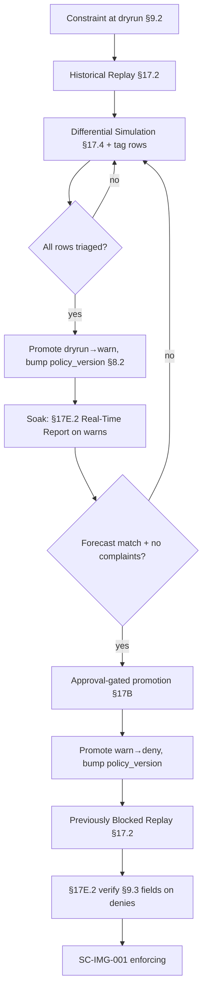

# DT-05 — Promote a constraint dry-run → warn → enforce

**Personas:** Marcus (Platform Governance Admin)
**Spec sections:** §7 Policy Lifecycle, §9.2 Gatekeeper Enforcement Modes, §17.2 Simulation Modes, §17.4 Differential Simulation Semantics, §17E.2/§17E.4 Reporting
**Type:** Mid-level
**Pre-condition:** Priya has finalized control `SC-IMG-001` (image signing required, enforcement class Runtime, §7.2). Marcus has authored the Rego package `governance.kubernetes.imagesigning` with §8.3 metadata (`__control_id__ = "SC-IMG-001"`), packaged as a signed OCI bundle (§8.2). The Gatekeeper constraint `imagesigning-required` is installed at `enforcementAction: dryrun` (§9.2). Privateer has ≥30 days of admission audit events captured per §17.3.
**Trigger:** Marcus must move `SC-IMG-001` to active enforcement on production clusters by promoting the constraint through dry-run → warn → deny.

## Steps
1. **Gate A — dry-run baseline.** Marcus opens the Simulation View (§17.6) and runs a **Historical Replay** (§17.2) of the constraint over the last 30 days of admission audit logs. The §17E.4 Simulation Report renders: events evaluated, would-be-blocked count, and Rego packages exercised.
2. **Gate A — differential review.** Marcus runs a **Differential Policy Simulation** (§17.2/§17.4) comparing the empty baseline to the new constraint. Each would-be-block row is triaged and tagged `Intended enforcement`, `Potential false positive`, or `Requires review` (§17.4). Owners of would-be-blocked workloads are notified via the §16 console.
3. **Promote to warn.** With zero `Requires review` rows outstanding, Marcus edits the constraint's `enforcementAction` from `dryrun` to `warn` (§9.2). The change is committed via GitOps, the bundle is re-signed, and `policy_version` is bumped (§8.2). The governance audit event records `mode_change: dryrun→warn`, the JWT subject of Marcus, and `correlation_id` (§9.3).
4. **Gate B — warn observation.** For a defined soak window, Marcus monitors the §17E.2 Real-Time Enforcement Report filtered by `control_id=SC-IMG-001`, watching `decision=warn` rows. He validates that no new requesters file complaints and that warn volume matches the dry-run forecast within tolerance.
5. **Gate B — sign-off.** Marcus opens the promotion-approval workflow; per §17B the request emits an `approval.requested` event. A second platform-admin approves the move to deny (separation of duties). The approval `correlation_id` is recorded against the upcoming policy version.
6. **Promote to deny.** Marcus changes `enforcementAction` to `deny` (§9.2), re-signs the bundle, bumps `policy_version` again. Gatekeeper rolls out the new constraint. The audit event records `mode_change: warn→deny`, approver subject, and the linked approval `correlation_id`.
7. **Gate C — post-enforcement check.** Marcus runs a **Previously Blocked Replay** + Real-Time Enforcement Report (§17.2, §17E.2) for the first 24 hours of deny. He confirms the deny rate matches the warn forecast and that every deny event carries the §9.3 required fields (Control ID, Constraint Name, Rego Package, policy_version, Admission Review UID, Correlation ID).

## Success criteria (testable)
- Three distinct `policy_version` values exist for the constraint: dry-run, warn, deny — each signed (§8.2) and traceable to a GitOps commit.
- Each `mode_change` audit event carries actor JWT subject, prior mode, new mode, and `correlation_id`.
- The §17E.4 Simulation Report at Gate A has zero remaining `Requires review` rows before promotion to warn.
- The warn → deny promotion is gated by a §17B approval event from a second admin, captured by `correlation_id`.
- The §17E.2 Real-Time Enforcement Report at Gate C shows `decision=deny` rows with all §9.3 fields populated.
- The deny-rate variance between Gate B forecast and Gate C actual is within the configured tolerance.

## Flowchart

## Notes
Differential tags from §17.4 are persisted with each promotion event so DT-06 (rollback) can reconstruct the decision rationale. Pairs with HL-02 image-signing rollout and DT-14 warn→deny variant.
