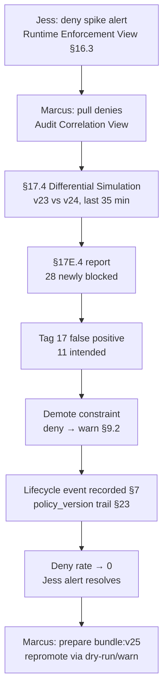

# DT-06 — Roll back a constraint promotion

**Personas:** Marcus (Platform Governance Admin), Jess (SRE / Cluster Operator)
**Spec sections:** §7 Policy Lifecycle, §9.2 Gatekeeper Enforcement Modes, §17.4 Differential Simulation, §17E.4 Simulation Report, §23 Auditability
**Type:** Mid-level
**Pre-condition:** A constraint for control `SC-NET-014` ("egress restricted to allowlisted CIDRs") was promoted from `warn` to `deny` 35 minutes ago. The previous bundle (`bundle:v23`) and current bundle (`bundle:v24`) are both pinned as signed OCI artifacts (§8.2). Replay-capable audit events (§13) are streaming.
**Trigger:** Jess gets paged: a spike of admission denies in `data-platform-prod` is blocking a routine batch job rollout. Three teams are affected within five minutes.

## Steps
1. Jess opens the Runtime Enforcement View (§16.3) filtered to `control_id=SC-NET-014`, sees the deny spike correlated to `policy_version=bundle:v24` and the `warn → deny` promotion event. She raises a Sev-2 alert and tags Marcus.
2. Marcus opens the Audit Correlation View (§16.3), pulls the last 35 minutes of `decision=deny` events for the control. Every event has §9.3 required fields including `correlation_id`, JWT subject, constraint name, and Rego package.
3. Marcus kicks off a §17.4 Differential Simulation: dataset = last 35 minutes of admission events; old policy = `bundle:v23`; new policy = `bundle:v24`. The §17E.4 simulation report shows 28 `newly_blocked` events.
4. Marcus inspects the newly-blocked set. Seventeen events reference an internal mirror CIDR (`10.244.0.0/16`) that was inadvertently dropped from the allowlist datum during the v24 edit; the remainder are legitimate enforcements.
5. Marcus classifies the 17 as `Potential false positive` and the 11 as `Intended enforcement` (§17.4 tags). Untagged risky changes: 0. He confirms with Jess that demoting to `warn` is the right immediate action while he prepares a corrected `bundle:v25`.
6. Marcus changes the Gatekeeper constraint `enforcementAction` from `deny` to `warn` (§9.2). The platform records the change as a policy lifecycle event (§7) with the prior `policy_version`, the new effective mode, actor JWT, and a link to the simulation report.
7. Within two minutes the deny rate for `SC-NET-014` drops to zero in the Runtime Enforcement View; warns continue to be emitted so the missing CIDR remains visible.
8. Marcus files a follow-up to ship `bundle:v25` with the corrected allowlist and re-promote through dry-run → warn → deny per §7.

## Success criteria (testable)
- The mode change is reflected in subsequent Gatekeeper audit events with the new `policy_version` and `decision=warn` instead of `deny` within two minutes of Marcus's action.
- The simulation report records `newly_blocked_count=28`, with 17 tagged `Potential false positive` and 11 tagged `Intended enforcement`; the report is attached to the rollback record.
- The policy lifecycle history (§7 / §23 Auditability) shows an ordered trail: `bundle:v23 (deny) → bundle:v24 (deny) → bundle:v24 (warn)` with actor, timestamp, and reason for each transition.
- No subsequent admission deny is observed for `SC-NET-014` after the demotion timestamp; warns for the same inputs continue to be emitted.
- Jess's alert auto-resolves on deny rate returning to zero; the incident is linked to the lifecycle entry by `correlation_id`.

## Flowchart

## Notes
Related: DT-05 (promote dry-run → warn → enforce), HL-17 (differential simulation prevents the rollback in the first place). The demotion is reversible; the lifecycle trail is the durable record.
