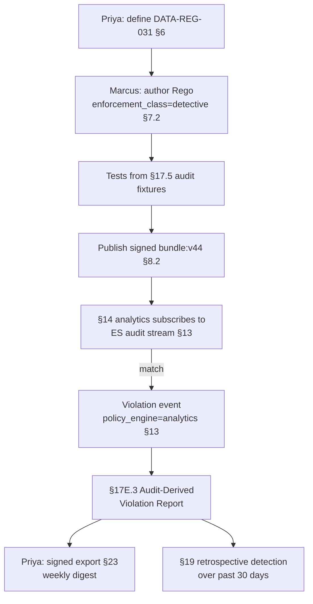

# DT-08 — Author a detective-only (audit-derived) policy

**Personas:** Marcus (Platform Governance Admin), Priya (Compliance Analyst)
**Spec sections:** §7.1 Policy Authoring, §7.2 Enforcement Classes (Detective), §12–13 Audit Schema, §14 Compliance Analytics, §17E.3 Audit-Derived Violation Report, §19 Retrospective Audit Detection
**Type:** Mid-level
**Pre-condition:** Elasticsearch / Kibana audit events are normalized into the replay-capable schema (§13) with `policy_engine=application`, `resource_type=elasticsearch.index`, and JWT subject. Priya has authored Gemara control `DATA-REG-031` ("Bulk read patterns against regulated indices must be reviewed"). Real-time blocking is not feasible because legitimate bulk-read patterns are indistinguishable from regulated ones without business context.
**Trigger:** Priya escalates that an external auditor will sample regulated-index access for the prior quarter; the team needs a continuously running detective control with reproducible evidence, not ad-hoc queries.

## Steps
1. Priya formalizes `DATA-REG-031` in §6: severity `high`, applicability `tenant=regulated-data`, evidence requirement listing required audit fields (`subject.sub`, `subject.groups`, `resource_id` index name, `operation`, `external_data_refs` for index classification table).
2. Marcus authors a Rego package `governance.elasticsearch.bulkreadreview`. §7.1 metadata sets `enforcement_class: detective`, `enforcement_targets: [analytics]`; he declines `runtime` because the platform cannot decide intent at request time.
3. The rule consumes normalized §13 events: it flags any event where `resource_type=elasticsearch.index`, the index appears in the `regulated_indices` external datum (`external_data_refs`), and `operation` is a scroll/search exceeding a `documents_returned` threshold, when the subject lacks the `compliance_scope=regulated-data` JWT claim (§15.3).
4. Marcus tags the bundle metadata so `__control_id__ := "DATA-REG-031"` and adds Conftest-style unit tests fed by §17.5 fixtures sourced from real prior audit events. Bundle is signed and published as `bundle:v44`.
5. The Compliance Analytics Engine (§14) subscribes the new policy to the Elasticsearch audit stream. Each match emits a `event_type=policy.violation`, `policy_engine=analytics`, with `replay_completeness` carried from the source event and `policy_version=bundle:v44`.
6. Priya opens the §17E.3 Audit-Derived Violation Report filtered to `DATA-REG-031`. The report shows violation timestamp, discovery timestamp, source audit log, reconstructed policy input, `policy_version`, confidence level (from `replay_completeness`), missing fields if any, matched control ID, and a recommended remediation template Marcus wrote into the rule.
7. Priya exports the report (signed per §23) and attaches it to the control's evidence trail; she configures a weekly digest to the data-governance steering group.
8. Jess and Marcus configure no admission constraint and no CI gate for this control; the §17E coverage view correctly shows `DATA-REG-031` as fully covered by the `detective` enforcement class.

## Success criteria (testable)
- Control `DATA-REG-031` records `enforcement_class=detective` and `enforcement_targets=[analytics]`; the platform does not provision a Gatekeeper constraint, Kyverno policy, or Conftest gate.
- Every emitted violation event conforms to §13 with `policy_engine=analytics`, `policy_version=bundle:v44`, `control_id=DATA-REG-031`, and a populated `external_data_refs` entry naming the regulated-indices datum and its version/digest.
- The §17E.3 report renders all required fields (violation/discovery timestamps, source audit log, reconstructed input, policy version, confidence, missing fields, matched control ID, recommended remediation) for every row.
- For at least one historical bulk-read event in the prior 30 days, the rule produces a violation with `replay_completeness=complete` (§19 retrospective detection works on past data, not only new traffic).
- The signed export Priya hands to the auditor carries a verifiable signature and a `policy_version` traceable to the OCI bundle digest.

## Flowchart

## Notes
Detective controls are first-class in §7.2; no admission point is required. Related: DT-21, DT-30, DT-78, HL-06. Confidence on each row derives from `replay_completeness` on the source event.
