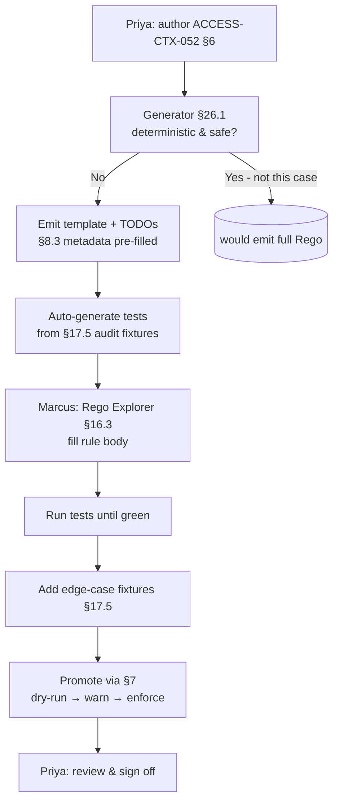

# DT-09 — Handle a control where Rego cannot be auto-generated; ship template

**Personas:** Priya (Compliance Analyst), Marcus (Platform Governance Admin)
**Spec sections:** §7.1 Policy Authoring, §8.3 Rego Metadata Extensions, §17.5 Test Cases from Audit Logs, §26.1 Resolved Design Guidance (Gemara-to-Rego generation)
**Type:** Mid-level
**Pre-condition:** The platform's Gemara-to-Rego generator applies the §26.1 rule: generate full Rego only when the result is complete, deterministic, and safe; otherwise generate a template with comments, stubs, and tests. Priya is authoring a new control whose enforcement requires human judgment.
**Trigger:** Priya creates control `ACCESS-CTX-052` ("Production write access from devices outside the corporate network requires step-up authentication review"). The enforcement requirement references `risk_level`, `compliance_scope`, and contextual signals the platform cannot evaluate deterministically.

## Steps
1. Priya defines `ACCESS-CTX-052` in §6 with severity `high`, enforcement requirement text describing the "step-up review" condition, evidence requirement listing required JWT claims (`risk_level`, `compliance_scope`, `groups`), and an exception requirement. She sets `enforcement_class: runtime`.
2. The generator inspects the control. Because the enforcement requirement contains non-deterministic language ("review", "outside the corporate network") and references claims (`risk_level`) whose mapping is environment-specific, the §26.1 rule fires: generator produces a **template**, not a full policy.
3. The generated Rego package `governance.access.contextstepup` ships with §8.3 metadata pre-filled (`__control_id__ := "ACCESS-CTX-052"`, `__required_claims__ := ["risk_level","compliance_scope","groups"]`, `__severity__ := "high"`), a `deny` rule stub, and `TODO` comments at each non-deterministic decision point explaining what cannot be generated and why.
4. The generator also emits a test scaffold under §17.5 from existing audit fixtures: at least one fixture per intended outcome (allow, deny, suspend_pending_approval), each linked to the control. Tests fail until Marcus supplies the rule body.
5. Marcus opens the package in the Rego Explorer (§16.3). The view shows the template, the `TODO` comments, the required-claim list, and the auto-generated tests. He implements the rule body: deny when `subject.risk_level == "high"` and request origin is outside the documented corporate ranges, surfacing as `suspend_pending_approval` (§17B.2) rather than hard deny.
6. Marcus runs the auto-generated tests; all pass. He adds two additional §17.5 fixtures from real audit events Priya flagged as edge cases and tags expected outcomes.
7. Marcus promotes the bundle through dry-run → warn → enforce per §7. The control's authoring metadata now records both the generator origin (`generated_from: template`) and Marcus's authorship for the rule body.
8. Priya reviews the Rego Explorer and confirms the implemented logic matches her enforcement requirement language; she signs off and closes the authoring task.

## Success criteria (testable)
- The platform records `generated_from=template` (not `full`) on `ACCESS-CTX-052`'s authoring metadata, with a reason citing the non-deterministic enforcement language and the environment-specific claim mapping.
- The generated Rego template includes §8.3 metadata fields pre-populated with the control ID, severity, and required claims declared by Priya.
- The auto-generated test scaffold contains at least one fixture per intended outcome declared in the control, each linked to `ACCESS-CTX-052` and to the Rego package; tests are red until the rule body is supplied.
- After Marcus's edits, the Rego Explorer shows the package metadata, the implemented rule, the tests (all green), and the lineage back to the original Gemara control.
- Promotion is blocked by the platform if any `TODO` markers remain in the rule body or if any auto-generated test is failing.

## Flowchart

## Notes
This is the §26.1 fallback path made concrete. The template approach prevents shipping an unsafe generated enforcement policy while still giving Marcus structure to fill. Related: DT-05, DT-11.
