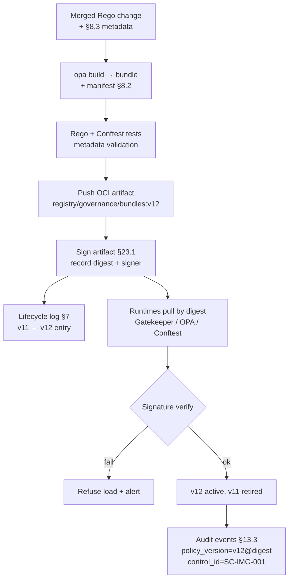

# DT-10 — Sign and version a Rego bundle as an OCI artifact

**Personas:** Marcus (Platform Governance Admin / Policy Library Maintainer)
**Spec sections:** §7 Policy Lifecycle, §8.1 OPA Responsibilities, §8.2 Policy Packaging (OPA bundles, OCI artifacts, signed artifacts, Gemara traceability), §8.3 Rego Metadata Extensions, §13.3 Required Core Fields, §23.1 Policy Integrity & Evidence Integrity
**Type:** Low-level
**Pre-condition:** Marcus has merged a reviewed change to the Rego source tree for `governance.kubernetes.imagesigning` (control `SC-IMG-001`). The current bundle in production is `bundle:v11`. The OCI registry, a signing key (per §23.1 policy integrity), and the bundle CI pipeline are wired up. Gatekeeper, OPA, and Conftest runtimes are configured to pull bundles from the registry and verify signatures before loading.
**Trigger:** The merged change is tagged for release; the bundle CI pipeline starts a release run that must produce `bundle:v12` as a signed, versioned OCI artifact traceable to `SC-IMG-001`.

## Steps
1. Marcus's release commit bumps the bundle manifest version to `v12`. The §7 lifecycle release job builds the bundle with `opa build`, producing the tarball plus a `.manifest` declaring the bundle revision and roots. §8.3 metadata (`__control_id__`, `__severity__`, `__governance_domain__`, `__required_claims__`) is present on every package and validated by the pipeline.
2. The pipeline runs the bundle's unit and integration tests (Rego tests, Conftest fixture tests). Any §8.3 metadata field missing on any package fails the build before signing, per §8.2 traceability requirement.
3. The pipeline pushes the bundle to the OCI registry as `registry.example/governance/bundles:v12`, tagging it with the immutable digest. The push annotates the OCI manifest with `control_ids=[SC-IMG-001,...]`, the source commit SHA, and the build provenance.
4. Marcus's pipeline signs the OCI artifact with the platform signing key (§23.1 policy integrity). The signature is stored alongside the artifact in the registry and recorded with the bundle digest in the policy lifecycle log (§7 / §23.1 auditability).
5. The runtime engines (Gatekeeper, OPA admission, Conftest in CI) poll the registry, pull `bundle:v12` by digest, and verify the signature against the configured trust root. A failed verification refuses to load the bundle and emits an alert; a passing verification activates `v12` and deactivates `v11`.
6. The first admission decision evaluated under the new bundle emits an audit event whose §13.3 core fields include `policy_version=bundle:v12@sha256:...`, `rego_package=governance.kubernetes.imagesigning`, and `control_id=SC-IMG-001`. The bundle digest, not just the tag, is recorded.
7. Marcus opens the Governance Console and confirms the §16.3 Rego Explorer shows `v12` as active across enforcement points, with the signature status `verified` and a clickable link from the OCI digest back to the source commit and the Gemara control.
8. The §7 lifecycle history now lists `bundle:v11 → bundle:v12` with actor, timestamp, signing identity, and digest. A subsequent rollback (if needed) re-pins `v11` by digest, not by mutable tag.

## Success criteria (testable)
- `bundle:v12` exists in the OCI registry with a verifiable signature; pulling and verifying with the configured trust root succeeds, and tampering with any byte of the artifact causes verification to fail.
- Every Rego package in the bundle declares §8.3 metadata; the build pipeline fails the release if any required metadata field is missing.
- Runtime audit events emitted after activation carry `policy_version` containing both the bundle tag (`v12`) and the immutable digest, plus the `control_id` from §8.3 metadata.
- The lifecycle log (§7 / §23.1) records the v11 → v12 transition with actor, timestamp, source commit, signing identity, and OCI digest; entries are append-only.
- An unsigned or wrong-signed bundle pushed to the registry is refused by all runtime engines and produces an audit event flagging the signature failure.

## Flowchart

## Notes
Signing implementation is intentionally unspecified in §23.1; the contract is verifiability and digest-pinning. Related: DT-11 (metadata validation), DT-13 (trace decision to bundle), DT-06 (rollback re-pins prior digest).
