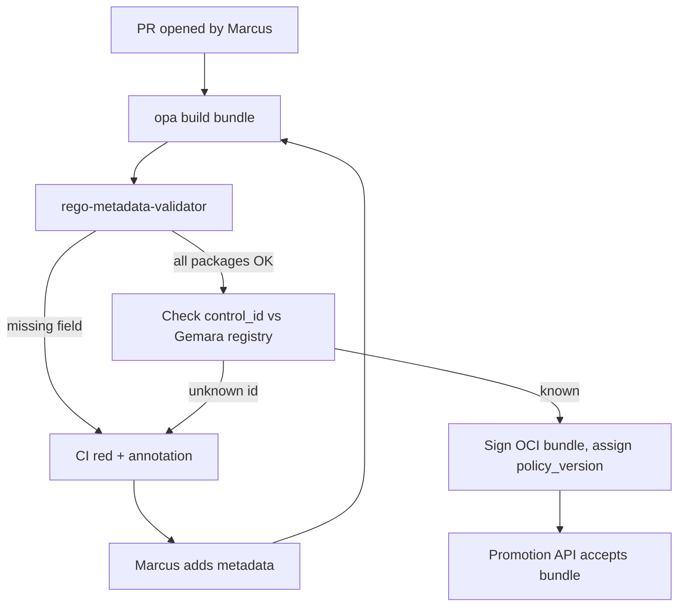

# DT-11 — Validate Rego metadata extensions before promotion

**Personas:** Marcus
**Spec sections:** §8.2 Policy Packaging, §8.3 Rego Metadata Extensions
**Type:** Low-level
**Pre-condition:** A Rego bundle repository builds OCI-signed bundles in CI; the platform requires every package to declare governance metadata before promotion to `warn` or `enforce`.
**Trigger:** Marcus opens a pull request that adds a new Rego package `governance.kubernetes.imagesigning` and the CI pipeline runs the metadata validator stage.

## Steps
1. Marcus edits `policies/kubernetes/imagesigning.rego`, declaring the package and adding `__control_id__`, `__severity__`, `__governance_domain__`, and `__required_claims__` per §8.3.
2. Marcus pushes the branch; the bundle build pipeline runs `opa build` then invokes the platform's `rego-metadata-validator` step.
3. The validator parses every `.rego` file in the bundle and enforces that each non-test package declares all four required metadata variables.
4. The validator cross-checks `__control_id__` against the Gemara control registry; an unknown control ID fails the step.
5. On Marcus's first push the validator fails because `__required_claims__` is missing on a sibling package `governance.kubernetes.labels`; CI marks the PR red and posts the missing-metadata report as a check annotation.
6. Marcus adds `__required_claims__ := ["groups", "tenant"]` to `labels.rego`, pushes again; the validator passes and the bundle is built and signed as an OCI artifact per §8.2.
7. The platform records `policy_version = bundle:v13` and links it to the listed control IDs in the policy registry.
8. Promotion to `warn` is allowed; without a green metadata check the promotion API would reject the bundle.

## Success criteria (testable)
- A package missing any of `__control_id__`, `__severity__`, `__governance_domain__`, `__required_claims__` fails the validator with a deterministic error naming the missing field and the package.
- A package with `__control_id__` not present in the Gemara control registry fails with an "unknown control" error.
- A passing validator run produces a signed OCI bundle tagged with a monotonically increasing `policy_version`.
- The promotion API refuses to promote a bundle that has no associated green validator run.
- Validator output is attached to the PR as a structured check, listing each package and its declared metadata.

## Flowchart

## Notes
Related: DT-10 (sign/version bundles), DT-26 (add new JWT claim into audit events). Validator is the single chokepoint for §3 G1 traceability at build time.
