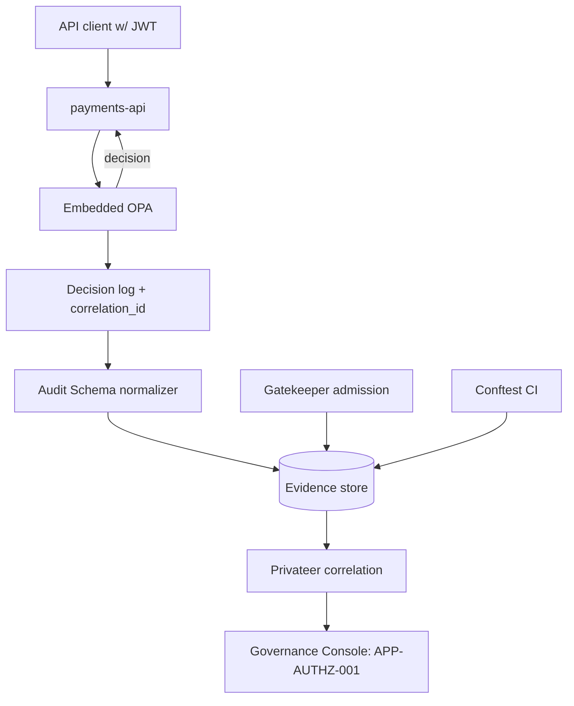

# DT-12 — Integrate an embedded application OPA into the evidence pipeline

**Personas:** Marcus, Sam
**Spec sections:** §8.1 OPA Responsibilities, §11 Privateer, §13 Audit Schema, §17C.4 Application PDP
**Type:** Mid-level
**Pre-condition:** Sam owns a payments microservice that performs in-process authorization checks; the platform already ingests admission and CI evidence. The shared Rego bundle is published as a signed OCI artifact (§8.2).
**Trigger:** Sam wants `payments-api` to enforce fine-grained authorization in-process and have those decisions appear alongside admission and CI evidence in Privateer.

## Steps
1. Sam embeds an OPA sidecar (or `opa-go` library) into `payments-api` and configures it to pull the shared bundle `governance.application.payments` at the version pinned for the namespace.
2. Marcus authors `governance.application.payments` Rego with the §8.3 metadata (`__control_id__ = "APP-AUTHZ-001"`, required claims `groups`, `tenant`).
3. On every authorization call, the embedded OPA evaluates the request, returns the decision to the service, and emits a decision log entry per §8.1 with `policy_engine = "application"` and the §13.3 required core fields (event_id, timestamp, decision, policy_version, rego_package, control_id, subject, jwt_claims, correlation_id, replay_completeness).
4. Sam's service stamps the inbound request's `correlation_id` (propagated from the API gateway and any upstream admission event) into both the response and the OPA decision log.
5. A platform agent ships decision logs to the Audit Schema Service (§12.2 Application Logs source); the normalizer validates required fields and marks `replay_completeness` accordingly.
6. Privateer (§11.2) correlates the new application decisions with: the admission event that deployed `payments-api` (Gatekeeper), and the CI Conftest evaluations that gated the deploy — joining on `correlation_id`, `resource_id`, and `control_id`.
7. Marcus opens the Governance Console; the Application PDP (§17C.4) is now listed for `payments-api`, with live decision counts and a link from the control to the package and to the running pods enforcing it.
8. Privateer's evaluation log for `APP-AUTHZ-001` shows evidence from three engines: Conftest (build), Gatekeeper (admission), application OPA (runtime).

## Success criteria (testable)
- An authorization call to `payments-api` produces an audit event with `policy_engine = "application"`, `control_id = "APP-AUTHZ-001"`, and `replay_completeness = "complete"`.
- The same `correlation_id` appears on the application decision log and on at least one admission and one CI evidence record for `payments-api`.
- The Privateer evaluation log for `APP-AUTHZ-001` lists application, Gatekeeper, and Conftest evidence sources.
- An application decision missing `jwt_claims` is flagged `replay_completeness = "partial"` and shows under "Missing audit fields" reporting.
- The Application PDP appears in the Governance Console Runtime Enforcement View bound to the deployed service.

## Flowchart

## Notes
Related: DT-13 (trace decision to bundle), DT-25 (replay_completeness). Sam owns the propagation of `correlation_id`; Marcus owns the bundle and metadata.
