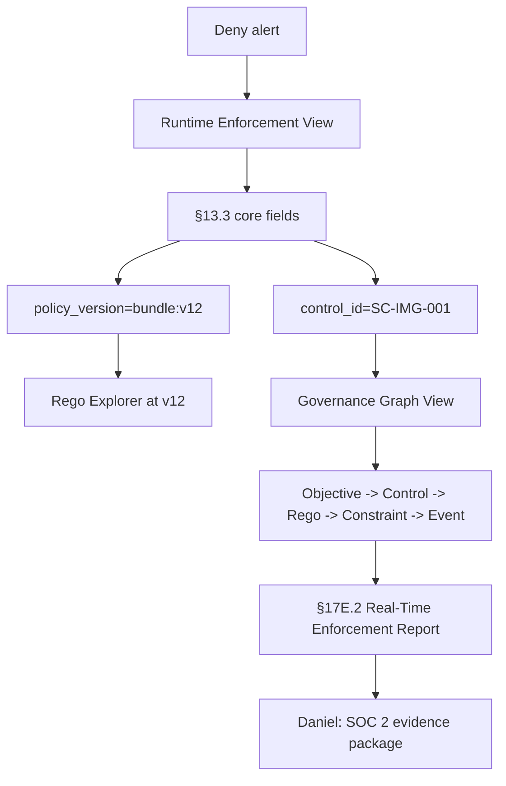

# DT-13 — Trace a runtime decision back to bundle version and Gemara control

**Personas:** Jess, Daniel
**Spec sections:** §3 G1 Governance-to-Enforcement Traceability, §13.3 Required Core Fields, §16.3 Governance Graph View, §17E.2 Real-Time Enforcement Report
**Type:** Low-level
**Pre-condition:** A signed Rego bundle is in `enforce` mode in production; Gatekeeper, OPA decision logs, and the Audit Schema Service are emitting events that conform to §13.3. The Governance Console is wired to the evidence store.
**Trigger:** Jess receives a Slack alert from the on-call dashboard: a deploy in `payments-prod` was denied two minutes ago. She opens the Runtime Enforcement View and clicks the deny.

## Steps
1. Jess opens the Governance Console → Runtime Enforcement View (§16.3) and selects the most recent deny for namespace `payments-prod`.
2. The detail panel renders the §13.3 core fields: `event_id`, `timestamp`, `decision = deny`, `policy_engine = gatekeeper`, `policy_version = bundle:v12`, `rego_package = governance.kubernetes.imagesigning`, `control_id = SC-IMG-001`, `subject`, `jwt_claims`, `correlation_id`, `outcome_reason = "Unsigned image prohibited"`.
3. Jess clicks `policy_version = bundle:v12`; the console navigates to the Rego Explorer view for that exact bundle revision, with the package source, declared metadata, and test coverage shown.
4. Jess clicks `control_id = SC-IMG-001`; the console switches to the Governance Graph View (§16.3) showing: governance objective → control SC-IMG-001 → Rego package → Gatekeeper constraint → the specific audit event Jess started from.
5. Jess confirms the deny was intended (image was actually unsigned) and closes the alert; the graph view records that the chain was viewed and by whom.
6. One quarter later, Daniel (auditor) opens the same event by `event_id` in read-only mode and walks the identical chain: audit event → `policy_version` → Rego package source at that version → control → governance objective.
7. Daniel exports a §17E.2 Real-Time Enforcement Report filtered to `control_id = SC-IMG-001` and the audit window; each row carries decision, policy version, control ID, actor, and approval correlation if any.
8. Daniel attaches the report and the on-screen graph snapshot to the SOC 2 evidence package.

## Success criteria (testable)
- Clicking a deny in the Runtime Enforcement View opens a detail panel containing every §13.3 required core field.
- Clicking `policy_version` opens the Rego package source at exactly that bundle revision (not HEAD).
- Clicking `control_id` opens the Governance Graph View with the full chain objective → control → Rego package → enforcement point → audit event highlighted.
- An auditor with read-only scope (§17A.2) can reproduce the same chain from `event_id` and export a §17E.2 report.
- The §17E.2 report includes decision timestamp, actor, resource, namespace, policy engine, policy version, control ID, decision, action performed, and approval correlation where applicable.

## Flowchart

## Notes
Related: DT-39 (graph view trace), DT-77 (real-time enforcement report). G1 traceability requires the bundle revision, not just the bundle name.
