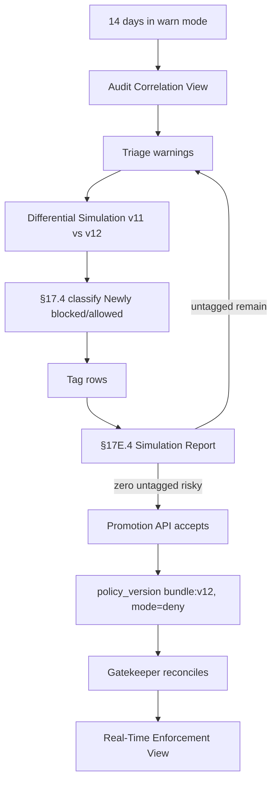

# DT-14 — Switch a Gatekeeper constraint from warn to deny in production

**Personas:** Marcus
**Spec sections:** §9.2 Enforcement Modes, §17.2 Simulation Modes, §17.4 Differential Simulation Semantics, §17E.4 Simulation Report
**Type:** Low-level
**Pre-condition:** Constraint `require-signed-image` for control `SC-IMG-001` has been running in `warn` mode (§9.2) in production for two weeks; warnings have accumulated in the audit store. The previous bundle is `bundle:v11` (dry-run → warn promotion).
**Trigger:** Marcus reaches the planned go/no-go review for switching `require-signed-image` from `warn` to `deny`.

## Steps
1. Marcus opens the Audit Correlation View filtered to `policy_engine = gatekeeper`, `control_id = SC-IMG-001`, mode `warn`, last 14 days; the panel lists every would-be deny.
2. Marcus triages each warning by `outcome_reason` and `resource_id`; legitimate violations are tagged "intended enforcement"; remaining items are either fixed at source or recorded as known exceptions.
3. Marcus runs a Differential Policy Simulation (§17.2) comparing `bundle:v11` (warn) and the candidate `bundle:v12` (deny) over the full 14-day audit dataset.
4. The platform classifies results using the §17.4 matrix: Newly blocked, Newly allowed, No enforcement change, Continued block; each newly blocked row must be tagged `intended enforcement`, `potential false positive`, `requires review`, or `emergency block`.
5. Marcus reviews remaining "potential false positive" rows; he confirms zero remain after fixes, and tags any approved relaxations as `approved exception` linked to a `PolicyException`.
6. Marcus generates the §17E.4 Simulation Report; it records policy version before/after, audit dataset, events evaluated, newly blocked/allowed counts, unchanged counts, tagged intentional changes, untagged risky changes, and false-positive candidates (now zero).
7. Marcus commits the mode change to `deny` in the constraint manifest, bumps `policy_version` to `bundle:v12`, and the pipeline rebuilds and signs the OCI bundle.
8. Promotion API accepts the change because the linked §17E.4 report shows zero untagged risky changes; the Gatekeeper constraint reconciles in production within minutes.
9. Marcus monitors the Real-Time Enforcement View for the first hour; any actual deny is now blocking and emits §13.3 audit events with `decision = deny`.

## Success criteria (testable)
- A differential simulation run exists in the platform comparing `bundle:v11` and `bundle:v12` over the prior 14 days of audit data.
- The §17E.4 report shows zero untagged "newly blocked" rows; all are tagged per §17.4.
- The promotion API rejects the warn-to-deny change while any "potential false positive" row remains untagged.
- After promotion, Gatekeeper events for `SC-IMG-001` carry `policy_version = bundle:v12` and `decision = deny` (not `warn`).
- The constraint's enforcement mode is observable as `deny` via `kubectl get constraint` and the Runtime Enforcement View.

## Flowchart

## Notes
Related: DT-05 (dry-run→warn→enforce), DT-49 (differential simulation), DT-79 (simulation report). The §17E.4 report is the artifact that justifies the mode change in audit.
