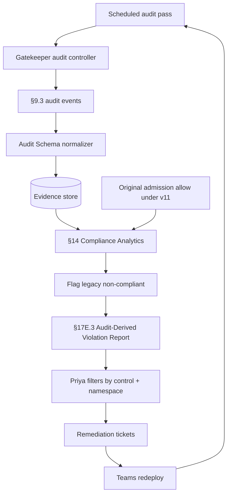

# DT-15 — Use Gatekeeper audit mode for periodic compliance scanning

**Personas:** Marcus, Priya
**Spec sections:** §9.2 Enforcement Modes (Audit), §9.3 Required Audit Fields, §14 Compliance Analytics, §17E.3 Audit-Derived Violation Report
**Type:** Mid-level
**Pre-condition:** Constraint `require-signed-image` was tightened in `bundle:v12` (DT-14) to add a stricter signature-key allowlist. Workloads admitted before promotion were not re-evaluated. Gatekeeper Audit mode (§9.2) runs on a scheduled cadence (e.g. every 6h).
**Trigger:** The scheduled Gatekeeper audit pass runs against the current cluster state and emits violation records for resources that pre-date `bundle:v12`.

## Steps
1. Gatekeeper's audit controller (§9.2 Audit) scans live resources in all namespaces against the active constraints and emits violation entries with the §9.3 required audit fields, including `control_id`, `constraint_name`, `rego_package`, `resource_kind/name`, `namespace`, `cluster`, `policy_version`, `correlation_id`, and `outcome_reason`.
2. The platform ingests Gatekeeper audit events into the Audit Schema Service (§12.2 Gatekeeper Audit Events); the normalizer marks `event_type = "policy.audit.scan"` and `decision = "deny"` (would-deny on existing resource).
3. The Compliance Analytics Engine (§14.1) correlates each audit-scan violation with the resource's original admission event; where the original admission decision was `allow` under `bundle:v11`, the engine flags the resource as "legacy non-compliant".
4. The analytics engine writes a §17E.3 Audit-Derived Violation Report record per resource: violation timestamp, discovery timestamp, source audit log, reconstructed policy input, policy version used for replay (`bundle:v12`), confidence level, missing fields if any, matched `control_id = SC-IMG-001`, recommended remediation ("redeploy with allowlisted signing key").
5. Priya opens the Audit Correlation View and filters by `control_id = SC-IMG-001` and namespace `payments-prod`; the view renders the list of legacy non-compliant Deployments with discovery vs. original-admission timestamps.
6. Priya exports the §17E.3 report for the affected namespaces and assigns remediation tickets to the owning teams via the platform's integration.
7. Marcus tracks remediation: as each Deployment is redeployed under the new signing key, the next Gatekeeper audit pass drops it from the violation list; analytics records the closure timestamp.
8. Priya runs a weekly coverage check; once the violation count for `SC-IMG-001` reaches zero, the control's status flips to "fully enforced + no legacy gap" in the Compliance Analytics dashboard.

## Success criteria (testable)
- Gatekeeper audit-mode violations are present in the evidence store with all §9.3 required audit fields and `event_type = policy.audit.scan`.
- Each legacy violation correlates to an earlier admission `allow` event under an older `policy_version`, demonstrating the policy tightened after admission.
- A §17E.3 Audit-Derived Violation Report can be filtered by `control_id` and `namespace` and includes reconstructed policy input, policy version used for replay, confidence level, and recommended remediation.
- Priya sees only resources in namespaces she is authorized for (§17A namespace-scoped violation visibility).
- When a violating resource is remediated, the next audit pass removes it from the list and analytics records the closure timestamp.

## Flowchart

## Notes
Related: DT-14 (warn→deny switch that created the legacy gap), DT-17 (reconcile audit vs admission), DT-78 (audit-derived violation report for SC-IMG-001).
