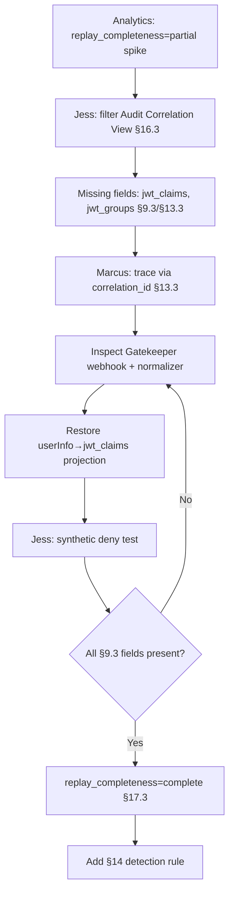

# DT-16 — Investigate a Gatekeeper event missing required audit fields

**Personas:** Marcus (Platform Security Engineer), Jess (SRE / Cluster Operator)
**Spec sections:** §9.3 Required Gatekeeper Audit Fields, §13 Standardized Audit Event Schema, §17.3 Audit-Driven Simulation Requirements
**Type:** Mid-level
**Pre-condition:** Gatekeeper in `cluster-a` enforces constraints linked to `SC-IMG-001`. The Audit Schema Service (§12) ingests events into the §13 replay schema. The Compliance Analytics Engine (§14) computes `replay_completeness` per event.
**Trigger:** The Audit Correlation View (§16.3) shows ~40% of `policy_engine=gatekeeper` events for `cluster-a/payments-prod` reporting `replay_completeness=partial` in the last 24 h.

## Steps
1. Jess opens the Audit Correlation View (§16.3), filters to `cluster-a/payments-prod`, `replay_completeness=partial`. The missing-field summary shows every affected event lacks `jwt_claims` and `jwt_groups` — both required by §9.3.
2. Marcus confirms via Rego Explorer (§16.3) that the `SC-IMG-001` constraint reads `input.review.userInfo.groups`; per §17.3, policies depending on a field absent from the audit record yield incomplete simulations.
3. Marcus correlates by `correlation_id` (§13.3) to the originating admission request. The admission record has `userInfo`; the Gatekeeper-emitted event has empty `jwt_claims`. The gap sits in the Gatekeeper → Audit Schema Service path, not Keycloak.
4. Marcus inspects the Gatekeeper webhook config and normalizer mapping for `cluster-a`. A two-day-old upgrade dropped the `userInfo → jwt_claims` projector via a config-map override.
5. Marcus re-enables the projection (`userInfo.username → subject.sub`, `userInfo.groups → jwt_claims.groups`, plus §15.2 required claims) and reapplies the config.
6. Jess triggers a synthetic deny in `payments-prod` (unsigned image). The new event carries the full §9.3 field set: `jwt_claims`, `jwt_groups`, `control_id=SC-IMG-001`, `constraint_template`, `admission_review_uid`, `correlation_id`.
7. Marcus replays the prior 24 h via §13.2: post-fix events flip to `replay_completeness=complete`; pre-fix events stay `partial` and are tagged a known data-quality gap (§17.3).
8. Marcus adds a §14 rule: alert when `replay_completeness=partial` exceeds 5% of Gatekeeper events per cluster per hour.

## Success criteria (testable)
- New Gatekeeper events from `cluster-a` contain all §9.3 required fields (validator over 1 h sample).
- ≥99% of post-fix Gatekeeper events in `payments-prod` show `replay_completeness=complete`.
- The missing-fields report identifies the affected window and lists `jwt_claims`, `jwt_groups`.
- A §14 rule fires when the partial-completeness ratio crosses the threshold.
- Replay of a pre-fix event still returns `partial`; replay of a post-fix event reconstructs the full §13.3 input authoritatively (§17.3).

## Flowchart

## Notes
Pre-fix events stay partial; simulations relying on them are not authoritative (§17.3).
