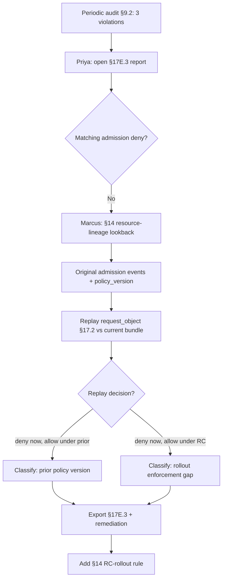

# DT-17 — Reconcile Gatekeeper periodic audit results against admission denies

**Personas:** Priya (Compliance & GRC Lead), Marcus (Platform Security Engineer)
**Spec sections:** §9.2 Enforcement Modes (Audit), §14 Compliance Analytics Engine, §17E.3 Audit-Derived Violation Report
**Type:** Mid-level
**Pre-condition:** Gatekeeper runs mixed mode: `Deny` for new admissions plus periodic `Audit` scans (§9.2) for `SC-IMG-001` ("all images must be signed"). The §14 analytics engine ingests both streams into the §13 replay schema. Priya holds Compliance Analyst, Marcus Platform Governance Admin (§17A.2).
**Trigger:** Today's periodic audit in `cluster-a/payments-prod` reports 3 Deployments violating `SC-IMG-001`, with no matching `decision=deny` admission events in the §17E.2 enforcement report.

## Steps
1. Priya opens the §17E.3 Audit-Derived Violation Report filtered to `SC-IMG-001`, `cluster-a/payments-prod`, last 7 days. It lists Deployments `api`, `worker`, `cron-reaper` with reconstructed policy input and source `gatekeeper.audit`.
2. Priya correlates by `resource_id` (§13.3) into the admission log; no `decision=deny` exists for any of the three within 7 days. The §14.2 Gatekeeper Bypass detector has not fired. She escalates to Marcus.
3. Marcus extends lookback to 90 days via §14 resource-lineage correlation (UID chain + name/namespace). `api` was admitted 42 d ago `allow` under `bundle:v10`; `worker` 60 d ago `allow` under `bundle:v10`; `cron-reaper` 5 d ago `allow` under `bundle:v12-rc1`.
4. Bundle history: `v10` lacked the signed-image annotation check; `v11` added it; `v12-rc1` guarded it with a `warn` feature flag for a 30-minute staged rollout; `v12` re-tightened it.
5. Marcus replays `cron-reaper`'s preserved `request_object` (§17.3) against current `bundle:v12` via §17.2 manifest simulation: `deny` with "Unsigned image prohibited" — confirming `v12` would block it.
6. Classification in the §17E.3 report:
   - `api`, `worker`: admitted under prior policy version. High confidence (lineage matched, prior `allow` present). Remediation: re-deploy signed or attach exception.
   - `cron-reaper`: enforcement gap during `v12-rc1` rollout. High confidence. Remediation: disable warn flag in future RCs; logged as §14 "inconsistent enforcement".
7. Priya exports the §17E.3 report with violation/discovery timestamps, source audit log, reconstructed input, replay policy version, confidence, `control_id`, and remediation. She files tickets.
8. Marcus adds a §14 rule: any periodic-audit violation whose admission record used a non-GA policy version is flagged "rollout enforcement gap".

## Success criteria (testable)
- The §17E.3 report lists all three resources with reconstructed input, source `gatekeeper.audit`, `control_id=SC-IMG-001`.
- Each finding links to its original admission decision and `policy_version` via §14 lineage.
- Replaying `cron-reaper`'s `request_object` against current bundle returns `decision=deny`.
- Each finding is classified "admitted under prior policy version" or "enforcement gap" with confidence.
- A §14 rule flags periodic-audit violations associated with non-GA policy versions.

## Flowchart

## Notes
Lineage-based classification depends on §13.3 `policy_version` being recorded on every admission decision.
