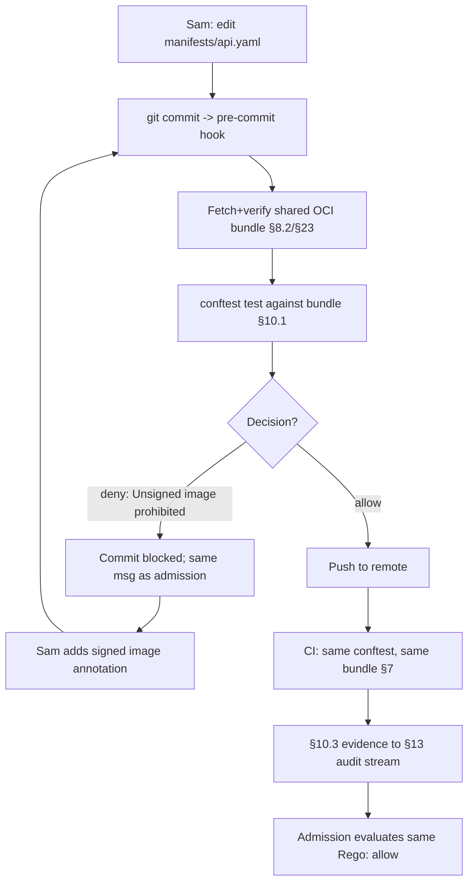

# DT-18 — Run Conftest locally in pre-commit with the shared bundle

**Personas:** Sam (Application Developer)
**Spec sections:** §10 Conftest Integration (§10.1 local + CI execution, §10.3 evidence), §7 Policy Lifecycle (unified, no CI/admission seam)
**Type:** Low-level
**Pre-condition:** The platform publishes a signed OPA bundle as a versioned OCI artifact (§8.2) containing the Rego used by CI Conftest jobs and Gatekeeper constraints (§7). Sam has Developer role (§17A.2) for `payments-dev`. His repo's CI runs `conftest test` against the same bundle reference.
**Trigger:** Sam keeps getting blocked at deploy time by `SC-IMG-001` "Unsigned image prohibited" because local edits to `manifests/api.yaml` only fail in CI or admission. He wants the same check at `git commit`.

## Steps
1. Sam installs the platform-provided pre-commit hook: `pre-commit install` plus the platform `.pre-commit-hooks.yaml` entry wiring Conftest. The hook pins the same OCI bundle reference (repo + digest) CI uses, so local and CI Rego come from one source (§7).
2. On first run the hook fetches the signed bundle to `~/.cache/governance-bundle/<digest>/` and verifies the signature (§23). Later runs are cached.
3. Sam edits `manifests/api.yaml` to add a Deployment without the `cosign.sigstore.dev/imageRef` annotation and runs `git commit`.
4. The hook invokes `conftest test --policy ~/.cache/governance-bundle/<digest>/policy --namespace governance.kubernetes.imagesigning manifests/` (§10.1 local execution against shared policy).
5. Conftest reports `FAIL - manifests/api.yaml - Unsigned image prohibited` — the same `outcome_reason` the Gatekeeper Rego emits at admission. Output carries `control_id=SC-IMG-001`, `policy_package=governance.kubernetes.imagesigning`, `decision=deny` per §10.3.
6. The hook blocks the commit. Sam adds the signed-image annotation, reruns `git commit`. Conftest returns `PASS`; the commit proceeds.
7. Sam pushes; CI runs the same `conftest test` against the same digest, producing a §10.3 `decision=allow` record. Admission evaluates the same Rego and admits — no seam drift across pre-commit, CI, admission (§7).
8. The CI evidence is normalized to §10.3 (`control_id`, `policy_package`, `resource`, `decision`, `evidence_type=build-time`, `pipeline`, `timestamp`) and appended to the §13 audit stream so the §17E.2 report links build-time to runtime admission.

## Success criteria (testable)
- The pre-commit hook references the same bundle digest as CI and Gatekeeper constraints.
- A commit introducing an unsigned-image manifest is blocked locally with the same `outcome_reason` text emitted by the runtime Rego.
- After fix, the manifest passes pre-commit, CI Conftest, and admission with no policy-logic divergence.
- The CI Conftest run emits a §10.3-conformant evidence record reaching the audit stream.
- Sam's local cache holds the verified bundle artifact with matching digest.

## Flowchart

## Notes
Shift-left only works because all three PDPs share one bundle reference (§7); divergence reintroduces the seam.
