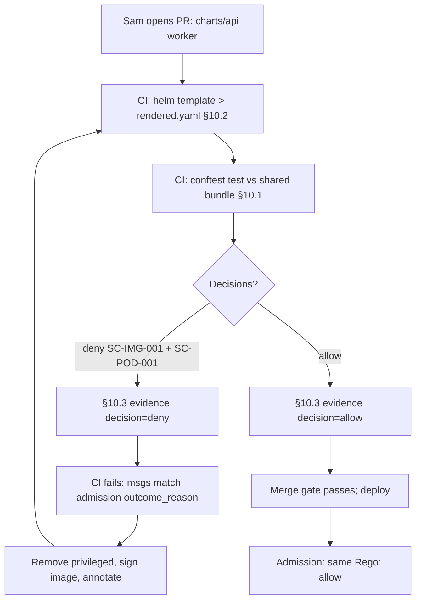

# DT-19 — Conftest validates a Helm chart in CI for production deploy

**Personas:** Sam (Application Developer), Marcus (Platform Security Engineer)
**Spec sections:** §10.2 Supported Inputs (Helm charts), §10.3 Evidence Output, §10.1 Responsibilities
**Type:** Low-level
**Pre-condition:** Marcus maintains the shared bundle including `governance.kubernetes.imagesigning` (`SC-IMG-001`) and `governance.kubernetes.podsecurity` (`SC-POD-001`). Sam's `charts/api` targets `payments-prod`. The GitHub Actions pipeline has a `conftest` step pinned to the bundle's signed OCI digest.
**Trigger:** Sam opens a PR adding a worker sub-chart. It must pass the production-deploy policy gate before merge.

## Steps
1. CI runs `helm template charts/api -f values-prod.yaml > rendered.yaml` so rendered manifests are visible to Conftest (§10.2 Helm via render-then-evaluate).
2. CI runs `conftest test --policy <bundle>/policy --output json rendered.yaml` (§10.1). The bundle's Rego evaluates rendered Deployments, ConfigMaps, Services, and the worker Pod spec.
3. Two policies fail. The worker Pod sets `securityContext.privileged: true` (violates `SC-POD-001`); its image `internal-registry/worker:dev-12` lacks the `cosign.sigstore.dev/imageRef` annotation (violates `SC-IMG-001`). Conftest exits non-zero; CI fails.
4. CI emits one §10.3 evidence record per failure:
   ```json
   {
     "control_id": "SC-IMG-001",
     "policy_package": "governance.kubernetes.imagesigning",
     "resource": "deployment/api-worker",
     "decision": "deny",
     "evidence_type": "build-time",
     "pipeline": "github-actions",
     "timestamp": "2026-05-12T10:14:22Z"
   }
   ```
   plus a matching `SC-POD-001` record. Both carry a `correlation_id` for the CI run.
5. The CI job summary surfaces control IDs, packages, violating resources, and `outcome_reason` strings ("Unsigned image prohibited", "Privileged container not permitted") — the same Sam would see at admission (§7).
6. Sam removes `privileged: true` from the worker `securityContext`, swaps to the signed production image tag with the required annotation in the chart's pod template, and pushes a new commit.
7. CI re-renders and re-runs Conftest. Both rules now `allow`; the §10.3 record reports `decision=allow` per control. CI passes.
8. The merge gate consumes the build-time evidence; Marcus's review dashboard (§17E.2 enforcement report aggregated with build-time records) shows both control decisions on the PR. The PR merges; admission re-evaluates the same Rego and admits.

## Success criteria (testable)
- `helm template` runs before Conftest so it evaluates rendered manifests (§10.2 Helm).
- A chart with a privileged container or unsigned image fails CI with non-zero exit and a clear per-control error.
- Each Conftest failure produces a §10.3-conformant evidence record (control_id, policy_package, resource, decision, evidence_type, pipeline, timestamp).
- The pass-run produces `allow` evidence correlated to the same PR.
- CI denial messages match the `outcome_reason` strings emitted by admission Rego for the same package (no seam drift).

## Flowchart



## Notes
Conftest provides build-time prevention (§7.2); shared Rego ensures parity with the runtime Gatekeeper decision.
