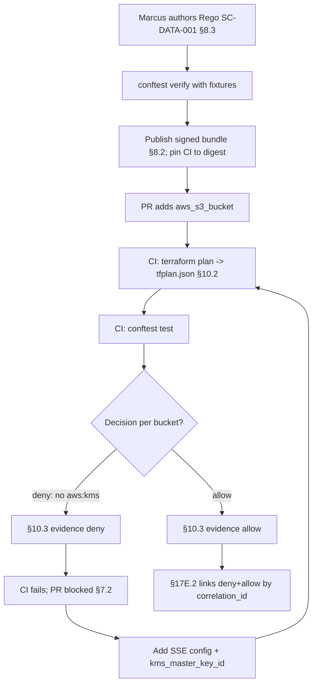

# DT-20 — Conftest validates a Terraform plan against a Gemara control

**Personas:** Marcus (Platform Security Engineer)
**Spec sections:** §10.2 Supported Inputs (Terraform plans), §10.3 Evidence Output, §7.2 Enforcement Classes (Build-Time)
**Type:** Low-level
**Pre-condition:** Gemara control `SC-DATA-001`: "All AWS S3 buckets storing regulated data must enforce server-side encryption with a customer-managed KMS key." Enforcement class Build-Time (§7.2). Shared bundle (§8.2) hosts Rego `governance.aws.s3.encryption` mapped to `SC-DATA-001`. CI runs `terraform plan` and emits JSON via `terraform show -json`.
**Trigger:** A developer's PR adds two `aws_s3_bucket` resources for regulated data; CI must fail any plan that does not enforce KMS encryption.

## Steps
1. Marcus authors `governance.aws.s3.encryption` with §8.3 metadata (`__control_id__ := "SC-DATA-001"`, `__severity__ := "high"`, `__governance_domain__ := "data-governance"`). The rule walks `input.resource_changes[]` for `type == "aws_s3_bucket"` and requires a sibling `aws_s3_bucket_server_side_encryption_configuration` with `sse_algorithm == "aws:kms"` and `kms_master_key_id` set.
2. Marcus adds fixture pairs in `tests/` (compliant and non-compliant plan JSON) and runs `conftest verify --policy policy/ tests/` to confirm correct allow/deny.
3. Marcus publishes the updated bundle as a signed OCI artifact (§8.2) and pins CI to its digest.
4. CI on the PR: `terraform plan -out=tfplan` → `terraform show -json tfplan > tfplan.json` → `conftest test --policy <bundle>/policy --namespace governance.aws.s3.encryption tfplan.json` (§10.2).
5. The plan creates `regulated-logs` (no encryption block) and `regulated-archive` (`sse_algorithm = "AES256"`, no KMS key). Conftest returns `FAIL` for both with `outcome_reason` strings; CI exits non-zero.
6. CI emits one §10.3 evidence record per violation:
   ```json
   {
     "control_id": "SC-DATA-001",
     "policy_package": "governance.aws.s3.encryption",
     "resource": "aws_s3_bucket.regulated-logs",
     "decision": "deny",
     "evidence_type": "build-time",
     "pipeline": "github-actions",
     "timestamp": "2026-05-12T11:02:00Z"
   }
   ```
   plus an identical record for `regulated-archive`. Records carry a shared `correlation_id` and are appended to the §13 audit stream.
7. PR blocked. The author adds `aws_s3_bucket_server_side_encryption_configuration` with `sse_algorithm = "aws:kms"` and `kms_master_key_id = aws_kms_key.regulated.arn` on both buckets. CI re-plans; Conftest returns `allow`; CI passes.
8. Marcus reviews build-time evidence in the §17E.2 report filtered to `SC-DATA-001`. Both deny and later allow records appear, tied to the PR via `correlation_id` — pre-merge evidence of `SC-DATA-001` enforcement (§7.2).

## Success criteria (testable)
- Rego `governance.aws.s3.encryption` declares `__control_id__ == "SC-DATA-001"` (§8.3).
- `conftest verify` passes (compliant fixture allow; non-compliant fixture deny).
- A plan with an `aws_s3_bucket` lacking `aws:kms` encryption causes CI to exit non-zero.
- One §10.3-conformant record per violating resource with `evidence_type=build-time`.
- After remediation, the same plan yields `decision=allow` records for the same resources.
- The §17E.2 report links deny and allow records to the PR via `correlation_id`.

## Flowchart



## Notes
Build-time prevention (§7.2) keeps non-compliant buckets from being applied; no AWS admission webhook exists as fallback.
