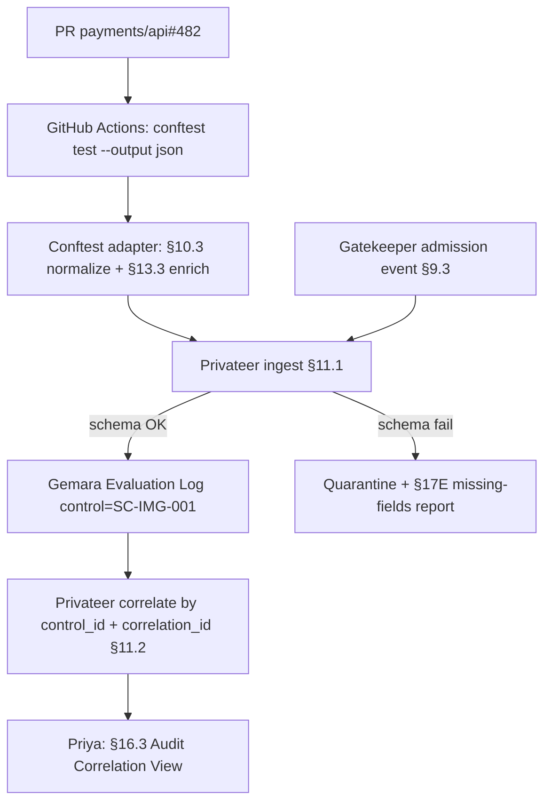

# DT-21 — Normalize Conftest output to the canonical evidence schema

**Personas:** Marcus (Platform Security Engineer), Priya (Compliance & GRC Lead)
**Spec sections:** §10.3 Conftest Evidence Output, §11.1 Privateer Responsibilities, §11.2 Evidence Correlation, §13.3 Required Core Fields
**Type:** Low-level
**Pre-condition:** A signed Rego bundle implementing control `SC-IMG-001` (Prevent unsigned workloads, §18.1) is published to OCI; the same bundle is consumed by Conftest in CI and by Gatekeeper at admission; Privateer (§11) is wired to ingest both feeds.
**Trigger:** A GitHub Actions pipeline runs Conftest against a Kubernetes manifest in PR `payments/api#482`; Conftest produces evidence that must reach Privateer in the canonical shape required by §10.3.

## Steps
1. Marcus configures the CI step `conftest test --output json --policy oci://registry.example/bundles/sc-img:v12 manifests/` against the same bundle Gatekeeper consumes (§7 unified lifecycle).
2. Conftest evaluates `deployment/api-server` and flags the missing `cosign.sigstore.dev/imageRef` annotation. The Conftest adapter (§10.1 "produce normalized evidence") emits a JSON record matching §10.3 exactly:
   ```json
   {
     "control_id": "SC-IMG-001",
     "policy_package": "governance.kubernetes.imagesigning",
     "resource": "deployment/api-server",
     "decision": "deny",
     "evidence_type": "build-time",
     "pipeline": "github-actions",
     "timestamp": "2026-05-12T00:00:00Z"
   }
   ```
3. The adapter enriches the record with §13.3 core fields it can derive from CI context: `event_id` (UUID per evaluation), `policy_engine: "conftest"`, `policy_version` (bundle digest), `rego_package` (= `policy_package`), `resource_type: "Deployment"`, `resource_id` (repo + ref + path), `subject` (GitHub Actions OIDC token claims), `operation: "ci.policy.evaluate"`, `correlation_id` (PR + commit SHA).
4. The adapter publishes the enriched event to the Privateer ingest endpoint. Privateer validates the §13.3 schema; events missing required core fields are quarantined and surfaced in the §17E "Missing audit fields" report.
5. Privateer (§11.2) keys the event by `control_id = SC-IMG-001` and writes it to the Gemara Evaluation Log (§11.1). The build-time evidence is now retrievable alongside Gatekeeper audit events and OPA decisions for the same control.
6. Later that day the PR merges and a deploy admission for the same workload reaches Gatekeeper. Gatekeeper emits an admission audit event (§9.3) with `control_id: SC-IMG-001` and a matching `correlation_id` derived from the commit SHA.
7. Privateer (§11.2) correlates the Conftest `evidence_type: build-time` record with the Gatekeeper admission event by `correlation_id` and `control_id`, producing a single linked evaluation chain.
8. Priya opens the Governance Console (§16.3 Audit Correlation View), filters by `SC-IMG-001`, and sees both the build-time deny and the matching admission decision against the same workload — closing the "Conftest in CI vs. Gatekeeper at admission drift" gap she previously bridged by hand.

## Success criteria (testable)
- Conftest output emitted by the CI step contains every §10.3 field with correct values and types.
- Privateer rejects (and reports) any record missing §13.3 required core fields, with reason `missing_required_field`.
- A query for `control_id = SC-IMG-001` in Privateer returns the build-time event and the admission event linked by a shared `correlation_id`.
- The Audit Correlation View renders both events on a single timeline keyed by control and resource.
- Re-running the CI step is idempotent: same `event_id` is not duplicated; a new `event_id` per evaluation run is stored.

## Flowchart



## Notes
DT-19 covers the upstream Helm-chart CI integration; DT-27 covers external-data version drift in the same bundle.
