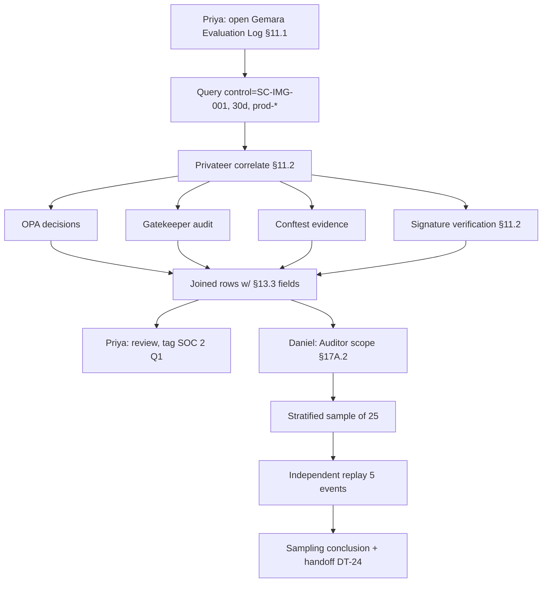

# DT-22 — Privateer evaluation log for one control over 30 days

**Personas:** Priya (Compliance & GRC Lead), Daniel (Internal/External Auditor)
**Spec sections:** §11.1 Privateer Responsibilities, §11.2 Evidence Correlation, §13.3 Required Core Fields, §17A.2 Auditor role
**Type:** Mid-level
**Pre-condition:** Control `SC-IMG-001` (Prevent unsigned workloads, §18.1) has been enforced for >30 days across the production fleet. Privateer (§11) is ingesting OPA decision logs, Gatekeeper audit events, Conftest evidence, and Sigstore/cosign signature-verification evidence. Priya holds Compliance Analyst scope and Daniel holds Auditor scope (§17A.2) for the relevant tenants.
**Trigger:** Priya is preparing the quarterly SOC 2 walkthrough for image signing; Daniel needs a sampling frame for operating-effectiveness testing of `SC-IMG-001`.

## Steps
1. Priya opens the Governance Console (§16) and navigates to the Gemara Evaluation Log view (§11.1). She filters: `control_id = SC-IMG-001`, time range `2026-04-12 → 2026-05-12`, scope `cluster:prod-*`.
2. Privateer executes the query against its correlated store and returns one row per evaluation with the §11.2 sources joined: Gemara control linkage, OPA decision ID, Gatekeeper admission event UID, any matching Conftest build-time record (DT-21), and the Sigstore signature-verification result that the Rego consumed (recorded as an `external_data_refs` entry per §13.3).
3. The view renders 4,217 evaluations: 4,205 allow, 12 deny, 0 `unknown`. Each row exposes `event_id`, `timestamp`, `policy_version`, `resource_id`, `subject`, `decision`, `outcome_reason`, `correlation_id`, and `replay_completeness` (§13.3).
4. Priya drills into the 12 deny rows; each links to an approved §17B exception (linked artifact: `PolicyException` CRD) or to a developer remediation. She tags the log view "SOC 2 Q1 evidence — SC-IMG-001" and pins it to the control card.
5. Daniel logs in under the Auditor role (§17A.2 — read-only, scoped to the audit period). He opens the same evaluation log via the Governance API (§21) using a token whose scope is constrained to `control_id=SC-IMG-001` and the agreed period.
6. Daniel uses the built-in sampling helper to draw a statistically valid sample of 25 events stratified by week and decision. For each sampled event he expands the row to view the §13.3 fields, the reconstructed policy input, and the correlated Conftest + Gatekeeper records (§11.2).
7. Daniel cross-checks five sampled events by independently re-executing the deployed policy version against the preserved input (§17.4 differential semantics path) and confirms each replay reproduces the original decision with `replay_completeness = complete`.
8. Daniel records his sampling conclusions; Priya exports the underlying population evidence for workpapers (handoff to DT-24 for the signed evidence package).

## Success criteria (testable)
- The Privateer log returns one row per evaluation with all §11.2 source links populated where the source produced an event for that evaluation.
- Every row carries the §13.3 required core fields; rows with `replay_completeness != complete` are visibly flagged.
- The Auditor token cannot return events outside `control_id = SC-IMG-001` or the agreed time window (storage-layer enforcement per §17A.5).
- Aggregate counts (allow / deny / unknown) reconcile to the underlying source counts within Privateer; any delta surfaces as a §17E "Missing audit fields" item.
- The sampling helper produces a reproducible, seedable sample with documented stratification.

## Flowchart

## Notes
DT-24 covers the signed export Priya prepares for workpapers; HL-05 frames the wider audit engagement.
