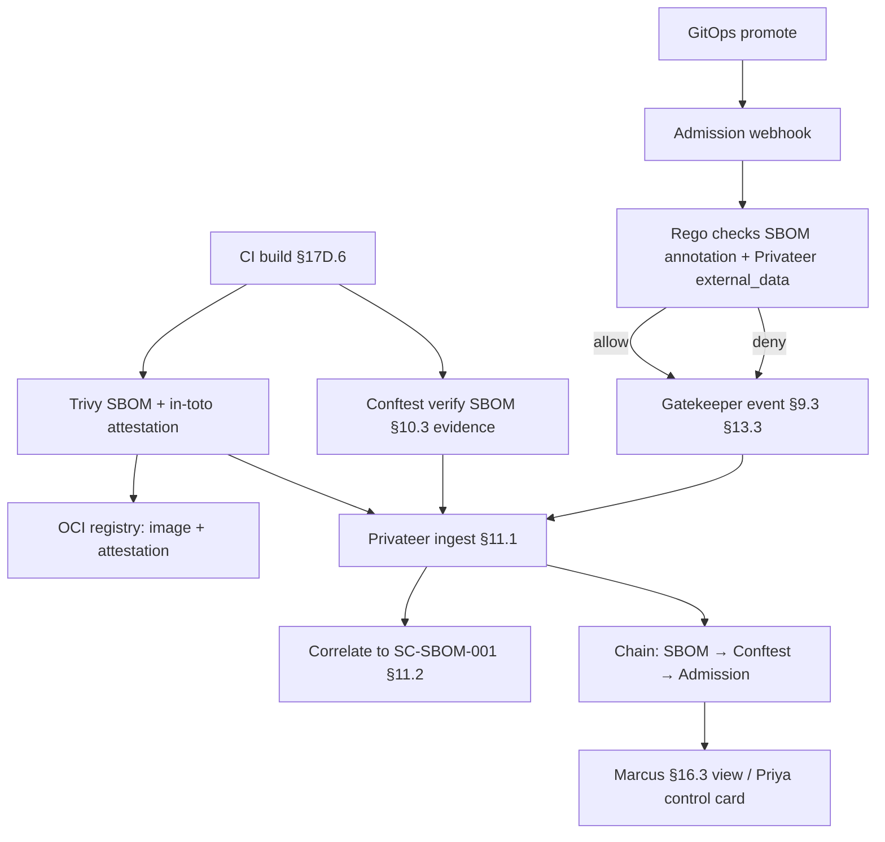

# DT-23 — Correlate SBOM attestation to a Gemara supply-chain control

**Personas:** Marcus (Platform Security Engineer), Priya (Compliance & GRC Lead)
**Spec sections:** §11.2 Evidence Correlation (SBOM attestations), §17D.6 Trivy Library (SBOM generated → "Production artifact must have SBOM"), §10.3 Conftest evidence, §13.3 audit fields
**Type:** Mid-level
**Pre-condition:** Gemara control `SC-SBOM-001` ("Production artifact must have SBOM", per §17D.6) exists with enforcement class "build-time + admission". Trivy is wired into the build pipeline to emit a CycloneDX SBOM and a signed in-toto attestation. The admission Rego in the shared bundle checks for the SBOM annotation `sbom.example.com/attestation-digest` on production deployments.
**Trigger:** The `payments/api` build pipeline produces a new image tag for promotion to `payments-prod`; Marcus needs Privateer to correlate the SBOM attestation to `SC-SBOM-001` end-to-end, and Priya needs continuous evidence that the control fired.

## Steps
1. The CI pipeline runs Trivy (`trivy image --format cyclonedx ...`) and produces an SBOM artifact (§17D.6 row "SBOM generated"). The build step signs the SBOM as an in-toto attestation and pushes it to the OCI registry alongside the image (subject digest = image digest).
2. A Conftest step in the same pipeline validates "SBOM artifact present and signed for this image digest" against the shared bundle. It emits a §10.3-normalized record with `control_id: SC-SBOM-001`, `policy_package: governance.supplychain.sbom`, `decision: allow`, `evidence_type: build-time`, plus §13.3 enrichment (`policy_version`, `correlation_id` = commit SHA, `external_data_refs` referencing the attestation digest).
3. Privateer (§11.1) ingests the Conftest record and the SBOM attestation. Per §11.2, Privateer correlates: governance control `SC-SBOM-001` ↔ Conftest evaluation ↔ SBOM attestation ↔ image digest.
4. GitOps promotes the image. The Kubernetes admission webhook evaluates the Deployment. The Rego checks the `sbom.example.com/attestation-digest` annotation and verifies that the annotation digest matches an attestation Privateer has recorded against `SC-SBOM-001` for this image (via external_data lookup).
5. Gatekeeper emits an admission audit event (§9.3, §13.3) with `control_id: SC-SBOM-001`, `decision: allow`, `external_data_refs: [{name: "sbom-attestation-status", version: <digest>}]`, `correlation_id` carrying the same commit SHA used at build time.
6. Privateer correlates the admission event with the earlier Conftest evaluation and SBOM attestation by `correlation_id` and image digest (§11.2), producing a single chain: SBOM produced → Conftest verified → admission verified.
7. Marcus opens the §16.3 Audit Correlation View, selects `SC-SBOM-001`, and confirms the three-link chain for the new release; a negative test (deploying an image without an SBOM attestation to staging) returns `decision: deny` and produces the symmetric chain ending in a Gatekeeper deny.
8. Priya views `SC-SBOM-001` on her control card and sees population-level coverage: count of production admissions, count of build-time evaluations, count of admissions with matching SBOM attestation.

## Success criteria (testable)
- For each production deployment, Privateer can return all four linked records: Gemara control `SC-SBOM-001`, Conftest build-time evidence, SBOM attestation, admission audit event.
- An image lacking an SBOM attestation produces a Gatekeeper `deny` with `control_id: SC-SBOM-001` and outcome_reason naming the missing attestation.
- The `correlation_id` and image digest tie the build-time and admission-time events; Privateer rejects any admission "allow" for `SC-SBOM-001` whose `external_data_refs` cannot be resolved to a stored attestation.
- The Audit Correlation View renders the chain on a single timeline for any selected deployment.
- Counts on Priya's control card reconcile: admissions evaluated == build evaluations + zero unmatched admissions.

## Flowchart

## Notes
DT-21 covers the Conftest normalization path reused here; HL-02 frames the broader supply-chain rollout.
