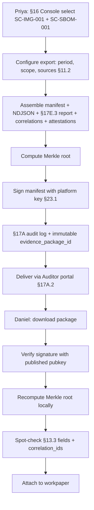

# DT-24 — Export a signed Privateer evidence package for an audit

**Personas:** Priya (Compliance & GRC Lead), Daniel (Internal/External Auditor)
**Spec sections:** §11.1 Privateer Responsibilities, §11.2 Evidence Correlation, §17E.1 Report Categories, §17E.3 Audit-Derived Violation Report, §23.1 Evidence integrity, §17A.2 Auditor role
**Type:** Low-level
**Pre-condition:** Privateer (§11) holds correlated evidence for `SC-IMG-001` (§18.1) and `SC-SBOM-001` (§17D.6) covering 2026-01-01 → 2026-03-31 across production clusters. Priya holds Compliance Analyst scope and Daniel holds Auditor scope (§17A.2) for those controls and period. The platform signing key is provisioned and its public key is published.
**Trigger:** Priya has finished her Q1 review (handoff from DT-22) and needs to hand Daniel a tamper-evident package he can verify independently for SOC 2 workpapers.

## Steps
1. Priya opens the Governance Console (§16), selects control cards `SC-IMG-001` and `SC-SBOM-001`, and invokes "Export evidence package": period `2026-01-01..2026-03-31`, scope `cluster:prod-*`, include Gemara Evaluation Logs (§11.1), Audit-Derived Violation Report (§17E.3), and §11.2 correlated source records (OPA decisions, Gatekeeper audit events, Conftest evidence, SBOM attestations, signature-verification).
2. The platform assembles: (a) `manifest.json` listing controls, period, scope, row counts per source, and Privateer query hash; (b) `evaluations/` with one NDJSON file per control of §13.3-conformant rows; (c) `reports/audit-derived-violations.json` per §17E.3; (d) `correlations/` linking artifacts by `correlation_id` per §11.2; (e) `attestations/` with SBOM in-toto attestations referenced by `external_data_refs`.
3. The platform computes a Merkle root over package contents (per-file SHA-256 leaves), writes `merkle.json`, and signs `manifest.json` (embedding the Merkle root, key id, signing timestamp, and policy-bundle versions in scope) with the platform signing key (§23.1 evidence integrity).
4. The platform records an §17A audit log entry for the export (actor=Priya, scope, package digest), assigns an immutable `evidence_package_id`, and delivers via the Auditor portal (§17A.2 read-only scoped access).
5. Daniel fetches the platform public key out-of-band from the published well-known URL and verifies the signature on `manifest.json` using a standard tool (e.g., `cosign verify-blob`) on his own workstation — no platform code involved.
6. Daniel recomputes the Merkle root locally and compares it to the value embedded in the signed `manifest.json`. Any byte-level tampering fails the comparison.
7. Daniel spot-checks: he selects 5 events from `evaluations/SC-IMG-001.ndjson`, confirms each row carries the §13.3 required core fields, and that its `correlation_id` resolves in `correlations/` to matching Gatekeeper and Conftest records (§11.2). He attaches `evidence_package_id`, signed manifest, and verification log to the workpaper.
8. Priya retains the `evidence_package_id` on the control card so any re-request returns the byte-identical package.

## Success criteria (testable)
- The exported package contains every artifact class listed in step 2, with row counts in `manifest.json` matching file contents exactly.
- Signature verification on `manifest.json` against the published public key succeeds; modifying any byte in any package file causes Merkle-root recomputation to disagree with the signed root.
- The Auditor-scoped download enforces §17A.5 storage-layer scoping: requests for events outside `SC-IMG-001`/`SC-SBOM-001` or the agreed period are not retrievable through the package URL.
- Each event in `evaluations/*.ndjson` validates against the §13.3 schema; every `correlation_id` referenced resolves within `correlations/`.
- Re-downloading by `evidence_package_id` returns a byte-identical package and the same signature.

## Flowchart

## Notes
DT-22 produces the underlying evaluation log; HL-05 frames the broader SOC 2 Type II engagement that consumes this package.
