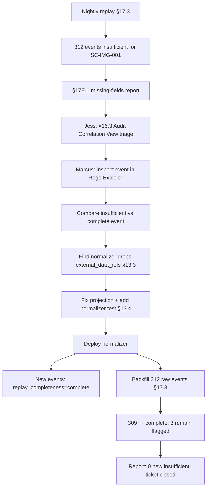

# DT-25 — Diagnose a `replay_completeness = insufficient` event

**Personas:** Marcus (Platform Security Engineer), Jess (SRE / Cluster Operator)
**Spec sections:** §13.1 Design Principle, §13.3 Required Core Fields (`external_data_refs`, `replay_completeness`), §13.4 Example Replay-Capable Event, §17.3 Audit-Driven Simulation Requirements, §17E.1 Report Categories ("Missing audit fields")
**Type:** Mid-level
**Pre-condition:** The platform replays historical Gatekeeper admission events nightly against the deployed bundle for `SC-IMG-001` (§18.1). The Rego depends on the `image-signature-status` external data source (per §13.4). The audit pipeline normalizes Gatekeeper events into the §13 schema before storage. The §17E.1 "Missing audit fields" report is enabled.
**Trigger:** Last night's replay produced 312 events tagged `replay_completeness = insufficient` for `SC-IMG-001`; the §17E.1 report flags them and Jess pages Marcus.

## Steps
1. Jess opens the §16.3 Audit Correlation View, filters `control_id = SC-IMG-001` and `replay_completeness = insufficient`, and confirms the 312 events all originate from `prod-east-2` between 02:14 and 04:00 UTC. She tags the cluster and time window to Marcus.
2. Marcus inspects a representative event in the Rego Explorer (§16.3). It matches the §13.4 example except `external_data_refs` is empty. Per §13.1, a replay record lacking information used by the original engine cannot produce an authoritative result — so the replayer correctly marked it `insufficient` rather than authoritative allow/deny (§17.3 final paragraph).
3. Marcus traces the audit pipeline: Gatekeeper → audit-webhook collector → normalizer → store. He compares an `insufficient` event with a `complete` event from `prod-east-1` for the same control: the `external_data_refs` field is dropped during normalization in the affected window.
4. Marcus reviews the normalizer config in Git. A merge from the previous afternoon refactored the field map and omitted `providers.image-signature-status` from the `external_data_refs` projection. The §17.3 requirement to preserve "external data references … and version or digest" is unmet.
5. Marcus opens a fix PR restoring the projection and adds a normalizer unit test (sampled from a bad event) asserting `external_data_refs[0].name == "image-signature-status"` with a populated version/digest. He runs Conftest against the normalizer config to keep §13.3 fields enforced going forward.
6. Marcus deploys the fix (rolling restart of the normalizer). Jess confirms post-deploy events carry populated `external_data_refs` and `replay_completeness = complete`.
7. Marcus backfills: re-normalize the 312 stored raw Gatekeeper events for the affected window (raw events retained per §17.3). 309 resolve to `complete`; 3 remain `insufficient` because their raw external-data response was not retained — these stay flagged for §17E.3 follow-up rather than promoted.
8. The §17E.1 missing-fields report shows 0 new `insufficient` events; Jess closes the ticket and Marcus links the PR to the §17A audit log entry.

## Success criteria (testable)
- The Audit Correlation View can list events by `replay_completeness` (`complete`, `partial`, `insufficient`) per §13.3.
- Any normalized event whose Rego decision consulted `image-signature-status` has a non-empty `external_data_refs` with `name` and `version`/digest (§13.3, §17.3).
- A regression test exercises the normalizer end-to-end and fails if `external_data_refs` for `image-signature-status` is dropped.
- After fix deployment, new events for `SC-IMG-001` emit `replay_completeness = complete` and zero new `insufficient` events appear in the §17E.1 missing-fields report.
- Backfilled events whose raw external-data response was retained successfully transition to `complete`; events whose raw data was lost stay flagged rather than being silently promoted (§13.1).

## Flowchart

## Notes
DT-27 covers external-data version drift (different failure mode); DT-16 covers missing-fields at the Gatekeeper source rather than the normalizer.
