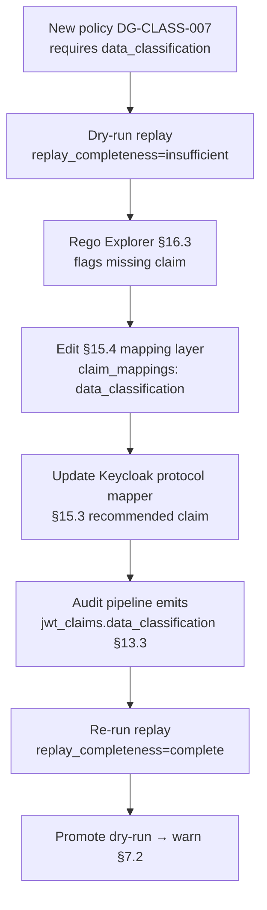

# DT-26 — Add a new JWT claim into audit events for a new policy

**Personas:** Marcus (Platform Governance Admin)
**Spec sections:** §13.3 Required Core Fields (jwt_claims), §15.2 Required JWT Claims, §15.3 Recommended Custom Claims, §15.4 JWT-to-Policy Mapping Layer, §16.3 Rego Explorer
**Type:** Low-level
**Pre-condition:** A new Gemara control `DG-CLASS-007` ("regulated data workloads require approved subjects") is in `dry-run` (§7.2). Its Rego references `input.subject.data_classification`, which is not currently surfaced by the Keycloak mapping layer (§15.4). The §15.2 required claims are all present in tokens; `data_classification` (§15.3) is recommended but absent.
**Trigger:** Marcus runs replay on the first 24 hours of dry-run events; `replay_completeness` (§13.3) returns `insufficient` for every event because `jwt_claims.data_classification` is missing.

## Steps
1. Marcus opens the Rego Explorer (§16.3) for the new policy. The "Required JWT Claims" panel lists `sub`, `tenant`, `groups`, and `data_classification`; the last is flagged red ("not provided by mapping layer").
2. Marcus inspects three dry-run audit events in the Audit Correlation View. Each has `replay_completeness=insufficient` and `outcome_reason` includes "missing input: subject.data_classification" — confirming §17.3's rule that missing policy inputs degrade replay.
3. Marcus edits the §15.4 mapping layer config to expose the claim:
   ```yaml
   claim_mappings:
     data_classification:
       source: resource_access.platform.attributes.data_classification
       transform: lowercase
   ```
   He commits the change and the platform's mapping-layer test fixture confirms the value resolves to `restricted | confidential | public` for representative subjects.
4. Marcus updates the Keycloak realm protocol mapper so the claim is issued in the JWT (kept as a §15.3 *recommended* claim, not added to §15.2 required for global tokens; only the platform mapping layer requires it for this policy).
5. Marcus re-runs replay over the same 24-hour dry-run dataset. New replay-capable events include `jwt_claims.data_classification` and `replay_completeness=complete`.
6. The Rego Explorer "Required JWT Claims" panel for `DG-CLASS-007` turns green. Marcus promotes the constraint from `dry-run` to `warn` (§7.2) once dry-run replay outcomes match expectation.

## Success criteria (testable)
- After the mapping-layer change, every new audit event from the `DG-CLASS-007` enforcement point includes a non-empty `jwt_claims.data_classification` value.
- Replay over the same audit dataset transitions from `replay_completeness=insufficient` to `replay_completeness=complete` for ≥99% of events.
- The Rego Explorer panel for the policy reports zero missing required claims.
- The mapping-layer config change is recorded as a versioned governance artifact (§7 lifecycle history) with actor JWT and timestamp.
- Tokens issued to subjects outside the policy's scope continue to validate (no regression in §15.2 required claims).

## Flowchart



## Notes
Related: DT-25 (diagnose insufficient replay), DT-35 (add claim to realm), HL-16 (Keycloak-driven claim evolution). The mapping layer is the contract surface; Rego policies depend on the *normalized* subject, not the raw token.
