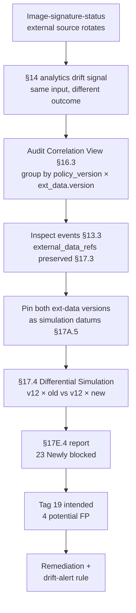

# DT-27 — Track `external_data_refs` version drift for image-signature checker

**Personas:** Marcus (Platform Governance Admin)
**Spec sections:** §13.3 Required Core Fields (external_data_refs), §17.3 Audit-Driven Simulation Requirements (external data version/digest), §17.4 Differential Simulation Semantics, §14.1 Compliance Analytics, §14.2 Example Detections
**Type:** Mid-level
**Pre-condition:** Control `SC-IMG-001` ("Unsigned workloads prohibited") is enforced via Gatekeeper on `bundle:v12`. Its Rego consults an `image-signature-status` external data source recorded as `external_data_refs[*].version` in every event (§13.3). The source rotated from `2026-05-10` to `2026-05-11`.
**Trigger:** The §14 analytics engine raises a drift signal: for the same `image_digest` policy input, decisions changed from `allow` to `deny` after the rotation, even though `policy_version=bundle:v12` is unchanged.

## Steps
1. Marcus opens the Audit Correlation View (§16.3) filtered to `control_id=SC-IMG-001` for the last 48 hours. He groups by (`policy_version`, `external_data_refs[name=image-signature-status].version`).
2. The grouped view shows four cells: `(v12, 2026-05-10)`, `(v12, 2026-05-11)`, plus two replay-only rows. For 23 distinct image digests, the same (`policy_version=v12`, image_digest) pair produces `allow` under `2026-05-10` and `deny` under `2026-05-11` — classic external-data drift, not policy drift.
3. Marcus inspects three sample events. `replay_completeness=complete` in all cases; only `external_data_refs[*].version` differs, satisfying §17.3 (external data version must be preserved for authoritative replay).
4. Marcus pins both external-data versions as named simulation datums and launches a §17.4 Differential Simulation on the 23 events: `(v12, ext=2026-05-11)` vs `(v12, ext=2026-05-10)`.
5. The §17E.4 report shows 23 events in the `Allow → Deny` quadrant. Marcus tags 19 as `Intended enforcement` (signatures expired/revoked) and 4 as `Potential false positive` (signer-cert rotation gap on the data-source side).
6. Marcus files remediation for the 4 false positives with the data-source owner, notifies image owners for the 19, and preserves the pinned digest in the simulation dataset (§17A.5) as evidence.
7. Marcus adds an analytics rule alerting when a fixed (`policy_version`, `image_digest`) pair flips outcome across `external_data_refs.version` boundaries.

## Success criteria (testable)
- Audit events for `SC-IMG-001` include `external_data_refs[name=image-signature-status].version` populated per §13.3 in 100% of decisions.
- The analytics drift alert fires when ≥1 (`policy_version`, `resource_id`) pair flips outcome across an `external_data_refs.version` change with no policy change.
- The §17.4 differential simulation report classifies all 23 events as `Newly blocked` and produces the 19/4 tagging breakdown.
- The pinned simulation dataset is reproducible: re-running it later yields identical decisions for the same (policy_version, external_data_version) tuple.
- The remediation ticket links back to the simulation `correlation_id` and the original audit events.

## Flowchart

## Notes
Related: DT-25 (replay completeness), DT-32 (cross-cluster enforcement consistency). External data version is part of the replay contract; treating it as policy-equivalent is the spec's design choice in §17.3.
