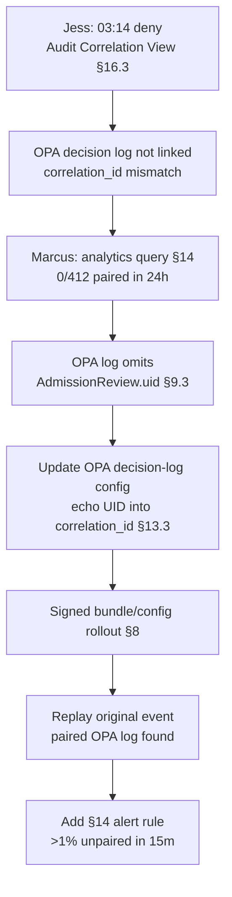

# DT-28 — Investigate a missing `correlation_id` between Gatekeeper and OPA

**Personas:** Jess (SRE / Cluster Operator), Marcus (Platform Governance Admin)
**Spec sections:** §9.3 Required Audit Fields (Correlation ID, Admission Review UID), §13.3 Required Core Fields (correlation_id), §14.1 Compliance Analytics, §16.3 Audit Correlation View, §17.3 Audit-Driven Simulation Requirements
**Type:** Mid-level
**Pre-condition:** Gatekeeper is configured with the platform's audit sink emitting §9.3 fields including `Admission Review UID`. The embedded OPA decision-log sink is enabled but its `decision_id` is generated independently of admission UIDs. Both streams normalize into the §13 replay schema.
**Trigger:** Jess investigates a `payments-prod` admission deny from 03:14 UTC. The Gatekeeper event has `correlation_id=abc-123` but searching OPA decision logs for that ID returns zero matches — she cannot tie the deny to the underlying Rego decision.

## Steps
1. Jess opens the Audit Correlation View (§16.3) for the Gatekeeper event. The detail panel shows the §9.3 fields populated (cluster, namespace, constraint name, JWT subject) but the "Linked OPA decision" tile reads "no match". She pages Marcus.
2. Marcus runs an analytics query: among the last 24 hours of Gatekeeper denies, how many have a paired OPA decision log via `correlation_id`? Result: 0 of 412. The §14 engine has been flagging these as `replay_completeness=partial` because the input-side OPA log is unreachable for replay.
3. Marcus inspects the OPA decision-log config and confirms the gap: OPA emits its own `decision_id` but does not echo the inbound `AdmissionRequest.uid`. Per §9.3, that UID is the canonical correlation anchor; per §13.3 it must populate `correlation_id` across both streams.
4. Marcus updates the OPA decision-log configuration so each entry carries the inbound Admission Review UID in its `correlation_id` (and keeps `decision_id` as a secondary identifier). He ships the change via the standard bundle/config rollout, signed and versioned.
5. After rollout, Marcus replays Jess's original event: the Gatekeeper `correlation_id=abc-123` now matches an OPA decision log with the full normalized input, JWT claims, and Rego trace. Jess closes the triage ticket.
6. Marcus adds a §14 analytics rule: alert when >1% of Gatekeeper denies in any rolling 15-minute window lack a paired OPA decision log by `correlation_id`. He backfills the 412 prior events as `correlation_id_recovered=false` so they are visible as a known gap.

## Success criteria (testable)
- After the config rollout, ≥99% of Gatekeeper deny events in any 15-minute window have a paired OPA decision log discoverable by `correlation_id` (= Admission Review UID).
- New events have `replay_completeness=complete` instead of `partial` for the OPA-input portion of the replay.
- The Audit Correlation View "Linked OPA decision" tile resolves to a clickable record for the post-fix sample event.
- The 412 prior events are tagged `correlation_id_recovered=false` and excluded from the rolling alert baseline.
- The §14 alert fires on a synthetic test where the config is reverted, and clears within one window after restoration.

## Flowchart

## Notes
Related: DT-25 (replay completeness), DT-16 (Gatekeeper missing audit fields). The Admission Review UID is the only identifier both engines see; using it as `correlation_id` is the spec-prescribed §9.3 anchor.
