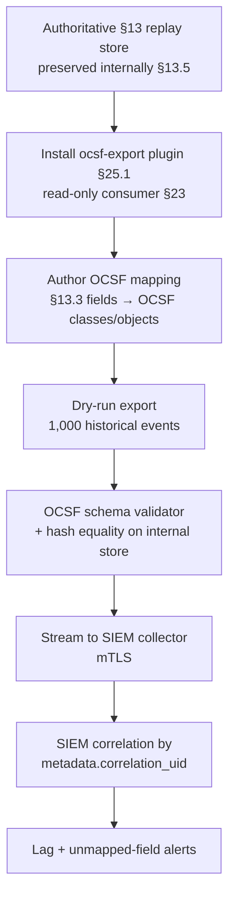

# DT-29 — Export OCSF-compatible event for SIEM compatibility

**Personas:** Marcus (Platform Governance Admin / Workflow Integrator)
**Spec sections:** §13.5 Optional Compatibility with OCSF, §26.2 OCSF Explanation, §25.1 Plugin System (SIEM integrations), §13.3 Required Core Fields, §23 Security
**Type:** Low-level
**Pre-condition:** The platform emits the §13 replay-capable schema as its authoritative internal event format. The corporate SIEM ingests OCSF (Open Cybersecurity Schema Framework — see §26.2). No mapping currently exists; SIEM analysts ask Marcus for OCSF-shaped policy-decision events without losing the internal replay schema.
**Trigger:** Marcus installs a SIEM-export plugin via the §25.1 plugin system and configures an OCSF mapping for `event_type=kubernetes.admission.request`.

## Steps
1. Marcus reviews §13.5: the replay schema is authoritative; OCSF is a *compatibility target*. The plugin must read replay events, not mutate them.
2. Marcus deploys the `ocsf-export` plugin (§25.1 SIEM extension point) as a downstream consumer of normalized §13.3 events; it has no write access to the canonical store (§23).
3. Marcus authors the mapping (kept in version control alongside the plugin config):
   - §13.3 `event_type=kubernetes.admission.request` → OCSF class `Application Activity` (6002) with `activity_id=Create`.
   - `decision=deny` → OCSF `status_id=Failure`; `decision=allow` → `Success`.
   - `subject.sub` + `jwt_claims` → OCSF `actor.user` object.
   - `policy_engine`, `policy_version`, `control_id` → OCSF `enrichments[]` with a stable `provider="gov-platform"`.
   - `correlation_id` → OCSF `metadata.correlation_uid`.
   - `external_data_refs` → OCSF `enrichments[]` (preserved verbatim as JSON).
4. Marcus runs a dry-run export on 1,000 historical events. The plugin produces OCSF JSON; an OCSF schema validator passes; a side-by-side check confirms every internal event is preserved unchanged in the platform's authoritative store.
5. Marcus points the plugin at the SIEM's HTTPS collector with mTLS. The SIEM ingests the events and indexes them under `Application Activity`. SIEM analysts confirm correlation searches by `metadata.correlation_uid` succeed.
6. Marcus documents the mapping as a versioned artifact and adds an alert if the plugin's export lag exceeds 5 minutes or if any field in §13.3 fails to map (so silent truncation is impossible).

## Success criteria (testable)
- For each exported event, the platform retains the original §13 replay event byte-identical in its authoritative store (verified by hash comparison).
- 100% of `kubernetes.admission.request` events in a 24-hour sample validate against the OCSF schema after mapping.
- A SIEM correlation search by `metadata.correlation_uid` returns the same event the platform's Audit Correlation View returns for that `correlation_id`.
- The plugin runs entirely as a read-only §25.1 consumer; attempts by the plugin identity to modify the authoritative store are denied (§23).
- An unmapped §13.3 required field triggers a plugin-level error rather than silently producing a partial OCSF event.

## Flowchart

## Notes
Related: HL-13 (cross-tenant detection landing in SIEM), DT-28 (correlation_id). §13.5 and §26.2 explicitly position OCSF as compatibility-only; the platform must never downgrade its replay schema to match OCSF.
