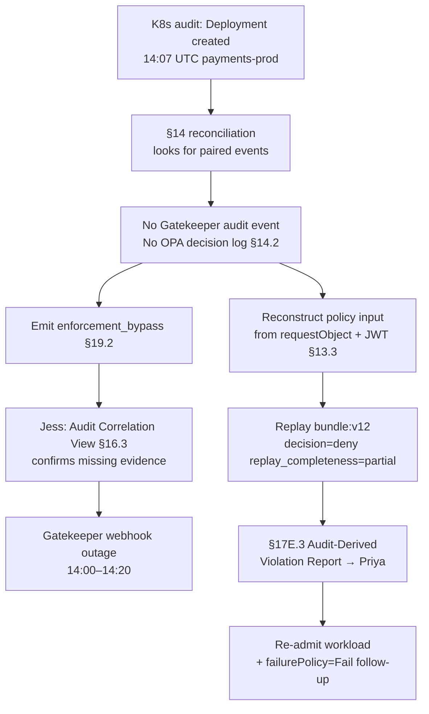

# DT-30 — Detect Gatekeeper bypass via missing audit event

**Personas:** Jess (SRE / Cluster Operator), Priya (Compliance & GRC Lead)
**Spec sections:** §14.2 Example: Gatekeeper Bypass, §19.2 Retrospective Audit Detection Example, §17E.3 Audit-Derived Violation Report, §13.3 Required Core Fields, §16.3 Audit Correlation View
**Type:** Mid-level
**Pre-condition:** Control `SC-IMG-001` is enforced via Gatekeeper in `cluster-a/payments-prod` on `bundle:v12`. The §14 engine correlates K8s audit logs, Gatekeeper events, and OPA decision logs by `correlation_id` (§13.3). A 20-min Gatekeeper outage occurred during a node upgrade.
**Trigger:** A §14 reconciliation pass discovers `Deployment payments-prod/api-legacy` created 14:07 UTC in the K8s audit log with no matching Gatekeeper event and no OPA decision log — the three §14.2 bypass conditions are met.

## Steps
1. The §14 analytics engine emits an `enforcement_bypass` alert per §19.2 ("K8s audit shows creation; no Gatekeeper event; no OPA decision log"), routed to Jess and Priya with `cluster=cluster-a`, `resource_id=cluster-a/payments-prod/deployment/api-legacy`, `correlation_id=k8s-audit:7f3c…`.
2. Jess opens the Audit Correlation View (§16.3) filtered to that `correlation_id`. Only the K8s audit row is present; Gatekeeper and OPA columns are empty (`missing_evaluation_evidence=true`).
3. Jess cross-references the cluster-a Gatekeeper webhook health timeline and confirms the 14:00–14:20 outage during the node upgrade. The deployment landed inside the gap; preliminary classification: "infrastructure-induced bypass, not malicious."
4. The platform reconstructs the policy input from the Kubernetes audit `requestObject` plus the subject's JWT claims at request time, emits a replay-capable event with `replay_completeness=partial` (no engine ever evaluated it), and runs `bundle:v12` against it. Result: `decision=deny`.
5. Priya opens the §17E.3 Audit-Derived Violation Report: violation timestamp (14:07), discovery timestamp (today), source (K8s API server audit), reconstructed input, `policy_version=bundle:v12`, `confidence_level=high`, `missing_fields=[]`, `control_id=SC-IMG-001`, recommended remediation.
6. Priya files the report as evidence for SC-IMG-001. Jess re-submits `api-legacy` through admission; it is denied for the same reason — confirming the audit-derived finding. Follow-up: set Gatekeeper webhook `failurePolicy=Fail` so future outages cannot silently bypass.

## Success criteria (testable)
- Analytics emits `enforcement_bypass` within one reconciliation interval (≤15 min) of the missing-evidence condition (§14.2, §19.2).
- The §17E.3 report includes: violation/discovery timestamps, source audit log, reconstructed input, replay policy version, confidence level, matched control ID, recommended remediation.
- Replay of the reconstructed input against `bundle:v12` returns `decision=deny` with `replay_completeness=partial`.
- The Audit Correlation View links the K8s audit row to the synthetic replay by `correlation_id`, with `missing_evaluation_evidence=true`.
- Re-submission of the workload through live admission is denied, confirming the audit-derived finding.

## Flowchart

## Notes
Related: HL-06 (retrospective bypass), DT-28, DT-25. `replay_completeness=partial` is the correct state for synthetic replays of bypassed events — never `complete`.
