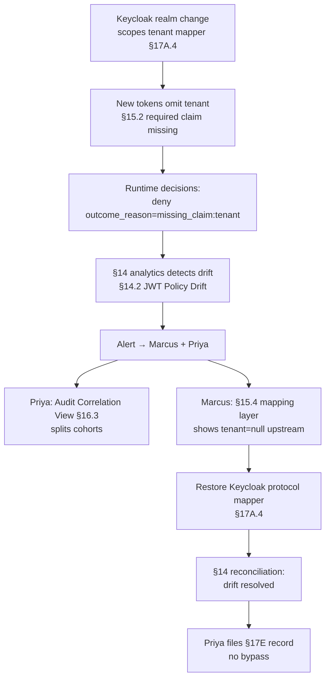

# DT-31 — Detect JWT policy drift after a Keycloak realm change

**Personas:** Marcus (Platform Security Engineer), Priya (Compliance & GRC Lead)
**Spec sections:** §14.2 Example: JWT Policy Drift, §15.2 Required JWT Claims, §15.4 JWT-to-Policy Mapping Layer, §17A.4 Keycloak Integration, §16.3 Audit Correlation View
**Type:** Mid-level
**Pre-condition:** Policies in the `tenant-isolation` package require the §15.2 claim `tenant`. Realm `platform-prod` issues `tenant` via a protocol mapper; the §15.4 mapping layer passes it through. The §14 engine reconciles JWTs in decision logs against §15.2's required-claim list.
**Trigger:** A realm-config change re-scopes the `tenant` protocol mapper to a single client; tokens issued to other clients now omit the claim. §14.2 JWT-drift fires within one reconciliation interval.

## Steps
1. The §14 analytics engine flags `jwt_policy_drift` per §14.2: "policy requires claim `tenant`; ≥18% of observed JWTs over the last 15 minutes omit it." The alert routes to Marcus (owner of Keycloak realms per §17A.4) and Priya (compliance impact).
2. Priya opens the Audit Correlation View (§16.3) filtered to the `tenant-isolation` policy package. Decision logs split into two cohorts: `decision=allow` (claim present) and `decision=deny outcome_reason=missing_claim:tenant` — the latter spiking from baseline ~0 to several hundred per minute.
3. Marcus pivots to the §15.4 mapping-layer view. The `tenant` normalized attribute is `null` for affected subjects. The mapping layer's source field `tenant` is empty in the raw token — confirming the regression is upstream in Keycloak, not in normalization.
4. Marcus inspects the `platform-prod` realm change history in Keycloak and identifies the recent protocol-mapper re-scoping as the cause. He restores the mapper's client scope to "all confidential clients" so the claim is re-issued.
5. The §15.4 mapping layer's fixture test re-runs against representative subjects and resolves `tenant` to a non-empty value for all expected clients. Newly issued tokens now carry the claim.
6. Marcus refreshes the §16.3 Audit Correlation View; `outcome_reason=missing_claim:tenant` returns to baseline within one reconciliation interval. The §14.2 drift alert auto-resolves.
7. Priya files the incident as a §17E coverage record: drift duration, affected decisions, no bypass (deny-on-missing was correct fail-closed). She links the realm-change ticket as root cause.

## Success criteria (testable)
- §14.2 emits `jwt_policy_drift` within one reconciliation interval (≤15 min) of the threshold being crossed.
- The alert names the required claim (`tenant`), policy package, and percentage of tokens missing the claim (§15.2).
- After mapper restore, §15.4 resolves `tenant` to a non-empty value for all representative subjects in fixture tests.
- The §14.2 drift alert auto-resolves within one reconciliation interval after restoration.
- `outcome_reason=missing_claim:tenant` returns to baseline; affected decisions are retained as evidence.
- No subject loses access permanently without an explicit policy change.

## Flowchart

## Notes
Related: DT-26 (add a claim), DT-35 (mapping-layer-only fix). Deny-on-missing is correct fail-closed behavior under §15.2; the incident is a coverage and availability issue, not a bypass.
