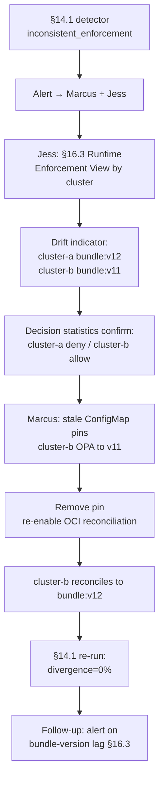

# DT-32 — Identify inconsistent enforcement across two clusters

**Personas:** Marcus (Platform Security Engineer), Jess (SRE / Cluster Operator)
**Spec sections:** §14.1 Detect inconsistent enforcement, §16.3 Runtime Enforcement View, §13.3 Required Core Fields (policy_version, cluster), §7.2 Enforcement Classes
**Type:** Mid-level
**Pre-condition:** Control `SC-IMG-001` (approved signer required for production images) is rolled out to `cluster-a` and `cluster-b` as Gatekeeper constraints sourced from the same OPA bundle. The §14 engine correlates decision logs by `control_id` and `policy_version` (§13.3). Bundle distribution is via OCI; both clusters reconcile from the same registry path.
**Trigger:** A §14.1 inconsistent-enforcement check finds identical input (same image, registry, signer claim) yields `deny` on `cluster-a` and `allow` on `cluster-b` across multiple events over 30 minutes.

## Steps
1. The §14.1 detector emits an `inconsistent_enforcement` finding: `control_id=SC-IMG-001`, divergence rate 100% on `signer=legacy-ci`, clusters `cluster-a` (deny) vs `cluster-b` (allow). The alert routes to Marcus and Jess.
2. Jess opens the §16.3 Runtime Enforcement View grouped by cluster. The "Active Gatekeeper constraints" panel shows `K8sApprovedSigner` present on both clusters, but the "Drift indicators" column flags `cluster-b` with `bundle:v11` while `cluster-a` runs `bundle:v12`.
3. Jess pivots to "Decision statistics" for the constraint. `cluster-a` denies 47 events in the last hour for `signer=legacy-ci`; `cluster-b` allows 12 with the same input — confirming the bundle-version delta is the cause, not a constraint-template difference.
4. Marcus inspects bundle history: `v12` tightened the approved-signer list (removed `legacy-ci`). `cluster-b`'s OPA is pinned to `v11` via a stale `ConfigMap` from a prior staged rollout; OCI reconciliation was disabled there.
5. Marcus removes the pin, re-enables reconciliation, and the §16.3 view flips `cluster-b` to `bundle:v12` within the interval. The §7.2 enforcement class stays at `enforce` on both clusters.
6. Marcus re-runs the §14.1 inconsistent-enforcement check over the next interval. For identical inputs, both clusters now return the same decision; the divergence rate returns to 0%.
7. Jess files a follow-up to add a §16.3 "Drift indicators" alert when any cluster's active bundle version trails the registry by more than one revision.

## Success criteria (testable)
- §14.1 emits `inconsistent_enforcement` with `control_id`, both clusters' `policy_version` values, and a sample of divergent decision pairs (§13.3).
- The §16.3 Runtime Enforcement View displays both clusters' active bundle versions side-by-side with a "Drift indicator" set on the lagging cluster.
- After Marcus removes the bundle pin, `cluster-b` reports `bundle:v12` in the next §16.3 refresh.
- A re-run of the §14.1 check shows divergence rate returning to 0% for `SC-IMG-001` on subsequent intervals.
- No constraint enters a non-enforcing §7.2 class as part of the remediation.

## Flowchart

## Notes
Related: DT-27 (external-data drift), DT-30 (bypass detection). §14.1 inconsistent-enforcement is distinct from §14.2 bypass: both clusters had evaluation evidence; only the policy version differed.
