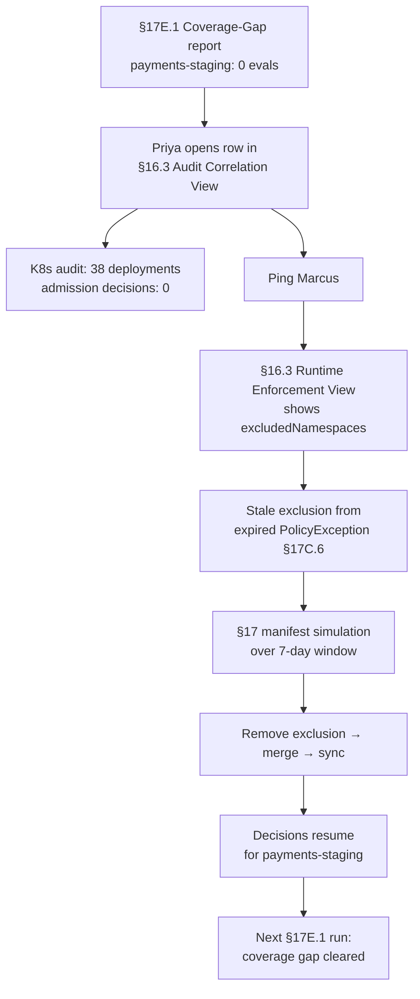

# DT-33 — Detect missing enforcement coverage in a namespace

**Personas:** Priya (Compliance & GRC Lead), Marcus (Platform Security Engineer)
**Spec sections:** §14.1 (detect missing enforcement coverage), §17E.1 (coverage gaps by namespace/control), §16.3 Audit Correlation View, §9 Gatekeeper, §6 Governance Hierarchy
**Type:** Mid-level
**Pre-condition:** Control `SC-IMG-001` is in scope for all production-class namespaces, including the `payments-staging` namespace (tagged `tier=production-equivalent` in the §6 governance hierarchy). The §14 engine tracks per-namespace evaluation counts and flags namespaces in scope with zero decisions across the reconciliation window.
**Trigger:** Priya's weekly Coverage-Gap report (§17E.1) lists `payments-staging` with `expected=in-scope`, `evaluations=0` for SC-IMG-001 over the last 7 days — either no deployments occurred, or the constraint is not installed.

## Steps
1. Priya opens the row in the Audit Correlation View (§16.3) for `namespace=payments-staging, control=SC-IMG-001`. Compliance gaps panel: "no enforcement decisions in window." The K8s API audit feed shows 38 Deployment create/update events in the same window — workloads exist but no admission decisions were recorded.
2. Priya pings Marcus with the report row. The Runtime Enforcement View (§16.3) filtered to `cluster-a` shows the SC-IMG-001 `K8sUnsignedImage` constraint present but with `match.namespaceSelector` excluding `tier=production-equivalent` — a relic of an earlier exclusion for `payments-staging` during a vendor onboarding.
3. Marcus inspects the constraint manifest in Git: a temporary `excludedNamespaces: [payments-staging]` block from a closed PolicyException (§17C.6) was never removed when the exception expired.
4. Marcus removes the `excludedNamespaces` entry, opens a PR, and runs a §17 manifest simulation against the last 7 days of `payments-staging` Deployment audit events: 36/38 would have been allowed, 2 would have been newly blocked (both flagged as test-fixture images with an unapproved signer).
5. Marcus merges the PR. ArgoCD syncs the constraint to `cluster-a`. Live admission decisions for `payments-staging` begin appearing in the §14 stream within minutes.
6. Priya re-runs the §17E.1 Coverage-Gap report. `payments-staging` now shows `evaluations>0` for SC-IMG-001 and the row drops off the report. The two newly-blocked test workloads are routed to the team via a §17B approval-gated exception path.

## Success criteria (testable)
- The §17E.1 Coverage-Gap report lists any in-scope (namespace, control) pair with zero evaluations during the window.
- The Audit Correlation View (§16.3) shows zero enforcement decisions despite non-zero K8s audit activity in the namespace.
- The root cause — a `namespaceSelector` / `excludedNamespaces` exclusion — is visible in the Runtime Enforcement View constraint detail.
- After the exclusion is removed and synced, the namespace appears in the next reconciliation window with `evaluations>0` and the coverage gap clears.
- A §17 simulation against the gap window quantifies newly-blocked vs newly-allowed deployments before the change is merged.

## Flowchart

## Notes
Related: HL-09, HL-15, DT-30, DT-80. The pattern — coverage gap caused by a not-cleaned-up exception — is the most common false-zero source seen in scope audits.
