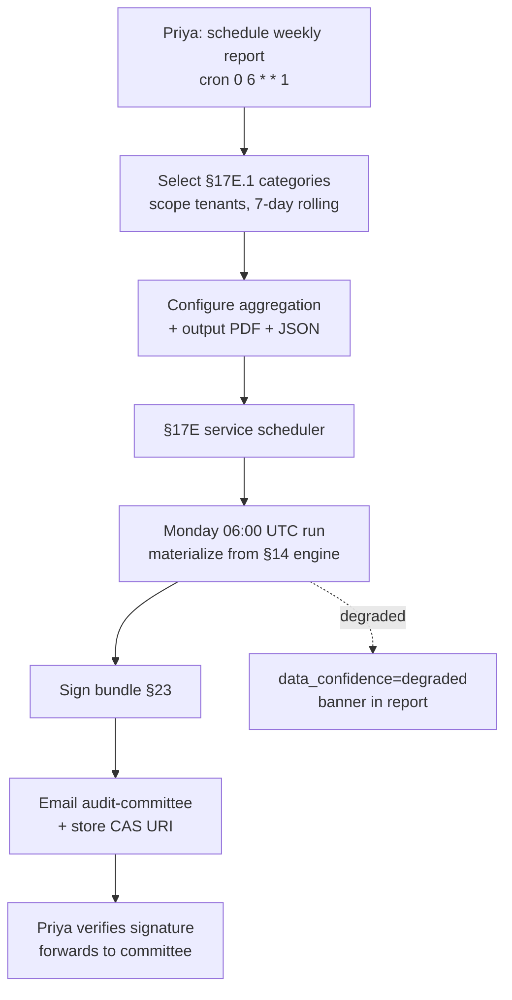

# DT-34 — Generate a weekly compliance report for executive review

**Personas:** Priya (Compliance & GRC Lead)
**Spec sections:** §14 Compliance Analytics Engine, §17E.1 Report Categories, §17E.2 Real-Time Enforcement Report, §23 Evidence integrity
**Type:** Low-level
**Pre-condition:** Priya holds the Compliance Analyst role (§17A.2) with read scope across all production tenants. The §14 engine continuously emits enforcement decisions, exception lifecycle events, bypass alerts, and coverage-gap reconciliations. The §17E reporting service supports scheduled signed exports.
**Trigger:** Priya schedules a recurring weekly report at Monday 06:00 UTC, sourcing from §17E categories and emailed to the audit-committee distribution list.

## Steps
1. Priya opens the Reporting view in the Governance Console and creates a new scheduled report. She names it "Weekly Executive Compliance Brief," scope `tenant in (payments, identity, platform)`, window `previous 7 days, rolling`, schedule `cron: 0 6 * * 1`.
2. She selects the §17E.1 categories to include: Real-time enforcement actions (§17E.2 fields), Approval requests issued, Suspended/pending actions, Violations detected from audit logs (§17E.3 summary), Coverage gaps by control and by namespace, Policy drift.
3. She configures aggregation: counts per control ID, top-10 denying policies, exception issuance and expiry counts, open bypass alerts from §14.2 (Gatekeeper bypass, JWT policy drift), week-over-week deltas.
4. She sets output: PDF (executive summary) plus JSON evidence bundle, signed with the platform's evidence signing key (§23), delivered to `audit-committee@corp` and stored to the evidence object store with a content-addressable URI.
5. The first run executes Monday 06:00 UTC. The §17E service materializes data from the §14 engine, validates row counts against the source decision stream, attaches the signing manifest, and emits a `report_generated` event with the URI and signature.
6. Priya receives the email. She verifies the signature using the published public key, checks the executive summary (enforcement totals, bypass alerts, top coverage gaps), and forwards the JSON bundle as a workpaper attachment to the audit committee summary deck.
7. Priya pins the scheduled report; subsequent weeks run unattended. If the §14 engine reports a stale reconciliation window or a data-completeness check fails, the report is generated with a `data_confidence=degraded` banner rather than silently shipping.

## Success criteria (testable)
- The scheduled report runs on cron and includes all §17E.1 categories Priya selected (enforcement, exceptions, bypass alerts, coverage gaps, drift).
- Each row in the Real-Time Enforcement section carries the §17E.2 required fields (timestamp, actor, resource, namespace, engine, policy version, control ID, decision, action, mutation diff, approval correlation).
- The output is signed per §23 and signature verification succeeds with the published key.
- Delivery to the configured email list and the evidence object store both complete; the report's content-addressable URI is recorded in the §14 evidence index.
- A degraded data-completeness condition surfaces as a banner in the report rather than being hidden.

## Flowchart

## Notes
Related: HL-01, DT-77, DT-78, DT-80. Signed output and the degraded-confidence banner are both compliance-grade requirements — never ship an unsigned executive report.
