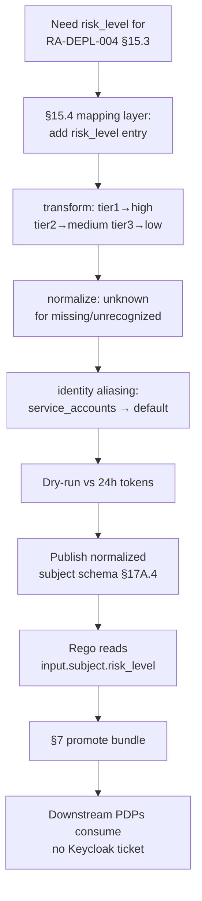

# DT-35 — Add a new claim to a Keycloak realm via the mapping layer

**Personas:** Marcus (Platform Security Engineer)
**Spec sections:** §15.4 JWT-to-Policy Mapping Layer (claim transformation, claim normalization, identity aliasing), §15.3 Recommended Custom Claims, §17A.4 Keycloak Integration
**Type:** Low-level
**Pre-condition:** New control `RA-DEPL-004` (risk-aware deployment gating) requires a normalized `risk_level` claim per §15.3. Keycloak stores a per-user custom attribute `corp_risk_tier` (`tier1|tier2|tier3`) from the HRIS sync; no policy consumes it. Marcus holds Platform Governance Admin (§17A.2).
**Trigger:** Marcus needs `risk_level ∈ {low, medium, high}` available to Rego without a Keycloak realm change ticket and without coupling policies to the raw `corp_risk_tier` attribute name.

## Steps
1. Marcus opens the §15.4 Mapping Layer config in the Governance Console and adds a new entry for `risk_level`: `source: user_attributes.corp_risk_tier`, transform: `lookup({tier1:'high', tier2:'medium', tier3:'low'})`, target: canonical claim `risk_level`.
2. He adds a normalization rule: missing or unknown source values map to `risk_level=unknown` (not absent) so policies can fail closed without distinguishing "claim missing" from "value not recognized."
3. Marcus adds an identity-aliasing rule for service accounts: `if subject_type==service_account → risk_level=service_account_default` (configurable per tenant), avoiding the need to populate `corp_risk_tier` on every machine identity.
4. Marcus runs the mapping layer dry-run tool against a sampled token set (last 24h, scoped to his domain per §17A.5). Output: 12,431 tokens normalized; distribution `low:8,902 medium:2,910 high:587 unknown:18 service_account_default:14`. The 18 `unknown` are flagged for HRIS follow-up.
5. He commits the mapping config; the layer publishes a new normalized-subject schema version. The §17A.4 normalized subject now includes `risk_level` alongside `subject_id`, `roles`, `groups`, `namespaces`, `policy_domains`, `tenants`.
6. Marcus updates the new `RA-DEPL-004` Rego to read `input.subject.risk_level` (canonical) — not `input.token.user_attributes.corp_risk_tier`. He runs unit tests against the §15.4 dry-run fixture; all pass.
7. Marcus promotes the Rego bundle via the standard §7 lifecycle. Downstream Gatekeeper / OPA / Conftest decision points consume `risk_level` without any Keycloak realm edit or client-scope change; the Rego Explorer (§16.3) "Required JWT claims" panel for `RA-DEPL-004` lists `risk_level` (normalized).

## Success criteria (testable)
- A `risk_level` mapping entry is created in the §15.4 layer with source, transform, and normalization rules, without modifying the Keycloak realm directly.
- The dry-run tool produces a value distribution over a sampled token set and surfaces `unknown` cases.
- The normalized subject (§17A.4) exposes `risk_level` alongside existing canonical fields.
- Rego references the canonical `input.subject.risk_level`, not the raw `corp_risk_tier` attribute path.
- Promotion of `RA-DEPL-004` occurs with no Keycloak realm change ticket; the Rego Explorer shows `risk_level` as a required claim.

## Flowchart

## Notes
Related: HL-16, DT-31, DT-36, DT-37. The mapping layer is exactly the indirection that decouples Rego from raw Keycloak attribute names — no Rego should reference `user_attributes.*` directly.
