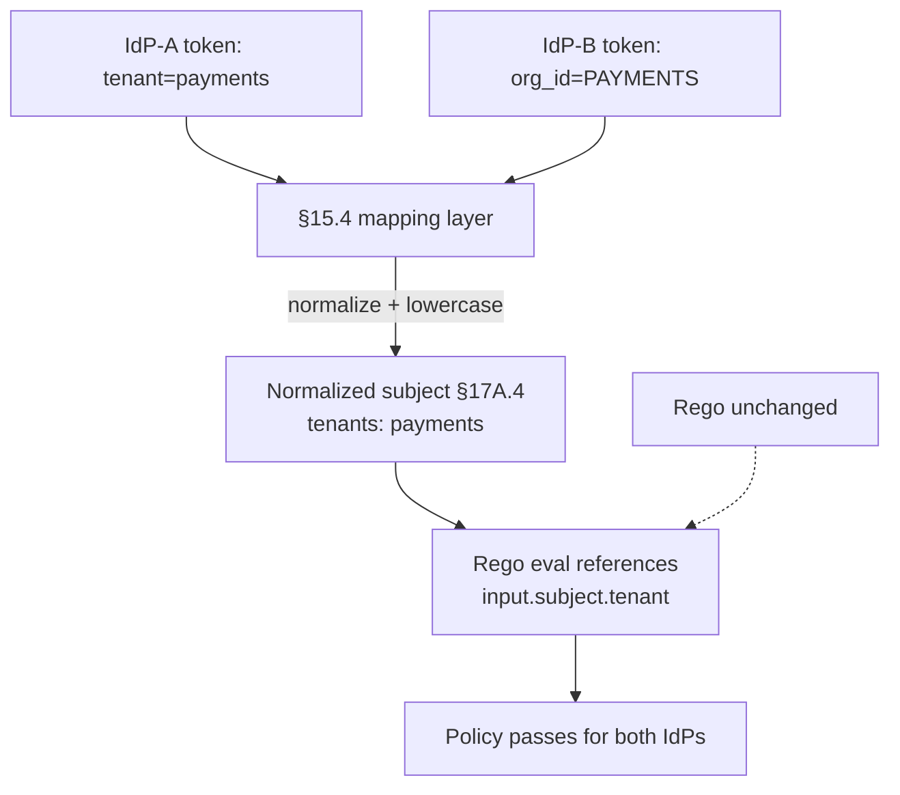

# DT-36 — Normalize a tenant claim across two IdPs

**Personas:** Marcus (Platform Security Engineer)
**Spec sections:** §15.4 JWT-to-Policy Mapping Layer (claim transformation, claim normalization), §17A.4 Keycloak Integration
**Type:** Low-level
**Pre-condition:** Two upstream identity providers are federated behind the platform's Keycloak realm. IdP-A emits `tenant: "payments"`; IdP-B (an acquired business unit's Okta) emits `org_id: "PAYMENTS"`. Existing Rego (e.g. `governance.kubernetes.imagesigning`) declares `__required_claims__` including `tenant` (§15.2 required claim), so subjects from IdP-B currently fail policy evaluation with "missing input: tenant".
**Trigger:** Marcus sees a spike of admission denials on workloads owned by IdP-B subjects after onboarding the second IdP; the Audit Correlation View attributes them to a missing required claim, not a real policy violation.

## Steps
1. Marcus opens the Rego Explorer (§16.3) for `governance.kubernetes.imagesigning` and confirms the "Required JWT Claims" panel lists `tenant` as required and flags it red for the IdP-B subjects.
2. Marcus inspects a sample token from each IdP through the Governance Console's token introspection view. He confirms IdP-A produces `tenant` (lowercase string) and IdP-B produces `org_id` (uppercase string) — and that no policy code in the platform references `org_id` directly.
3. Marcus edits the §15.4 mapping layer to normalize both sources into the canonical `tenant` claim, using `claim transformation` and `claim normalization`:
   ```yaml
   claim_mappings:
     tenant:
       sources:
         - claim: tenant            # IdP-A
         - claim: org_id            # IdP-B
       transform: lowercase
       on_conflict: prefer_first_non_empty
   ```
4. Marcus commits the change. The mapping-layer test fixture loads representative tokens from both IdPs and asserts the normalized subject (§17A.4) contains `"tenants": ["payments"]` in each case.
5. Marcus deploys the new mapping config (versioned governance artifact per §7 lifecycle history). No Rego, ConstraintTemplate, or Conftest test is modified — Rego continues to reference `input.subject.tenant`.
6. Marcus reissues tokens for two test subjects (one per IdP) and replays the failing admission events through the simulation framework (§17.4). Both now evaluate successfully.
7. Marcus monitors live traffic for 15 minutes: denial rate for IdP-B subjects drops to baseline; no IdP-A regressions appear.

## Success criteria (testable)
- Tokens from both IdPs produce a normalized authorization subject whose `tenants[]` includes the same canonical lowercase tenant string.
- The Rego Explorer "Required JWT Claims" panel reports zero missing required claims for either IdP cohort.
- No Rego, Gatekeeper, or Conftest source file is modified by the change; the mapping-layer config is the only versioned artifact in the diff.
- IdP-B admission denials attributed to "missing input: tenant" drop to zero within one token-refresh interval.
- Mapping-layer config change is recorded with actor JWT, timestamp, and prior/new value in lifecycle history.

## Flowchart



## Notes
Related: DT-26 (add claim to audit), DT-35 (add claim to realm), HL-13 (cross-tenant access), HL-16 (Keycloak claim evolution). The §15.4 mapping layer is the contract surface: Rego sees the normalized subject only.
