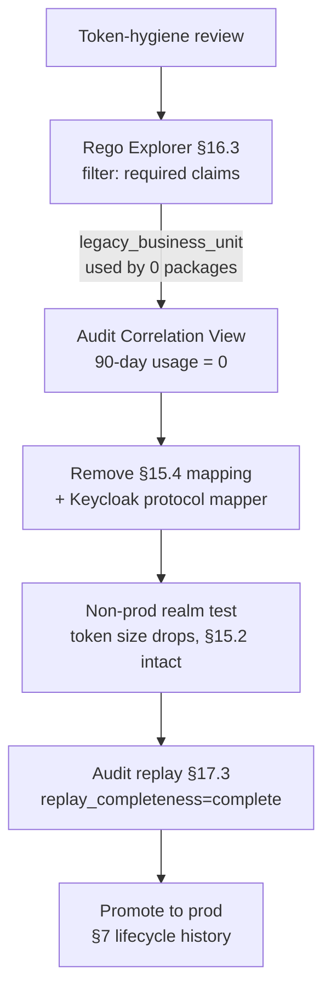

# DT-37 — Decommission an obsolete claim required by no policy

**Personas:** Marcus (Platform Security Engineer)
**Spec sections:** §15.2 Required JWT Claims, §15.4 JWT-to-Policy Mapping Layer, §16.3 Rego Explorer (required JWT claims, rule dependencies)
**Type:** Low-level
**Pre-condition:** The §15.4 mapping layer still issues `legacy_business_unit`, a custom claim added years ago for a deprecated cost-allocation policy. It is not in the §15.2 required-claim set. Tokens have grown past Keycloak's preferred size threshold and the platform team has a token-bloat ticket open. Marcus believes nothing references the claim, but wants the Rego Explorer to prove it before deletion.
**Trigger:** During a quarterly token-hygiene review, Marcus filters the Rego Explorer to find unused custom claims.

## Steps
1. Marcus opens the Rego Explorer (§16.3) and uses its "Required JWT Claims" index across every Rego package in the bundle catalog. He filters for packages that declare `legacy_business_unit` in `__required_claims__` (§8.3 Rego metadata extensions) or reference `input.subject.legacy_business_unit` in rule bodies. Zero hits.
2. Marcus cross-checks the Rego Explorer's "Rule dependencies" graph for any downstream rule that transitively reads the claim. Zero hits, including in disabled and dry-run packages (§7.2).
3. Marcus queries the Audit Correlation View for any decision in the last 90 days whose `jwt_claims.legacy_business_unit` was non-null and contributed to outcome. Zero hits.
4. Marcus edits the §15.4 mapping layer to remove the claim mapping:
   ```yaml
   # removed:
   # claim_mappings:
   #   legacy_business_unit:
   #     source: attributes.legacy_bu
   ```
   and removes the matching Keycloak realm protocol mapper.
5. Marcus deploys the change to a non-prod realm first. He samples 20 freshly minted tokens; the claim is absent and average JWT byte size drops measurably. Existing §15.2 required claims (`sub`, `tenant`, `groups`, `roles`, `environment`, etc.) are unchanged.
6. Marcus replays the prior 24 hours of audit events from prod against the new mapping (§17.3 audit-driven simulation). `replay_completeness=complete` is preserved for every event — no policy regressed.
7. Marcus promotes the mapping-layer config change to prod. The change is recorded as a versioned governance artifact (§7 lifecycle history).

## Success criteria (testable)
- Rego Explorer reports zero Rego packages declaring or referencing `legacy_business_unit` before and after the change.
- Tokens minted post-change contain none of the removed claim; all §15.2 required claims remain present.
- Audit replay over a representative 24-hour window shows no change in decision outcomes and no degradation of `replay_completeness`.
- Average JWT payload size for the affected realm decreases (measurable in token-introspection telemetry).
- The mapping-layer and Keycloak protocol-mapper changes are captured as versioned artifacts with actor, timestamp, and previous value retained for rollback.

## Flowchart



## Notes
Related: DT-26 (add claim), DT-36 (normalize tenant), HL-16 (Keycloak claim evolution). Removal is safe only because Rego Explorer's dependency view and audit replay both confirm zero references.
