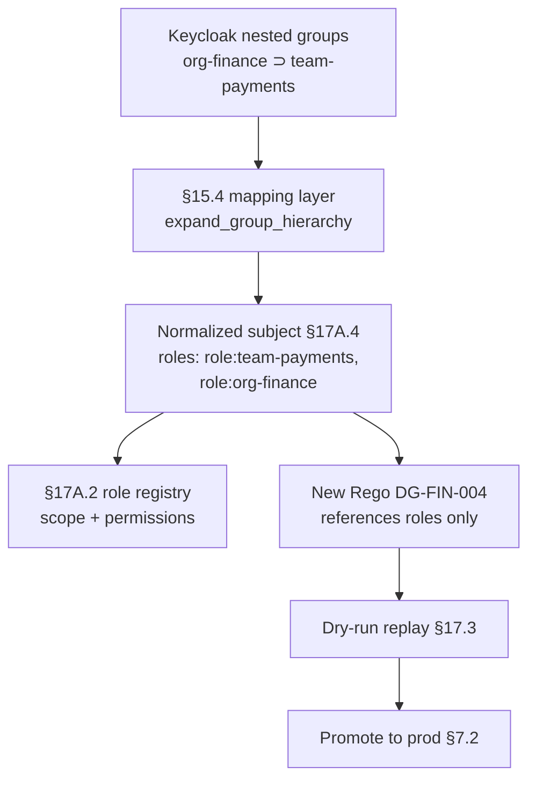

# DT-38 — Map group hierarchy to role expansion at token issuance

**Personas:** Marcus (Platform Security Engineer)
**Spec sections:** §15.4 JWT-to-Policy Mapping Layer (group expansion, role hierarchy resolution), §17A.2 Role Model
**Type:** Mid-level
**Pre-condition:** Keycloak is configured with nested groups: `org-finance` contains `team-payments` and `team-billing`; `org-platform` contains `team-sre` and `team-admission`. Existing Rego rules walk `input.subject.groups` and string-match parent group names — fragile, duplicated across packages. Marcus wants Rego to depend only on a normalized `roles` claim so the §17A.2 role model is the single source of truth.
**Trigger:** A new control (`DG-FIN-004`) requires "any finance-org subject may view payments-tenant violations." Rather than hand-roll a fourth group-walking helper, Marcus configures the mapping layer to expand the group hierarchy into roles at token issuance.

## Steps
1. Marcus opens the Rego Explorer (§16.3) and identifies the three existing Rego packages that walk groups manually. He notes them for refactor after the mapping change lands.
2. Marcus edits the §15.4 mapping layer to enable `group expansion` and `role hierarchy resolution`:
   ```yaml
   claim_mappings:
     roles:
       sources:
         - claim: groups
       transform: expand_group_hierarchy
       hierarchy:
         org-finance:   [team-payments, team-billing]
         org-platform:  [team-sre, team-admission]
       emit_as: role:<group>
   ```
   So a subject in `team-payments` is issued `roles: ["role:team-payments", "role:org-finance"]`.
3. Marcus authors a mapping-layer test fixture: subjects in `team-payments`, `team-sre`, and both, must produce the expected role sets. The fixture asserts the normalized authorization subject (§17A.4) `roles[]` contents.
4. Marcus aligns the §17A.2 role model: each emitted `role:<group>` is registered with appropriate scope and permission primitives (§17A.3 — e.g. `violation:view` scoped to tenant `payments` for `role:org-finance`).
5. Marcus deploys the mapping change to a non-prod realm. He requests fresh tokens for three test subjects and confirms the expanded `roles` claim is present and correctly populated.
6. Marcus writes the new `DG-FIN-004` Rego rule referencing `input.subject.roles[_] == "role:org-finance"` — no group walking. The rule lands in dry-run (§7.2).
7. Marcus replays 24 hours of finance-tenant audit events against dry-run. Expected allow/deny matches the spec. Marcus opens a follow-up to refactor the three group-walking packages to use `roles`.
8. Marcus promotes the mapping change to prod; new control begins issuing decisions backed by the role hierarchy.

## Success criteria (testable)
- Tokens issued post-change include an expanded `roles[]` array containing both the leaf-group role and every parent-group role per the configured hierarchy.
- Mapping-layer test fixture passes for every documented hierarchy permutation including subjects in multiple leaf groups.
- The new `DG-FIN-004` Rego references only `input.subject.roles`, not `input.subject.groups`, and the Rego Explorer "Rule dependencies" reflects this.
- Replay of 24 hours of finance-tenant audit events produces no false positives or false negatives against the expected decision set.
- The §17A.2 role registry contains each newly emitted role with explicit scope and permission primitives.

## Flowchart



## Notes
Related: DT-26, DT-36, HL-04 (developer onboarding), HL-13 (cross-tenant). Hierarchy resolution lives in the mapping layer so Rego stays declarative and the §17A.2 role model remains the contract.
