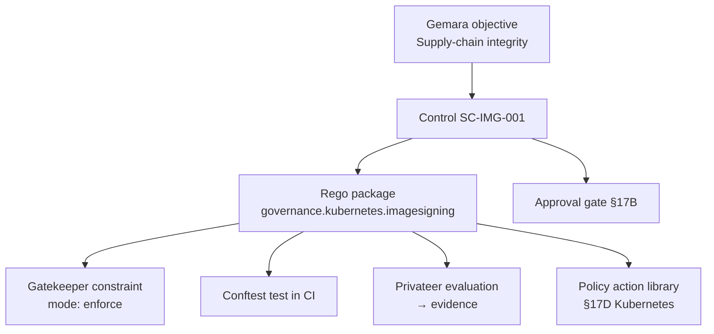

# DT-39 — Use Governance Graph View to trace control → Rego → enforcement points

**Personas:** Priya (Compliance & GRC Lead), Marcus (Platform Security Engineer)
**Spec sections:** §16.3 Required Views — Governance Graph View (objectives, controls, Rego packages, enforcement points, audit evidence, approval gates, policy action libraries)
**Type:** Mid-level
**Pre-condition:** The platform is populated with Gemara objectives, controls (including `SC-IMG-001` — production images must be signed), signed Rego bundles (`governance.kubernetes.imagesigning`, §8.3 metadata extensions present), an active Gatekeeper constraint, Conftest tests wired into CI, and Privateer evaluations producing evidence. Priya holds the Compliance Analyst role (§17A.2) — read-only across the relevant policy domains. Marcus holds Platform Governance Admin.
**Trigger:** Priya is preparing the quarterly SOC 2 workpaper for image signing and needs a single, defensible view that maps the control all the way to its enforcement evidence.

## Steps
1. Priya opens the Governance Console (§16) and selects the Governance Graph View (§16.3). She searches for `SC-IMG-001` and selects it. The graph renders centered on the control.
2. The graph displays the upstream node — the Gemara objective the control decomposes (e.g. "Supply-chain integrity of production workloads") — and the downstream nodes: the Rego package `governance.kubernetes.imagesigning`, the Gatekeeper constraint enforcing it at admission, the Conftest test wired into the build pipeline, and the Privateer evaluation producing evidence. The "policy action libraries" (§17D) node shows the Kubernetes library backing the constraint.
3. Priya clicks the Rego package node. A side panel renders the §8.3 metadata (`__control_id__: SC-IMG-001`, `__severity__: critical`, `__governance_domain__: supply-chain`, `__required_claims__: [groups, tenant, environment]`), the bundle version, signing status, and current promotion stage (§7.2).
4. Priya clicks the Gatekeeper constraint node. The side panel shows the active enforcement mode (enforce), recent decision counts, and the audit-evidence link (§16.3 Audit Correlation View). She clicks the Conftest node next and sees the test fixture and CI runs.
5. Priya clicks the approval gate node (§17B) attached to the most recent promotion of the constraint. She reviews the approver, timestamp, and linked workflow webhook record.
6. Priya asks Marcus to verify a discrepancy: the Privateer node shows one evaluation marked `inconclusive`. Marcus follows the same graph from his Admin role, clicks through, and opens the evidence directly for triage — no separate console required.
7. Priya exports the rendered graph (with linked artifact identifiers) as part of her workpaper attachment. The export references each artifact by signed identifier, not screenshot.

## Success criteria (testable)
- Selecting `SC-IMG-001` renders, in a single graph, the linked objective, control, Rego package, Gatekeeper constraint, Conftest test, Privateer evaluation, approval gate, and policy action library — all as navigable nodes.
- Clicking any node opens a detail panel showing that node's identifier, version, and provenance (e.g. Rego metadata, bundle signature, approver record).
- Priya's read-only Compliance Analyst role is sufficient to render and export the graph; no node requires elevated permission to view metadata.
- Graph navigation is bidirectional: from any enforcement-point node, the user can reach the originating control and objective in one click.
- The export artifact references nodes by stable identifier (control ID, bundle digest, constraint name) sufficient for audit workpaper inclusion.

## Flowchart

## Notes
Related: DT-13 (decision → bundle → control), HL-01 (quarterly SOC 2 cycle), HL-05 (Type II audit). The graph is the §16.3 "Goal G1 traceability" surface — Priya's primary workpaper view.
