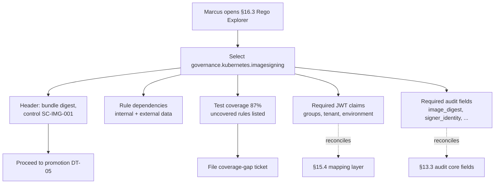

# DT-40 — Use Rego Explorer to view test coverage and required claims

**Personas:** Marcus (Platform Security Engineer)
**Spec sections:** §16.3 Required Views — Rego Explorer (rule dependencies, control mappings, policy test coverage, required JWT claims, required audit fields); §8.3 Rego Metadata Extensions
**Type:** Low-level
**Pre-condition:** The signed Rego bundle `governance.kubernetes.imagesigning` is published with §8.3 metadata (`__control_id__: SC-IMG-001`, `__severity__: critical`, `__required_claims__`, `__required_audit_fields__`), the Conftest suite for the package has been run by CI and emitted a coverage report, and the Gemara control `SC-IMG-001` is registered in the governance catalog. Marcus holds the Platform Governance Admin role (§17A.2) so all Rego Explorer panels are visible to him.
**Trigger:** Before promoting a candidate bundle from `warn` to `enforce` (per §7.2 lifecycle), Marcus opens Rego Explorer to confirm coverage and required-claim health for the imagesigning package.

## Steps
1. Marcus opens the Governance Console (§16) and navigates to the Rego Explorer view (§16.3). The Rego package index lists all packages in the active bundle catalog.
2. Marcus selects `governance.kubernetes.imagesigning`. The header panel renders the package name, current bundle digest, signing status, and the linked Gemara control mapping `SC-IMG-001` (§8.3 `__control_id__`).
3. Marcus inspects the "Rule dependencies" panel. It graphs internal rule calls (`deny`, `violation`, helper rules like `is_signed`, `is_production`) and external data references (Gatekeeper `data.inventory`, signing-trust list). No orphan or unreachable rule is flagged.
4. Marcus opens the "Policy test coverage" panel. It reports 87% line coverage from the Conftest suite, with two specifically uncovered helper rules listed by name and file:line. Coverage is sourced from the latest CI run referenced by commit SHA.
5. Marcus opens the "Required JWT Claims" panel. It enumerates the claims declared in `__required_claims__`: `groups`, `tenant`, `environment` — each cross-checked against the §15.2 required-claim set and the §15.4 mapping-layer output. All three are green (present in the normalized subject).
6. Marcus opens the "Required audit fields" panel. The package declares `image_digest`, `signer_identity`, `attestation_predicate_type` via `__required_audit_fields__` (§8.3). Each field is matched against the §13.3 core audit field set and the Gatekeeper audit emitter shows green for emission.
7. Marcus notes the two uncovered helpers, files a Conftest test gap ticket against them, and decides the package meets the promotion bar: control-mapped, deps clean, claims and audit-field contracts honored. He proceeds to promote per DT-05.

## Success criteria (testable)
- Selecting `governance.kubernetes.imagesigning` displays its linked Gemara control ID (`SC-IMG-001`) sourced from §8.3 metadata, not free-text.
- The rule-dependency graph enumerates every internal helper and external data reference used by the package, with no unreachable rules.
- Policy test coverage is reported as a single percentage (87%) plus an itemized list of uncovered rules, traceable to a specific CI run.
- The Required JWT Claims panel lists exactly the package's declared claims (`groups`, `tenant`, `environment`) and reconciles them against the §15.4 normalized subject.
- The Required audit fields panel lists exactly the package's declared fields and confirms emission against §13.3 / Gatekeeper audit output.

## Flowchart

## Notes
Related: DT-11 (Rego metadata validation), DT-05 (warn → enforce promotion), DT-13 (decision → bundle → control), DT-26 (add claim to audit). Rego Explorer is the single pre-promotion checkpoint that proves §8.3 metadata is honored end-to-end.
