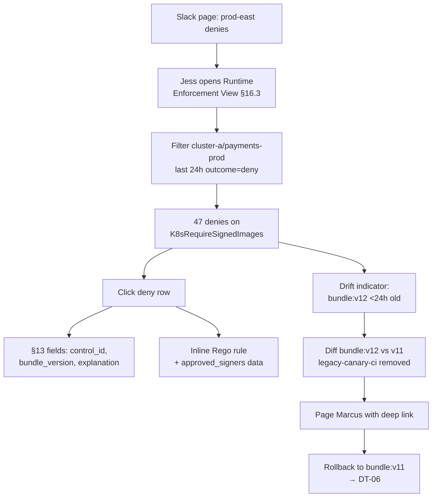

# DT-41 — Use Runtime Enforcement View to investigate recent denies

**Personas:** Jess (SRE / Cluster Operator), Marcus (Platform Security Engineer)
**Spec sections:** §16.1 Console objectives, §16.2 Headlamp plugin model, §16.3 Runtime Enforcement View, §13 Standardized Audit Event Schema
**Type:** Low-level
**Pre-condition:** Headlamp plugin is installed in `cluster-a`; Jess authenticated via Keycloak with `namespaces: ["payments-prod","payments-dev"]` and SRE role on `cluster-a`. Constraint `K8sRequireSignedImages` (control `SC-IMG-001`) is enforced from `bundle:v12` shipped four hours ago; previous version was `bundle:v11`.
**Trigger:** Payments team Slack: "deploys failing in prod-east since the last release." Jess accepts the page at 02:14 UTC.

## Steps
1. Jess opens the Runtime Enforcement View (§16.3) inside Headlamp. It lists active Gatekeeper constraints, OPA bundles, and Kyverno policies for clusters in her scope.
2. She filters `cluster=cluster-a`, `namespace=payments-prod`, `mode=enforce`, `window=last 24h`, `outcome=deny`. Decision statistics show 47 denies on `K8sRequireSignedImages` clustered after 22:00 UTC; drift indicators flag this constraint as "version changed <24h".
3. Jess clicks the most recent deny row. The detail pane shows §13 audit fields: `decision_id`, `correlation_id`, `subject.sub`, `policy_bundle_version=bundle:v12`, `control_id=SC-IMG-001`, `engine=gatekeeper`, `explanation="signer DN not in approved_signers"`.
4. From the detail pane she opens the inline Rego rule — the view resolves `bundle:v12` to its signed OCI artifact and shows the `deny` rule plus the `approved_signers` data document.
5. She clicks "diff vs previous version": drift indicator surfaces that `bundle:v12` removed `signer:legacy-canary-ci` from `approved_signers`. All denied images carry that signer.
6. Jess pages Marcus with a deep link to the deny row. Marcus confirms the change was unintended and rolls back to `bundle:v11` from the same view (see DT-06); decision stats return to baseline within one reconciliation interval.

## Success criteria (testable)
- Runtime Enforcement View renders active constraints, OPA bundles, Kyverno policies, decision statistics, recent denies, and drift indicators for clusters in Jess's Keycloak-derived scope only.
- Filtering by `cluster`, `namespace`, `window=24h`, `outcome=deny` returns the 47 denies on `K8sRequireSignedImages`.
- Each deny row exposes the §13 fields: `decision_id`, `correlation_id`, `policy_bundle_version`, `control_id`, `engine`, `explanation`, `subject`.
- The drift indicator flags `bundle:v12` as recently promoted and exposes a diff against `bundle:v11`.
- The deep link sent to Marcus resolves to the same deny detail pane regardless of who follows it (subject to scope).

## Flowchart

## Notes
Related: HL-03, HL-09, DT-06, DT-13, DT-44. The view inherits Headlamp's cluster context so Jess does not switch tools mid-incident.
