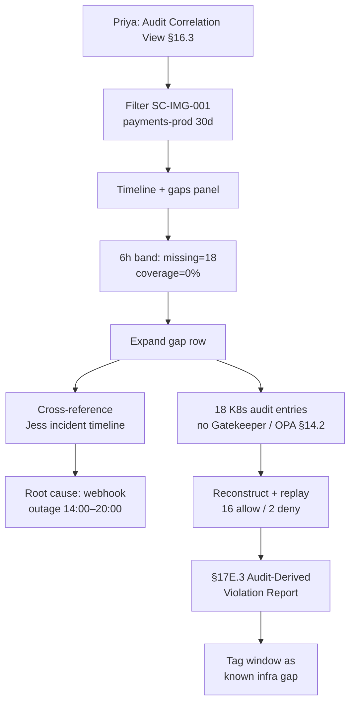

# DT-42 — Use Audit Correlation View to find a compliance gap

**Personas:** Priya (Compliance & GRC Lead), Jess (SRE / Cluster Operator)
**Spec sections:** §16.3 Audit Correlation View, §14 Compliance Analytics, §14.2 Gatekeeper bypass, §13 Audit schema, §17E.3 Audit-Derived Violation Report
**Type:** Mid-level
**Pre-condition:** Control `SC-IMG-001` is enforced via Gatekeeper in `cluster-a/payments-prod`. Compliance Analytics correlates K8s API server audit, Gatekeeper, and OPA decision logs by `correlation_id`. Yesterday Jess closed an incident: Gatekeeper webhook outage 14:00–20:00 UTC during a control-plane upgrade. Priya is preparing quarterly SOC 2 evidence for `SC-IMG-001`.
**Trigger:** Priya opens the Audit Correlation View to assemble enforcement evidence for the past 30 days and notices a coverage gap on yesterday's date.

## Steps
1. Priya opens the Audit Correlation View (§16.3) and filters `control_id=SC-IMG-001`, `namespace=payments-prod`, `window=30d`. The view returns enforcement decisions, missing evaluations, compliance gaps, violation timeline, and FP/FN analysis.
2. The violation timeline shows a discontinuity: a flat band labelled "missing evaluations" between 14:00 and 20:00 UTC yesterday. Compliance gaps panel: `expected_admissions=18`, `evaluated=0`, `coverage=0%` for that window.
3. Priya expands the gap row. The view shows 18 K8s API server audit entries (Deployments + StatefulSets in `payments-prod`) with no paired Gatekeeper event or OPA decision — the §14.2 bypass condition.
4. She opens "Cross-reference" and pastes Jess's incident ID. The view links Jess's incident timeline (webhook health 14:00–20:00 = `unhealthy`) to the same window; root cause classified `infrastructure-induced`, not `malicious`.
5. For each of the 18 entries the platform reconstructs the policy input from `requestObject` + JWT claims and replays against the bundle active at the time. FP/FN panel reports: 16 would have been allowed, 2 would have been denied (`replay_completeness=partial` per §17.3).
6. Priya exports an §17E.3 Audit-Derived Violation Report for the 2 reconstructed denies, files it as compensating evidence against `SC-IMG-001`, and tags the 6-hour window as "known gap, infrastructure-induced, remediated".

## Success criteria (testable)
- Audit Correlation View displays enforcement decisions, missing evaluations, compliance gaps, violation timeline, and FP/FN analysis filtered to Priya's scope.
- The 6-hour gap is rendered as a contiguous "missing evaluations" band with `coverage=0%` and 18 unpaired K8s audit entries.
- Cross-referencing Jess's incident attaches webhook-health data to the gap row and classifies root cause.
- Replay of the 18 reconstructed inputs returns 16 allow / 2 deny with `replay_completeness=partial`.
- The §17E.3 report includes control ID, violation/discovery timestamps, source audit log, reconstructed input, confidence level, and bundle version.
- The tagged window appears on subsequent evidence exports as an annotated, classified gap rather than silent absence.

## Flowchart

## Notes
Related: DT-30, HL-06, HL-15, DT-28. Reconstructed-replay results carry `replay_completeness=partial` per §17.3 and never `complete`.
