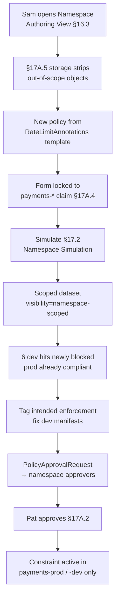

# DT-43 — Use Namespace Authoring View as a Namespace Policy Author

**Personas:** Sam (Application Developer, acting as Namespace Policy Author for `payments-*`)
**Spec sections:** §16.3 Namespace Authoring View, §17A.2 Namespace Policy Author / Approver, §17A.3 Permission Primitives, §17A.4 Keycloak claims, §17A.5 Storage-Level Access Controls, §17.2 Namespace Simulation
**Type:** Mid-level
**Pre-condition:** Sam is in Keycloak group `team-payments`, role `namespace-policy-author`, claim `namespaces:["payments-prod","payments-dev"]`, `policy_domains:["runtime-security"]`. Teammate Pat holds `namespace-policy-approver` in the same scope. A Kyverno template `RateLimitAnnotations` exists in the shared library.
**Trigger:** The payments team agrees to require an `x-ratelimit-tier` annotation on every `Deployment` in their namespaces, ahead of a rate-limit rollout.

## Steps
1. Sam opens the Namespace Authoring View (§16.3). It lists only policies, simulations, violations, and approval states whose `namespaces` metadata intersects `payments-prod` or `payments-dev` — §17A.5 storage filters strip everything else before it reaches the GUI.
2. Sam clicks "New namespace policy", picks `RateLimitAnnotations` from the library, names it `payments-ratelimit-tier`, scopes to `payments-*`, and authors the rule "require annotation `x-ratelimit-tier in {free, standard, premium}` on Deployments". The form is hard-locked to namespaces in Sam's claim and refuses any `clusterScope` field.
3. Sam clicks "Simulate". The platform creates a `PolicySimulationRun` with `visibility=namespace-scoped`, `namespaces=["payments-prod","payments-dev"]`. Inputs are materialized as a scoped dataset (§17A.5) — no objects outside `payments-*` are included.
4. Manifest + cluster-snapshot simulation (§17.2) reports: 6 existing Deployments in `payments-dev` lack the annotation (would be newly blocked); `payments-prod` is fully compliant. Sam tags the 6 dev hits as "intended enforcement" per §17.4 and updates the dev manifests.
5. Sam submits the policy for approval. The `PolicyApprovalRequest` routes to namespace approvers — Pat sees it in his Namespace Authoring View. Global policy admins do not receive it; it never leaves `payments-*` scope.
6. Pat opens the request, reviews the attached simulation report, and clicks Approve. Promotion writes the policy with `visibility=namespace-scoped`; the constraint syncs to `payments-prod` and `payments-dev` only, and appears in Sam's view as `active`.

## Success criteria (testable)
- Namespace Authoring View renders only objects whose `namespaces`/`tenant` metadata intersect Sam's Keycloak claim; a storage-layer probe with Sam's token cannot retrieve `default` or `cluster-system` policies (§17A.5).
- New-policy form server-side rejects any scope outside `payments-*` and any `clusterScope=true` value.
- The simulation dataset carries `{namespaces:["payments-prod","payments-dev"], visibility:"namespace-scoped"}` and excludes other namespaces.
- The approval request is visible to in-scope `namespace-policy-approver` holders (Pat) only.
- After Pat approves, the constraint is enforced in `payments-prod`/`payments-dev` only.
- Sam cannot self-approve his own policy (separation of `policy:edit` and `approval:approve` per §17A.3).

## Flowchart

## Notes
Related: HL-04, HL-08, DT-50, DT-53, DT-55. Storage-level enforcement (§17A.5) is what makes this different from a GUI-only filter — verified by API probe, not screenshot.
