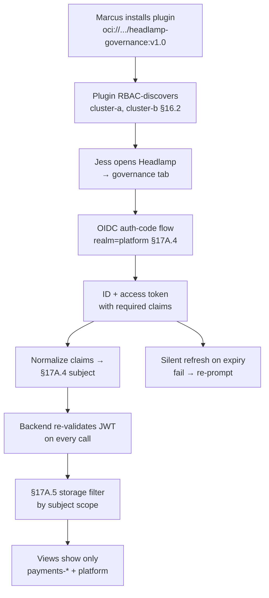

# DT-44 — Install Headlamp plugin and authenticate via Keycloak OIDC

**Personas:** Marcus (Platform Security Engineer), Jess (SRE / Cluster Operator)
**Spec sections:** §16.1 Console objectives, §16.2 Framework Requirements (Headlamp plugin, Keycloak/OIDC, RBAC discovery), §17A.4 Keycloak Integration, §17A.5 Storage-Level Access Controls
**Type:** Low-level
**Pre-condition:** Keycloak realm `platform` exists with `groups`, `realm_access.roles`, `namespaces`, `policy_domains`, `tenants` claim mappers per §17A.4. Headlamp is deployed and connected to `cluster-a` and `cluster-b`. Jess is in group `sre-cluster-a` with `namespaces:["payments-prod","payments-dev","platform"]` and role `sre`. The platform publishes the governance-console plugin as a signed OCI artifact.
**Trigger:** Marcus rolls out the plugin to SRE Headlamp installs so Jess can investigate denies in-context (see DT-41).

## Steps
1. Marcus installs the plugin: `headlamp-plugin install oci://registry/platform/headlamp-governance:v1.0`. The plugin manifest declares its OPA REST endpoints, WebAssembly Rego runtime, and OIDC client `headlamp-governance`.
2. On first launch the plugin performs Kubernetes-native RBAC discovery (§16.2): it reads `SelfSubjectAccessReview` against each connected kubeconfig context and auto-discovers `cluster-a`, `cluster-b`. No static cluster list is required.
3. Jess opens Headlamp. The governance plugin tab triggers an OIDC authorization-code flow against Keycloak realm `platform`, client `headlamp-governance`, scopes `openid groups roles namespaces policy_domains tenants`.
4. Keycloak issues ID + access tokens. The plugin normalizes claims into the §17A.4 subject: `{subject_id, username:"jess", roles:["sre"], groups:["sre-cluster-a"], namespaces:["payments-prod","payments-dev","platform"], policy_domains:["runtime-security"], tenants:["payments","platform"]}`.
5. The plugin attaches the subject to every backend call; the backend re-validates JWT signature, expiry, and `aud=headlamp-governance` per request and applies §17A.5 storage filters using the subject's scope.
6. In-plugin views are scoped: Jess sees `cluster-a`+`cluster-b` cluster panels (RBAC-discovered) but only `payments-*` and `platform` namespaces inside Runtime Enforcement, Audit Correlation, and Namespace Authoring views. A storage-layer probe with her token for `default` policies returns empty (§17A.5).
7. On token expiry the plugin runs the OIDC refresh flow silently; if refresh fails the plugin clears the cached subject and re-prompts. Marcus verifies the audit log: every plugin-originated request carries `subject.sub=jess` and a `correlation_id`.

## Success criteria (testable)
- Plugin installs from the signed OCI artifact and registers in Headlamp without modifying Headlamp core.
- Cluster context auto-discovers via Kubernetes RBAC; no static cluster list is needed.
- OIDC authorization-code flow completes; tokens contain all §17A.4 required claims.
- Normalized subject matches the §17A.4 schema exactly for Jess.
- In-plugin views render only data inside Jess's `namespaces`/`tenants`; a direct storage-layer query for out-of-scope objects returns empty (§17A.5).
- JWT is re-validated server-side on each backend call (signature, expiry, audience); silent refresh works; failed refresh re-prompts.
- Plugin-originated audit events include `subject.sub`, `groups`, `correlation_id`.

## Flowchart

## Notes
Related: HL-16, DT-35, DT-41, DT-43. Headlamp is the §16.2 default for Kubernetes-first deployments because it inherits cluster context and namespace-scoped access patterns.
