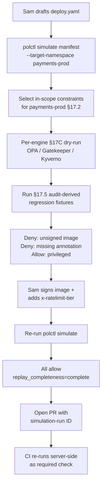

# DT-45 — Run manifest simulation before submitting a PR

**Personas:** Sam (Application Developer, payments team)
**Spec sections:** §17.1 Simulation objectives, §17.2 Manifest Simulation, §17.3 Audit-Driven Simulation Requirements, §17.5 Policy Authoring Test Cases from Audit Logs, §17C engine selection, §16.3 Namespace Authoring View
**Type:** Low-level
**Pre-condition:** Sam is in Keycloak group `team-payments`, role `developer`, `namespaces:["payments-prod","payments-dev"]`. The platform CLI `polctl` is installed locally and authenticated via OIDC device flow. Constraints active in `payments-prod` include `K8sRequireSignedImages` (OPA/Gatekeeper, control `SC-IMG-001`), `K8sBlockPrivileged` (Gatekeeper, `RUN-SEC-002`), and `RateLimitAnnotations` (Kyverno, `RUN-SEC-014`). Audit-derived fixtures exist for each.
**Trigger:** Sam has drafted `deploy.yaml` for `payments-prod/api` and wants to know if it will pass admission before opening a PR.

## Steps
1. Sam runs `polctl simulate manifest -f deploy.yaml --target-namespace payments-prod` (or pastes the YAML into the Namespace Authoring View's "Simulate manifest" form, §16.3). The platform parses the manifest and selects all constraints whose scope matches `payments-prod` per §17.2 Manifest Simulation.
2. The platform routes each constraint through its native engine per §17C — `K8sRequireSignedImages` → OPA/Gatekeeper dry-run, `K8sBlockPrivileged` → Gatekeeper dry-run, `RateLimitAnnotations` → `kyverno test`. The OPA input is built per §17.3 (subject + resource + operation), with Sam's JWT-derived claims as the subject.
3. The platform also runs the §17.5 audit-derived regression fixtures linked to each constraint so Sam's manifest is compared to known-good and known-bad cases.
4. Results return per-engine: `K8sRequireSignedImages` → **deny** (`reason: image registry/payments/api:1.4 not signed by approved_signers`); `K8sBlockPrivileged` → **allow**; `RateLimitAnnotations` → **deny** (`reason: missing annotation x-ratelimit-tier`). Each row includes `control_id`, `policy_bundle_version`, `engine`, `explanation`, and the §17.5 fixture link.
5. Sam fixes both issues locally: signs the image via the team's signing pipeline (re-tags `1.4`), adds `x-ratelimit-tier: standard` to the Deployment template. Re-runs `polctl simulate manifest -f deploy.yaml`.
6. Second run returns **allow** for all three constraints; the audit-derived fixtures still pass; the platform prints a summary `result=allow, control_coverage=3/3, replay_completeness=complete` and a copyable simulation-run ID.
7. Sam opens his PR with the simulation-run ID pasted into the description. CI re-runs the same simulation server-side as a required check; admission later in `payments-prod` produces the same outcome — no surprise denies.

## Success criteria (testable)
- `polctl simulate manifest` selects only constraints whose scope intersects the target namespace, using Sam's Keycloak claims.
- Each in-scope constraint is evaluated by its native engine (OPA, Gatekeeper dry-run, `kyverno test`) per §17C; results are reported per-engine.
- Each result row includes `control_id`, `policy_bundle_version`, `engine`, `outcome`, `explanation`, and a link to the §17.5 fixture (if any).
- Audit-derived fixtures linked to each constraint are executed alongside Sam's manifest in the same run (§17.5).
- After fixes, the run returns `allow` for all three constraints, `replay_completeness=complete`, and the same simulation-run ID can be re-executed deterministically server-side.
- The CI server-side re-run produces an identical decision to the local run for the same manifest and bundle versions.

## Flowchart

## Notes
Related: HL-04, DT-18, DT-50, DT-51, DT-65. The same simulation-run ID must replay deterministically across CLI, GUI, and CI; non-determinism here would defeat §17.5.
