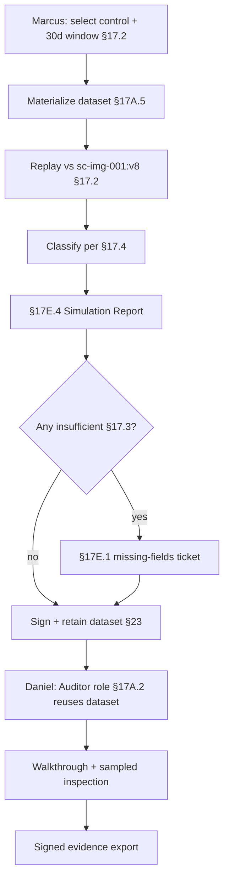

# DT-46 — Historical replay for one control over 30 days

**Personas:** Marcus (Platform Security Engineer), Daniel (Internal/External Auditor)
**Spec sections:** §17.1 Objectives (Historical replay), §17.2 Simulation Modes (Historical Replay), §17.3 Audit-Driven Simulation Requirements, §17A.2 Auditor role, §17E.4 Simulation Report
**Type:** Mid-level
**Pre-condition:** Control `SC-IMG-001` (Prevent unsigned workloads, §18.1) is enforced by a Gatekeeper constraint backed by the currently deployed Rego bundle `sc-img-001:v8`. The audit pipeline has been emitting §13-compliant replay-capable events for cluster `prod-east-2` for 30+ days and `external_data_refs` carries the `image-signature-status` provider version/digest. Daniel holds the Auditor role (§17A.2) scoped to the cluster and control for the audit period.
**Trigger:** Marcus needs to validate that the live `sc-img-001:v8` Rego classifies the last 30 days of admission events the way operators believe it does; Daniel will reuse the same materialized replay dataset two weeks later for his SOC 2 walkthrough.

## Steps
1. Marcus opens the §17.2 Historical Replay UI in the Governance Console (§16.3 Rego Explorer), selects `control_id = SC-IMG-001`, cluster `prod-east-2`, window `last 30 days`, and target bundle `sc-img-001:v8`. He names the replay dataset `sc-img-001-30d-2026-05`.
2. The platform materializes the dataset per §17A.5 (scoped, immutable, with `object_type = simulation_dataset`, `control_ids = [SC-IMG-001]`). It validates each event against §17.3 fields — `external_data_refs`, JWT attributes, bundle version, decision ID — and flags any with `replay_completeness != complete`.
3. The replayer evaluates each event against `sc-img-001:v8` and classifies the result. Marcus reviews the §17E.4 Simulation Report: 11,402 events evaluated; 11,210 unchanged denied, 184 unchanged allowed, 0 newly blocked, 0 newly allowed (because the deployed bundle is the same as the simulation target), and 8 marked `insufficient` per §17.3.
4. Marcus drills into the 8 insufficient events; all 8 are from a 12-minute window where the `image-signature-status` provider digest was not captured. He files a §17E.1 missing-fields ticket (DT-25 pattern) and excludes them from authoritative counts.
5. Marcus exports the §17E.4 Simulation Report (PDF + signed JSON manifest per §23) and links it to the `sc-img-001:v8` policy version in the §16.3 Rego Explorer. The dataset is retained read-only.
6. Two weeks later Daniel begins SOC 2 fieldwork. Under his Auditor role (§17A.2, read-only, scoped to `cluster=prod-east-2`, `control_ids=[SC-IMG-001]`), he opens the same materialized dataset `sc-img-001-30d-2026-05` rather than requesting a fresh export.
7. Daniel performs an independent walkthrough: he picks 5 randomly sampled allow decisions and 5 deny decisions, inspects the §13 input fixture and the explanation, and ties each to the deployed `sc-img-001:v8` bundle digest. He confirms population completeness (11,402 of 11,410 events authoritative; 8 disclosed as insufficient).
8. Daniel exports a signed evidence package for his workpaper. The dataset is referenced by digest; storage-layer scope (§17A.5) prevents access outside his authorized cluster/control.

## Success criteria (testable)
- Materialized replay dataset carries §17A.5 metadata (`object_type`, `cluster`, `control_ids`, `created_by`, `visibility`).
- §17E.4 Simulation Report includes all required fields: policy version before/after, events evaluated, newly blocked/allowed, unchanged allowed/denied, tagged changes, untagged risky changes, false-positive/negative candidates.
- Events lacking §17.3-required fields are tagged `insufficient` and excluded from authoritative counts, not silently promoted.
- The same dataset digest is reusable by Daniel under the Auditor role without re-extraction, and storage queries refuse access outside his scope.
- Exported simulation report is signed and references the deployed bundle digest (§23).

## Flowchart

## Notes
The same materialized dataset serves two consumers (engineering + audit) without re-extraction — the immutability requirement in §17A.5 is what makes that safe.
