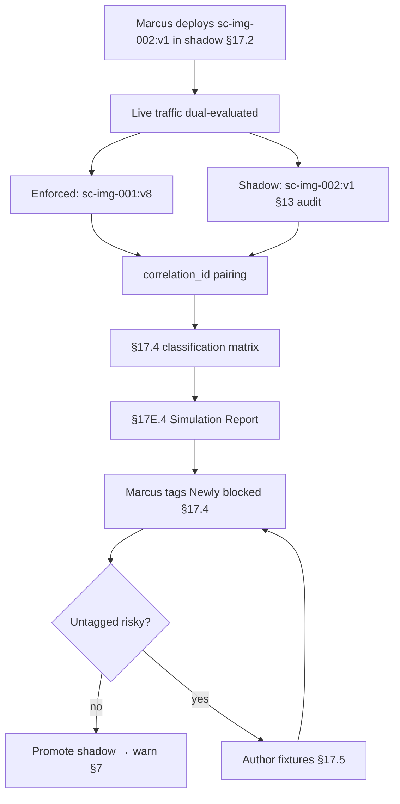

# DT-47 — Run live shadow mode for a new policy

**Personas:** Marcus (Platform Security Engineer)
**Spec sections:** §17.1 Objectives (Live dry-run evaluation), §17.2 Simulation Modes (Live Shadow Mode), §17.4 Differential Simulation Semantics, §17.5 Policy Authoring Test Cases from Audit Logs, §17E.4 Simulation Report, §7 enforcement classes (warn / dry-run / enforce)
**Type:** Mid-level
**Pre-condition:** Marcus has authored a new Rego policy `sc-img-002:v1` (require signer identity to match an approved signer set), backed by control `SC-IMG-002`. The deployed bundle for the same admission point is `sc-img-001:v8` (signing presence only). The audit pipeline emits §13-compliant events with `enforcement_mode`, `policy_bundle_version`, and `decision_id`. Marcus holds Platform Governance Admin (§17A.2).
**Trigger:** Marcus wants to evaluate `sc-img-002:v1` against live production admission traffic for 72 hours without enforcing it, then decide whether to promote to warn → enforce.

## Steps
1. Marcus deploys `sc-img-002:v1` to the admission controllers alongside `sc-img-001:v8` with `enforcement_mode = shadow` (per §17.2 Live Shadow Mode and §7 enforcement classes). The shadow evaluator receives the same admission input as the enforcing engine; its decision is recorded but never returned to the API server.
2. Each shadow decision is written to the §13 audit store with `enforcement_mode = shadow`, the new `policy_bundle_version = sc-img-002:v1`, and a `correlation_id` matching the live `sc-img-001:v8` decision. This preserves the §17.4 pairing needed for differential classification.
3. Marcus opens the §16.3 Rego Explorer "Shadow Run" view, names the run `sc-img-002-shadow-72h`, and starts the 72-hour window. The console displays a running tally and the §17E.4 in-progress simulation report.
4. At T+24h the platform classifies each paired decision per §17.4 (Allow→Deny "Newly blocked", Deny→Allow "Newly allowed", and the two unchanged buckets). Marcus reviews the running buckets: 38 Newly blocked, 0 Newly allowed (expected — the new policy is strictly stricter), 6,402 unchanged allowed, 71 unchanged denied.
5. Marcus inspects the 38 Newly blocked decisions in the Rego Explorer. 35 are canary deployments from `team-payments` using a legacy signer; 3 are unknown service accounts that should not have been signing at all. He converts the 3 unknown cases into §17.5 audit-derived test fixtures linked to `SC-IMG-002`.
6. At T+72h the shadow window closes. The §17E.4 Simulation Report records: policy_version_before = `sc-img-001:v8`, policy_version_after = `sc-img-002:v1`, events evaluated = 19,847, newly blocked = 112, newly allowed = 0, unchanged allowed = 18,930, unchanged denied = 805, false-positive candidates = 0 after tagging.
7. Marcus tags the 109 legacy-signer Newly blocked results as §17.4 "Intended enforcement" (with a linked exception request for the canary signer, DT-03 pattern), and the 3 unknown-signer cases as "Emergency block".
8. With zero untagged risky changes, Marcus promotes `sc-img-002:v1` from `shadow` to `warn` (§7 enforcement classes), schedules a 7-day warn window, and links the simulation report as the promotion gate artifact.

## Success criteria (testable)
- Shadow decisions never reach the admission API response path; the live `enforcement_mode` for the workload remains driven by `sc-img-001:v8`.
- Every shadow decision has a paired live decision via `correlation_id` and is stored with `enforcement_mode = shadow` per §13.
- The §17.4 classification matrix is populated for the full 72-hour window with non-null counts for all four buckets.
- The §17E.4 Simulation Report includes all required fields and is exportable when the window closes.
- Promotion from `shadow` to `warn` is gated on zero untagged risky changes in the report.

## Flowchart

## Notes
The shadow→warn→enforce ladder is the spec's intended replacement for "deploy to staging and hope". DT-46 is the historical-replay analogue against past traffic.
