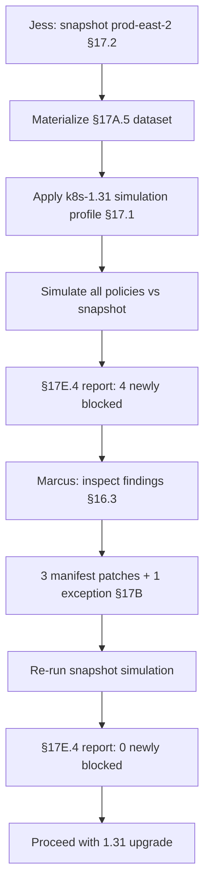

# DT-48 — Cluster snapshot simulation for upgrade readiness

**Personas:** Jess (SRE / Cluster Operator), Marcus (Platform Security Engineer)
**Spec sections:** §17.1 Objectives (Prospective impact analysis), §17.2 Simulation Modes (Cluster Snapshot Simulation), §17A.5 Storage-Level Access Controls, §17E.4 Simulation Report
**Type:** Mid-level
**Pre-condition:** Jess plans to upgrade cluster `prod-east-2` from Kubernetes 1.29 to 1.31. The fleet has all production policies in the active bundle set (including `SC-IMG-001`, `SC-PSS-001`, `SC-NET-001`). PodSecurity defaults and certain admission field shapes change in 1.31 (e.g., stricter `supplementalGroupsPolicy`, default `seccompProfile` handling). The Governance Console snapshot collector has RBAC read across cluster resources.
**Trigger:** Jess wants to know which currently-running resources would be newly blocked after the upgrade so she can fix them before draining nodes.

## Steps
1. Jess opens §17.2 Cluster Snapshot Simulation in the Governance Console and selects cluster `prod-east-2`. The platform captures a snapshot of all live objects in scope (Deployments, StatefulSets, DaemonSets, Pods, NetworkPolicies, ServiceAccounts) and stores it as a §17A.5 dataset (`object_type = simulation_dataset`, `cluster = prod-east-2`, `visibility = cluster-scoped`).
2. Jess selects the simulation profile `k8s-1.31-readiness`: this profile loads the same policy bundles currently enforced, but switches the policy input adapter to the 1.31 admission field shapes (drop deprecated PSP-shim fields, enable stricter `seccompProfile` defaulting). The framing matches §17.1 "Prospective impact analysis".
3. The platform runs every policy in simulate mode against every snapshot object, classifying each (Allow / Deny / Warn) per the §7 enforcement class declared by each bundle. Results are written into a §17E.4 Simulation Report `snapshot-2026-05-12-prod-east-2`.
4. The report flags 4 resources that would be newly Denied under post-upgrade input shapes:
   - `payments/api-7c4` Deployment — Pod spec relies on an empty `seccompProfile` that 1.31 defaults to `RuntimeDefault`, tripping a `SC-PSS-001` rule expecting an explicit profile.
   - `ml/feature-store` StatefulSet — uses a `supplementalGroups` shape that fails the updated `SC-PSS-001` constraint.
   - `legacy/batch-runner` Deployment — references a removed `v1beta1` field that the simulator's 1.31 adapter rejects.
   - `obs/log-shipper` DaemonSet — privileged-true with no exception linked.
5. Jess sends the snapshot report link to Marcus. Marcus opens each finding in the §16.3 Rego Explorer, confirms the policy and field expectations, and authors three small manifest patches (explicit `seccompProfile`, updated `supplementalGroupsPolicy`, removal of the deprecated field). The fourth (`obs/log-shipper`) becomes a DT-03 exception request.
6. The application teams merge the patches via GitOps. Jess re-runs the snapshot simulation against the now-updated cluster state with the same profile. The new §17E.4 report shows 0 newly blocked, 3 unchanged allowed (the patched resources), 1 covered-by-exception. The pre-upgrade gate is green.
7. Jess proceeds with the 1.31 upgrade. Post-upgrade, live admission decisions match the snapshot prediction; no admission denies of running workload pods occur during rollout.
8. Jess archives both snapshot datasets and reports under the upgrade change record; storage scope (§17A.5) keeps them visible only to fleet-scoped roles.

## Success criteria (testable)
- The snapshot dataset includes every in-scope live object on `prod-east-2` and carries §17A.5 metadata (cluster, visibility, created_by).
- The simulation profile produces a §17E.4 report listing every newly Denied object with policy ID, policy bundle version, field, and explanation.
- The 4 originally-flagged resources are each remediated or exception-covered before the upgrade begins.
- A re-run of the snapshot simulation after remediation returns 0 untagged newly blocked.
- Storage queries from non-fleet roles cannot retrieve the snapshot dataset.

## Flowchart

## Notes
Snapshot simulation is the prospective mirror of DT-46's retrospective replay — same engine, different input source.
