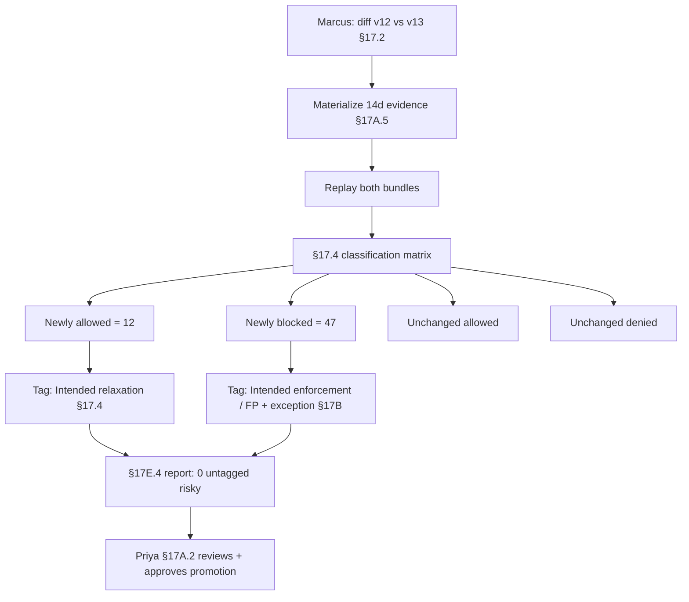

# DT-49 — Differential simulation across two policy versions

**Personas:** Marcus (Platform Security Engineer), Priya (Compliance & GRC Lead)
**Spec sections:** §17.2 Simulation Modes (Differential Policy Simulation), §17.4 Differential Simulation Semantics (Allow→Deny / Deny→Allow / Allow→Allow / Deny→Deny matrix and tagging), §17.6 Example Simulation Workflow, §17E.4 Simulation Report
**Type:** Mid-level
**Pre-condition:** The image-signing policy bundle is currently `bundle:v12` (control `SC-IMG-001`). Marcus has authored `bundle:v13` which relaxes the signer-identity constraint to permit a new approved signer (`build-signer-v2`) and adds a stricter rule that denies images without a `sbom.spdx` attestation. Marcus has 14 days of §13-compliant audit events for both allow and deny decisions across the production fleet, retained per §17.3.
**Trigger:** Before promotion, Marcus must show Priya the behavioral diff between v12 and v13 with each classification bucket reviewed and tagged.

## Steps
1. Marcus opens §17.2 Differential Policy Simulation in the Governance Console, selects policy package `sc-img-001`, sets `previous = bundle:v12`, `new = bundle:v13`, and the evidence set `last 14 days, all clusters`. The platform materializes the evidence per §17A.5 as `sc-img-001-diff-v12-v13`.
2. The replayer re-evaluates each historical event against both bundles using the §17.3 reconstructed inputs, and classifies pairs per the §17.4 matrix: Allow→Deny, Deny→Allow, Allow→Allow, Deny→Deny.
3. The §17E.4 Simulation Report returns: events evaluated 24,108; Newly blocked (Allow→Deny) 47; Newly allowed (Deny→Allow) 12; Unchanged allowed 19,902; Unchanged denied 4,147.
4. Marcus reviews each Newly allowed (Deny→Allow) decision (per §17.6 step 6). All 12 trace to deployments that were previously denied for "unknown signer" and are now allowed because they used `build-signer-v2`. Marcus tags all 12 as §17.4 "Intended relaxation" with rationale "added build-signer-v2 to approved signer set, approved in change CHG-4471".
5. Marcus reviews each Newly blocked (Allow→Deny) decision. 44 are deployments lacking the `sbom.spdx` attestation — he tags them §17.4 "Intended enforcement". 3 trace to a vendor-managed sidecar that has no SBOM today; he tags those "Potential false positive" and files a §17B exception request linked to the rationale.
6. He spot-checks the Unchanged allowed and Unchanged denied buckets to confirm volume sanity (no unexpected drop in allow rate beyond the 47, no unexpected spike in deny rate beyond the 47 + 3).
7. The §17E.4 report now records: tagged intentional changes 56, untagged risky changes 0, false-positive candidates 3 (with exception), false-negative candidates 0. Marcus exports the signed report (§23) and links it to `bundle:v13` in the §16.3 Rego Explorer.
8. Marcus ships the report to Priya. She opens it under her Compliance Analyst role (§17A.2), reads the rationale and tagged buckets, verifies the link to control `SC-IMG-001` and the §17B exception for the vendor sidecar, and approves promotion of `bundle:v13` to warn for a 7-day window.

## Success criteria (testable)
- The §17.4 matrix is populated for all four buckets (Newly blocked, Newly allowed, Unchanged allowed, Unchanged denied) with reconciling totals equal to events evaluated.
- Every Newly allowed result carries one of the §17.4 tags (`Intended relaxation`, `Potential regression`, `Requires review`, `Approved exception`) with a non-empty rationale before promotion.
- Every Newly blocked result carries one of the §17.4 tags (`Intended enforcement`, `Potential false positive`, `Requires review`, `Emergency block`).
- The §17E.4 report records 0 untagged risky changes prior to promotion.
- Priya can open the same report under the Compliance Analyst role, see the rationale and exception linkage, and the promotion gate is recorded against `bundle:v13`.

## Flowchart

## Notes
Differential simulation is the §17.6 canonical workflow distilled to two-version comparison; live shadow mode (DT-47) is the dual against live traffic.
