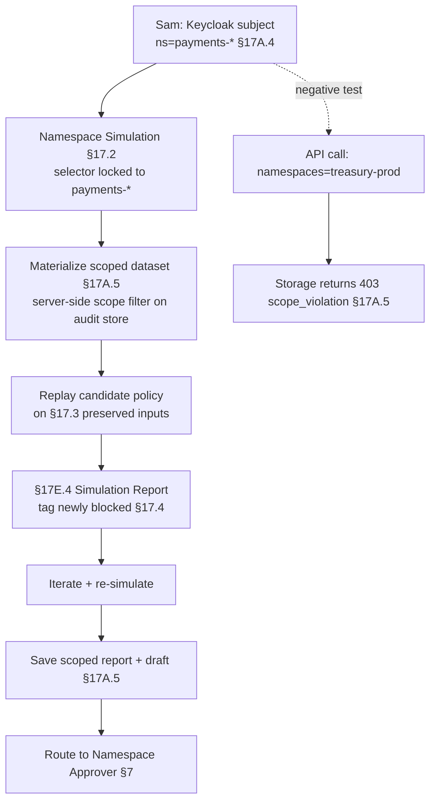

# DT-50 — Namespace-scoped simulation by a Namespace Policy Author

**Personas:** Sam (Application Developer / Namespace Policy Author for `payments-*`)
**Spec sections:** §17.1 Objectives (Namespace-scoped testing), §17.2 Simulation Modes (Namespace Simulation), §17.3 Audit-Driven Simulation Requirements, §17A.2 Namespace Policy Author role, §17A.3 Permission Primitives (`policy:simulate`, `policy:test`), §17A.5 Storage-Level Access Controls, §17E.4 Simulation Report
**Type:** Low-level
**Pre-condition:** Sam is authenticated via Keycloak with normalized subject (§17A.4) `namespaces=[payments-prod, payments-dev]`, `tenants=[payments]`, holding `policy:simulate` and `policy:test` (§17A.3). Neighbor tenant `treasury` runs in the same cluster. Audit pipeline emits §17.3-compliant events. Sam has drafted Kyverno policy `payments-egress-restrict-v1`.
**Trigger:** Sam runs a Namespace Simulation against the last 7 days of admission events to see what his candidate policy would have done in his namespaces — without touching `treasury-*`.

## Steps
1. Sam opens Namespace Authoring View (§16.3) and selects mode **Namespace Simulation** (§17.2). The namespace selector is constrained to `payments-prod, payments-dev`; `treasury-*` is not enumerable, not merely greyed-out (§17A.5: enforced in storage, not GUI).
2. Sam selects control `SC-NET-002`, evidence window `last 7 days`, and clicks **Materialize**. The platform creates a §17A.5 dataset with metadata `object_type=simulation_dataset, namespaces=[payments-prod, payments-dev], tenant=payments, control_ids=[SC-NET-002], created_by=sam, visibility=namespace-scoped`.
3. Materialization queries the audit store with a server-side scope filter derived from Sam's subject; events outside his namespace set are excluded at query time (§17A.5: "Audit replay datasets must be materialized as scoped datasets before use"). Row count is logged with subject ID.
4. The replayer evaluates `payments-egress-restrict-v1` against the scoped dataset using §17.3 preserved inputs (normalized policy input, JWT attributes, request operation, external-data version). Events missing required fields are flagged `incomplete` and excluded from authoritative counts.
5. The §17E.4 Simulation Report renders: events evaluated 1,842; newly blocked 6 (all `payments-prod`); newly allowed 0; unchanged allowed 1,809; unchanged denied 27. Sam tags 5 as §17.4 `Intended enforcement`, 1 as `Potential false positive`, iterates, and re-simulates.
6. As a negative test, Sam crafts a direct API call requesting `namespaces=[treasury-prod]`. The storage layer rejects with `403 scope_violation` independent of any GUI control (§17A.5: "GUI-only authorization is insufficient"). The attempt is logged.
7. Sam saves the report and iterated draft as namespace-scoped artifacts; both inherit §17A.5 metadata and are invisible to `treasury` users and to subject-less global queries.
8. Sam routes the policy to his Namespace Policy Approver (§17A.2) via the §7 promotion workflow; the saved report is attached as the simulation gate artifact for promotion to `warn` in `payments-prod`.

## Success criteria (testable)
- Namespace selector enumerates only Sam's authorized namespaces; cross-namespace selection is impossible from both GUI and API.
- Materialized dataset carries all §17A.5 required metadata and contains zero rows outside `payments-prod, payments-dev` (verified by direct storage query).
- Direct API calls requesting out-of-scope namespaces return `403 scope_violation` from the storage layer, with the attempt logged.
- §17E.4 report contains all required fields and is saved as a namespace-scoped artifact.
- Sam can simulate but cannot promote past `warn`; promotion requires his Namespace Policy Approver per §17A.2.
- Events missing §17.3 fields are tagged `incomplete` and excluded from authoritative counts.

## Flowchart

## Notes
Related: DT-43 (namespace authoring end-to-end), DT-55 (storage-scope verification), DT-49 (differential simulation at fleet scope). Storage-level enforcement is what distinguishes Namespace Simulation from a UI filter.
